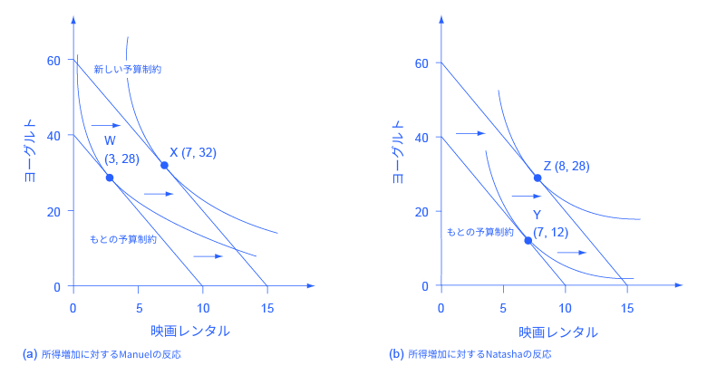
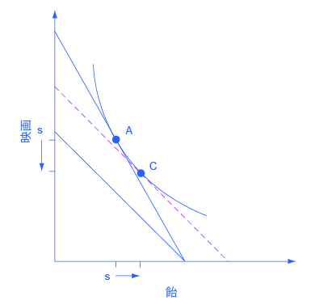

## 補論 B | 無差別曲線

経済学者は効用最大化をするという単語を用いて人々の選好を説明します。消費者選択の章では、ひとりひとりが受け取る効用の程度は数値で表されます。この付録では人の選好を説明する他の方法を紹介します。それは無差別曲線と呼ばれるものです。無差別曲線は、多くの学生や経済学者が非現実的であると感じる、効用に数値を当てはめるという仮定を用いません。このためこの無差別曲線のフレームワークは基礎となるモデルの論理の理解に役立ちます。

#### 無差別曲線とは？
人々は各々の満足度を数値で表すことが出来ません。しかしながら、どのような選択が自分をより満足させるのかを識別することは出来ます。無差別曲線は同じ満足度、効用を与える財の組み合わせを表しています。例として図B1には、Lillyさんがリラックスできる、トレードオフの関係にある2つの行動(ドーナツを食べることと文庫本を読むこと)に対するLillyさんの選好を表す３本の無差別曲線が引かれています。無差別曲線（Ul, Um, Uh）はそれぞれ、とある程度の効用を示しています。まずはその中の一つの無差別曲線の意味を学び、次に無差別曲線をグループとして把握しましょう。

  

    図B1 Lillyさんの無差別曲線
  

Lillyさんはある1つの無差別曲線上では、全ての点で同じ効用を得ます。点Fのような、最も高い位置にある無差別曲線Uh上の任意の点は、点A, B, C, Dのような、真ん中の無差別曲線Um上の任意の点よりも高い効用を与えます。同じように、真ん中の無差別曲線Um上の点はどこでも、一番低い位置にある無差別曲線Ul上のどの点よりも高い効用を与えます。

#### 無差別曲線の形状
無差別曲線Um上に点A, B, C, Dがあります。無差別曲線は等しい効用を持つ選択の集合なので、Lillyさんは彼女個人の趣向による判断で、2冊の本と120個のドーナツ(点A)、3冊の本と84個のドーナツ(点B)、11冊の本と40個のドーナツ(点C)、12冊の本と35個のドーナツ(点D)から同じ量の効用を得ます。また彼女はこの無差別曲線上の上記以外の点から同等の効用を得る可能性もあります。

無差別曲線は2つの点(1. 右下がりの曲線である点。2. 原点に対して凸型である点。)でおおよそ似たような形状を取ります。別の言い方をすると、左側ほど傾きが急で、右側に行くにつれて水平に近づく曲線です。右下がりの無差別曲線は、Lillyがある効用を保ちながら財の数を変化させるためには、ある財を減らして他の財をより多く手に入れる必要性、つまりトレードオフの関係を示しています。例えば、同じ無差別曲線Um上の点Aと点Bでは、Lillyに同じ程度の効用がもたらされます。つまり、例えばLillyが本の消費を2冊から3冊に増やす場合に得られる限界効用は、彼女がドーナツの消費を120個から84個に減らす場合に失う限界効用と等しいということであり、点Aと点Bで最終的な彼女の効用は変化しないということです。実際、無差別曲線上の傾きは限界代替率であり、ある人が、効用が同じであるように交換する財の数の比なのです。

Umの様な無差別曲線は左に向かうほど垂直に、右に向かうほど水平になります。この形状になる理由としては、限界効用逓減の法則（個人が財をより消費するほど、追加された財から得られる限界効用は減少するという概念）が挙げられます。無差別曲線Um上の異なる2点間（点AB間と点CD間）の選択を比較してみましょう。どちらの選択もLillyさんは本の消費を1つ増やします。しかし一方ドーナツの消費量は、点AB間では36個減少し、点CD間では5個しか減少しません。この違いの理由は点Aと点Cの開始点が異なり、限界効用についての異なる含意を持つためです。点Aでは、Lillyさんは少しの本と多くのドーナツを持っています。それゆえ彼女の追加の本の消費によって得られる限界効用は比較的高く、追加のドーナツの消費による限界効用は比較的低いと言えます。つまり、本から得られる限界効用を相殺するためには、比較的多くの数のドーナツが必要になります。一方で、点CではLillyさんは多くの本と少ないドーナツを持っています。この開始点では追加の本の消費によって得られる限界効用は比較的低く、追加のドーナツの消費による限界効用は高くなります。本から得られる限界効用を相殺するためには、比較的少ない数のドーナツが必要となります。要約すると、両方の財の限界効用逓減の結果として限界代替率(効用が同じとなる2つの財の数量の比率)が変化し、無差別曲線の傾きは変化するのです。

#### 複数の無差別曲線
一つ一つの無差別曲線は、ある一定量の効用を与える選択肢を表します。また、異なる効用の量に応じて異なる無差別曲線が描かれます。つまり、Lillyさんの選択について、図上に無数の無差別曲線を描くことが可能です。図B1ではそれらの無数にある無差別曲線の中から、3つのみが描かれています。本来は図上には無数の無差別曲線が存在しているということを覚えておきましょう。

より上にある無差別曲線は、より高い効用の程度を表しています。図B1では無差別曲線Ulの効用の程度は低いと考えることができ、一方で無差別曲線Uｍの効用は中程度であり、無差別曲線Uhでの効用の程度は高いと考えることができます。無差別曲線Uh上でのすべての選択は無差別曲線Uｍ上でのすべての選択よりも好まれ、また無差別曲線Uｍ上でのすべての選択は無差別曲線Ul上でのすべての選択よりも好まれます。

より上にある無差別曲線がなぜ、より好まれるのかを理解するために、無差別曲線Uｍ上の点Bと無差別曲線Uh上の点Fを比較します。点Fは本（３冊から5冊）とドーナツ（84個から100個）の両方を点Bより消費しているので、点Fは明らかに点Bより好まれます。ある無差別曲線上の点は効用の程度が同じであるという定義から、もし無差別曲線Uh上の点Fが無差別曲線Um上の点Bよりも好まれる場合、無差別曲線Um上の点B以外の点でも同様の関係が成立します。より一般的に、無差別曲線Ulのような下の方にある無差別曲線上の全ての点について、その点での2つの財の消費量よりも消費量の多い点をUmやUh上で見つけることができます。上にある無差別曲線上の点が下にある無差別曲線上の点よりも好まれ、与えられた無差別曲線上の点は同程度の効用を示すことから、上にある無差別曲線上の全ての点が下にある無差別曲線上の全ての点よりもより効用が高いと言えます。

無差別曲線の形や、効用が高いか低いかという議論は、個人による効用の数値的な推定は必要としません。それらは、人々が、効用を一定に保つ場合、1つの財の消費量を減らした場合には、その減少した効用を補うためにもう1つの財の消費量を増やす必要があるという仮定と、人々がある財をより多く消費すると、その限界効用は逓減するという仮定に基づいています。これらの仮定を用いて個人の好みを示す無差別曲線を描くことが出来ます。

#### 無差別曲線の個別性
人はそれぞれ好みや効用の度合いが異なります。無差別曲線の、右下がりであり、左端では傾きが急で右側では傾きが緩やかであるという大まかな形状は変わりませんが、その厳密な形は人によって異なります。例えば図B1はLillyさんの好みにのみ当てはまります。他の人の無差別曲線は異なる点を通ることになります。

### 無差別曲線による効用の最大化
人は効用を最大化しようとします。それはつまり、できる限り上の方の無差別曲線上の選択を行いたいたいということです。しかし人には予算制約があり、このことがどのトレードオフが選択肢として可能かを示します。

#### 最も効用の高い無差別曲線での効用最大化
本とドーナツの組み合わせにおけるLillyさんの選択を振り返ってみます。本1
冊の価格は6ドルで、ドーナツ1つの価格は50セントです。これらにLillyさんは60ドル使うことができます。これらの情報から図B2で表されるような予算制約線を描くことができます。予算制約線の周辺には図B1と同様の無差別曲線が描かれています、Lillyさんの効用を最大化する選択はどのようなものなのでしょうか？この表からいくつかの可能性が考えられます。

  

    図2 無差別曲線と予算制約
  

Lillyさんの好みは無差別曲線で示されます。Lillyさんの予算制約は、本とドーナツの価格、そして彼女の所得によって与えられ、直線で表されます。Lillyさんの最適な選択は、予算線と無差別曲線Umが接する点Bです。より高い無差別曲線であるUh上のF点などでは、Lillyさんはより高い効用を得られますが、予算線がどの点でもUhと接していないので、彼女はこの選択をすることはできません。Gのような点はLillyさんにとって選択可能ですが、無差別曲線Ul上にあり、Um上にある点Bよりも低い効用しか与えません。

5冊の本と100個のドーナツの点Fは、この図の中で最も高い無差別曲線Uh上に存在しているため、かなり望ましい選択です。しかし、与えられたLillyさんの予算制約ではその選択をする余裕がありません。無差別曲線Ul上にある3冊の本と70個のドーナツの点Hは、Lillyさんの予算制約線の内側にあり、効用最大化の観点からLillyさんは常に予算制約線上の点を選ぶため、無駄な選択といえます。BとGの選択はどちらも可能な組み合わせですが、6冊の本と48個のドーナツの点Gは、3冊の本と84個のドーナツの点Bがある無差別曲線Umよりも低い無差別曲線Ul上にあります。もしLillyさんが点Gの選択から始めてドーナツと本から得られる限界効用を考えたとすると、彼女はいくつかドーナツを追加し、本を減らすことが彼女をより幸せにすると判断し、より好ましい点Bに移動するでしょう。Lillyさんの無差別曲線によって与えられた彼女の嗜好の組み合わせと、価格と収入によって定められたLillyさんの機会集合によって、Bが彼女にとって最も効用を最大化する選択となります。

最も効用を最大化する無差別曲線は、機会集合(予算制約線)と1点で接するものです。無差別曲線は(図上に描かれる数は有限ですが)無数に存在するため、常に予算制約線と接する一つの無差別曲線が存在します。より高いUhの様な無差別曲線は予算制約線よりも上にあるため、それがより高い効用をもたらすとしても、予算を超えてしまうため選択することができません。より低いUlの様な無差別曲線は、予算制約線と二つの交点を持ちます。しかし無差別曲線が予算制約線と二つの場所で交わるとき、それとは別の、予算制約線と1点で接する、より高い効用をもたらす無差別曲線が存在します。

### 所得の変化
所得の上昇は予算制約線を右にシフトさせます。図で表すと、新たな予算制約線はより高い位置にある無差別曲線と接するため、より高い効用を得ることを表します。所得の減少は予算制約線を左にシフトさせます。この場合、予算制約線がより低い位置にある無差別曲線と接することから、効用の減少を表します。もし所得が50%増加する場合、個人は本とドーナツの消費をどのように変えるでしょうか。2つの財の消費量は50%増えるのでしょうか、それとも一つの財の消費量が大きく増加し、もう一つの財の消費量は少ししか増加しないもしくは減少するでしょうか。

個人的な趣向や無差別曲線の形はそれぞれの人で異なるので、収入の変化に対する反応も人それぞれになります。図B3(a)と図B3(b)でManuelとNatashaの趣向を例に考えてみましょう。2人は最初はそれぞれ40ドルという同じ額の収入で、それを1ドルのヨーグルトと4ドルのレンタルビデオ（映画）に使います。すなわち彼らは同一の予算制約線で選択を行います。しかし、Manuelの無差別曲線によって明らかとなる彼の趣向に基づくと、最初の予算制約において効用を最大化する選択は、彼の機会集合が最も効用の大きい無差別曲線と接する点Wで、それは3本の映画と28個のヨーグルトを消費するという選択です。一方、最初の予算設定においてNatashaの効用を最大化する選択は点Yで、7本の映画と12個のヨーグルトとなるでしょう。

  

    図B3 ManuelとNatashaの無差別曲線
  

ManuelとNatashaは最初は全く同じ予算制約線に直面しています。つまり、財の価格と収入が2人で共通しているということです。しかし、彼らの趣向を表す無差別曲線は同じではありません。(a) Manuelの最初の選択は点Wで、彼は収入の増加に対して、主に映画の消費量を増加させる形で点Xのように反応します。(b) 反対にNatashaの最初の選択である点Yで、彼女は収入の増加に対して比較的多くのヨーグルトを選ぶという形で反応します。予算制約線が同じであっても、個人的趣向は異なる選択と、異なる収入の変化をもたらします。

ManuelとNatashaの収入が60ドルに増加した時、彼らの予算制約は右にシフトします。図B3（a）を見てわかるように、新たにManuelの効用を最大化するのは点Xになり、7回の映画と32個のヨーグルトを選択します。これは、Manuelは増えた収入分のほとんどを映画に使うということです。Natashaの新しい効用最大化の選択は点Zであり、ここでは8回の映画と28個のヨーグルトを選択します。これは、彼女は増えた収入分のほとんどをヨーグルトのために使うということです。このようにそれぞれの無差別曲線によって起こりうる反応も様々です。しかしながら、2つの財がどちらも通常財であった場合、一般的に所得が増加すると(それぞれどの程度増えるかは個人の趣向によりますが)どちらの財の購入料も増えます。。もし2つの財うち1つが劣等財である場合、所得が増加するとその劣等財の購入量は減ります。

### 価格変化に対する反応：代用と収入の影響
財の価格が上昇は予算制約線を左にシフトさせます。そしてそれにより、より低い効用を示す無差別曲線と接するようになります。逆に、財の価格が下落した場合予算制約線は右にシフトし、より高い効用を示す無差別曲線に接するようになります。価格の変化がそれぞれの財の需要量に与える影響の厳密な数値は個人の好みに依存します。

価格変化に直面すると誰もが連結した２つの効果、代替効果と所得効果を経験します。代替効果とはある財の価格が高くなった時に、人々が代替物を買い求める効果です。もしオレンジがより高価になったとすると、果物好きな人はオレンジの購入量を減らし、りんごやグレープフルーツ、レーズンをより食べるようになるでしょう。逆に財が安くなったとき人々はその財をより多く消費するようになります。もしオレンジが安くなれば人々はオレンジを買い、他のフルーツや食品の購入を抑えるでしょう。所得効果とは価格の変化がどのように、各人の所得に基づく実質購買力を変えるかを指します。もし皆さんがずっと買っていた財の価格が下がれば、皆さんの購買力は上がります。つまりより多くその財を購入できるようになります。逆にもしずっと皆さんが買ってきた財の価格が上がれば、与えられた収入の中での購買力は下がります。（よく混乱してしまうことの1つに、「所得効果」は実際の収入の変化を意味しているのではないということがあります。所得効果とは、財の価格が変化することで、ある予算で購入可能な財の数量が変化することを指します。。「所得効果」でなく「購買力効果」と呼ぶほうが正解に近いのかもしれません。しかし所得効果という経済用語は数十年ほど使われてきており、この教科書では呼び方を所得効果とします。）価格が変化するとき、消費者は常に代替効果、所得効果の両方を同時に実感します。

無差別曲線を用いることで、代替と収入の影響をグラフに示すことができます。図B4では、Ogdenは散髪とピザという2つの財の選択に直面しています。散髪は20ドル、ピザは6ドルで、彼は120ドルのお金を持っています。

  

    図B4 代用と収入の影響
  

もともとの選択は、元の予算制約線と無差別曲線の接点である点Aです。そして新しい選択は、新しい予算制約線とより低い無差別曲線の接点である点Bです。点Cは、散髪の料金が値上がりした場合の傾きを示している点線と、元の無差別曲線の接点です。代替の影響は点Aから点Cへのシフトのことで、より少ない散髪とより多くのピザを消費するようになることを意味しています。所得効果は点Cから点Bへのシフトです。つまり、購買力の低下は、相対価格はそのままで無差別曲線を高い方から低い方へとシフトさせます。所得効果により、両方の財の消費量が減少します。代替効果と所得効果の影響のどちらもが、散髪の消費をより少なくします。ピザについては、この場合、代替効果と所得効果の影響が打ち消しあい、同じ量の消費に落ち着きます。

Ogdenは、より高い機会集合とより高い無差別曲線上にある点Aの選択から始めます。散髪代が30ドルに上がった場合、彼はより低い機会セットとより低い無差別曲線上の点Bを選択します。2回の散髪と10個のピザを選ぶ点Bは、3回の散髪と10個のピザを選ぶ点Aのすぐ下にあり、Ogdenは散髪の値上げに対して散髪の回数のみを減らし、ピザの消費量は変えないという反応をしたことを示しています。

図の点線と点Cは代替効果と所得効果を分けています。このような機能を理解するために次の質問について考えてみましょう。2つの財の相対価格が変化し、かつこの価格の変化が彼の効用に影響を及ばさない場合、Ogdenは消費をどのように変えるでしょうか？予算制約線の傾きは2つの財の相対価格によって決定されています。つまり、元の予算制約線の傾きは元の相対価格、新しい予算制約線の傾きは新しい相対価格によって決定されています。図中の点線は新しい予算制約線と平行に挿入され、新たな相対価格を反映しますが元の無差別曲線接しています。これは、元の効用との比較を理解しやすくするためのものです。

元の点Aの選択から点Cへの動きは代替効果です。これは（元の予算制約線と点線の傾きの変化が示すように）相対価格がシフトし、かつ（元の無差別曲線に接するように）購買力は変化しなかった場合にOgdenが行う選択を示しています。代替効果は相対的に高価になった財（Ogdenの場合は縦軸の散髪代）から相対的に安価になった財（Ogdenの場合は横軸のピザ代）に代替することを促進します。縦軸、横軸それぞれに1つずつある「s」とつけられた「代替効果」を表す2つの矢印はこの動きの方向を示しています。

所得効果は点Cから点Bへの動きです。これは相対価格が一定のとき、購買力が減少した場合(図中の破線と新しい予算制約線の傾きは同じ場合)のOgdenの反応を示しています。(もし2つの財が通常財である場合、)ある財の価格が上昇すると、購買力が減少するので、この場合の所得効果は2つの財の消費量が減ることを意味します。それぞれの軸に示されている「i」の横にある2つの矢印は所得効果の動きの方向を示しています。

次に、代替効果と所得効果を組み合わせましょう。ピザの価格が上がった時、Odgenは図の説明で示される2つの理由からピザの消費量を減らしました。それはつまり、値上げの代替効果は彼のその財の消費量の減少を導き、値上げの所得効果もまた消費量の減少をもたらしました。しかし、ピザの価格が上がった時、Odgenが散髪する頻度は同じでした。ピザの値上げの代替効果は、散髪が相対的に安価になることを意味し、この要因単体ではOgdenがより多くの散髪を消費することを促進します。しかし、ピザの値上げによる所得効果は両方の財の消費量を減らすことを促進し、この要因単体ではOgdenは散髪の回数を減らすことを促進します。図B4で示されるように、今回の例において、Odgenの散髪への消費における代替効果と所得効果は相殺されます。そのため最終的にピザの価格が上がった時、以前と同じ回数だけ散髪します。 

こういった所得効果や代替効果は、その人の個人的嗜好によって異なります。例えば、もしもOgdenがピザから散髪に消費を切り替える代替効果が非常に強く、所得効果を上回る場合、ピザの価格増加に伴って散髪に行く頻度が増加するでしょう。このときの状態が図に描かれるとしたら、新しい予算制約と無差別曲線の接点は点Bの右下にあるでしょう。逆に、もしもピザから散髪への代替効果がそこまで強くなく、所得効果が相対的に強かった場合、Ogdenは、ピザ価格の上昇に対して両財の消費を減らすことで対応するでしょう。この場合、価格変化後における彼の最適な消費選択は、新しい予算制約上のB点より左上にあるでしょう。

代替効果と所得効果は、しばしば様々な現象の羅列として議論されますが、これら２つの現象は、価格変化という1つの原因から生じているという事を忘れないようにしましょう。これら2つを別々に分析することも可能ですが、2つの効果は常に同時に起こっており、決して切り離すこはできません。

### 労働と余暇及び異時点間の選択における無差別曲線
無差別曲線の概念は家計（世帯）の労働と余暇との間の選択や現在と将来の間における異時点間の選択におけるトレードオフに適応できます。労働と余暇のトレードオフの選択においては、それぞれの無差別曲線は、あるレベルの効用をもたらす収入と余暇の組み合わせを表します。異時点間の選択においては、それぞれの無差別曲線はあるレベルの効用をもたらす現在と将来の消費の組み合わせを表します。この場合も無差別曲線の、右下がりで、右に行くにつれて横軸と平行になる形をしているという一般的な形状は維持されます。

#### 労働と余暇の例
Petuniaの時給は12ドルでしたが、20ドルに上がる事になりました。家事や睡眠時間を考慮すると、彼女は週当たりに労働や余暇のために80時間費やす事ができます。図B5に描かれているように、彼女のもとの予算制約上では、Petuniaが最大の効用を得られるのは点Aです。点Aで予算制約線は、より低い無差別曲線（Ul）に接しています。点A上では、週当たり余暇に30時間費やし、労働に50時間費やします。そうすると、収入は週当たり600ドル得られます。上記の通り、Petuniaの時給は20ドルに上がります。それによって、彼女の予算制約は右にシフトします。効用を最大化する彼女の新しい選択は、より高い位置にある無差別曲線（Uh）に新しい予算制約線が接する点Bとして描かれています。点Bでは、Petuniaは週当たりそれぞれ40時間を余暇と労働に費やします。その際、収入は週当たり800ドルになります。

  

    図B5 Petuniaの賃金の変化
  

Petuniaの最初の選択は点Aであり、もとの予算制約線とより低い無差別曲線（Ul）の接点です。賃金の増加によって予算制約は右にシフトし、彼女は新しい無差別曲線（Uh）との接点の点Bを選択をします。代替効果は点Aから点Cへの移動として表されます。この場合、代替効果によってPetuniaは、相対的に高くなった余暇に費やす時間を減らし、労働時間を増やして相対的に得やすくなった収入を増やします。所得効果はC点からB点への移動として表されます。この例では、所得効果によって両財の消費が促進されます。この例では、代替効果と所得効果の両方によって収入が増加します。しかし余暇は代替効果によって減少し、所得効果によって増加します。最終的に、Petuniaの場合はより多くの余暇に時間を費やすようになります。

代替効果と所得効果を考えることで、Petuniaがどのように賃金上昇に反応するのか議論することができます。点線を描く事によって、２つの効果を分けて考えることができます。

代替効果は、収入が比較的得やすく余暇が比較的高価であるように賃金が上がり、かつ同じレベルの効用を保つ場合にPetuniaがどのように労働時間を変化させるかを示します。労働と余暇における予算制約線の傾きは賃金水準によって決定されます。そのため、破線は新しい賃金水準での労働と余暇のトレードオフを反映させる形で新しい予算制約線と同じ傾きを保ちつつ、元の効用のレベル、あるいは「購買力」を示す形で無差別曲線に接するように描かれます。元々の点Aから点Cへの移動（元々の無差別曲線と破線の間の接点）はより高い賃金によってPetuniaが余暇の時間の消費を減らし、労働時間を増やす選択を取ることを表します。図B5の「s」の矢印は余暇と所得における代替効果を示しています。

所得効果は、(図上では労働と余暇の予算制約線を右側にシフトさせる形で表される)賃金の上昇はPetuniaがより高いレベルの効用を得ることが可能となることを表します。所得効果は点Cから点Bへの移動で、(図上では破線が新しい予算制約線と平行であることで表されるように、)賃金が変化しない場合にPetuniaがより高い効用あるいは「購買力」に対してどのように行動を変化させるかを示しています。Petuniaがより余暇と所得を増やすよう促す所得効果は、図5の水平軸と垂直軸における矢印「i」で描かれています。

二つの効果を合わせて考えると、Petuniaさんは高賃金に対して点Aから点Bの選択に変えるという反応をします。この反応はより収入を多くすることになります。その理由は２つの理由から説明できます。１つ目の理由は高賃金の代替効果により収入を得ることが相対的に得やすくなったから、２つ目の理由は高賃金の所得効果がより多くの収入と余暇を得ることを可能にするからです。彼女の点Aから点Bへ移る反応は、余暇をより多くすることを促す所得効果が、より少ない余暇を促す代替効果より強いというPetuniaさんの選好によるものです。

図B5はあくまでPetuniaさんの選好を表しています。他の人はおそらく違う選択をするでしょう。例えば余暇に対する代替効果と所得効果が完全に釣り合っている人は、高賃金に対して元の選択の点Aの垂直上方向に位置する点Dのような選択をするかもしれません。その選択は高賃金の恩恵のすべてを、これまでと同じ時間働くことによって収入の形で受け取るということを意味します。しかし余暇に対する代替効果が所得効果を上回っているまた別の人は、高賃金に対して点Fのような選択をするかもしれません。この選択では高賃金に対してより多くの時間働き、より多くの収入を得てるという反応を示しています。これらの異なる選好を考慮して、新しい予算制約線上の点Bでなく、点Dや点Fにそれぞれ接する別の無差別曲線Uhを描くことができます。

### 異時点間選択の例

Questinは10,000ドルの貯金があります。彼はこれらの全て又は一部を今回の休暇で使うか5年後のもう一つの大きな休暇のために貯金するか考えています。今後5年間で彼は利子による収益率が80％になることを予想しています。グラフB6ではQuestinの現在の消費と将来の消費における予算制約線と無差別曲線を示しています。Questnがもとの異時点間の予算成約で得られる最も高い効用は点Aです。点Aは、6,000ドルを消費し4,000ドルを将来のために貯金するという選択で、この選択によって将来的に利子により貯金額が7,200ドルになることが予想されます。（4,000ドルの個人貯蓄に80％の利子がついて返還されるため）。

しかしながら、Questinは彼が期待していた利子率が非現実的に高いことに気づきました。彼はこの5年間で利子収益30％を得るというのがより現実的な予測でしょう。これにより、彼の予算制約線は左にシフトし元々の最大効用を得られる選択は不可能となってしまいました。Questinは利子収益が低くなったことで貯金に回す額を変えるのでしょうか？ここでもまた代替効果と所得効果は様々な選択の裏にある動機を考えるためのフレームワークを提供します。代替効果と所得効果を分離するためのツールである点線は、新たな利子率を反映させる形で新たな機会集合と同じ傾きを保ちつつ、効用あるいは「購買力」に変化がないことを反映させる形でもとの無差別曲線と接するように描かれます。

代替効果は、Quentinがどのように消費を変えるはずだったかを示します。この場合利子率が低いことで将来の消費が相対的により高価なものとなり、現在の消費が相対的に安価となる場合の消費の変化です。元の選択肢である点Aから点Cへの移動は、効用を変化させない場合、Quentinが低い利子率に対してより現在の消費を増やし、将来の消費を減らすことを示しています。図B6の縦軸と横軸にある「s」の矢印は代替効果の方向を示しています。代替効果は、Quentinは低い利益率を理由に現在より多くのお金を消費し、将来より少ないお金を消費するだろうことを示唆します。

Quentinは所得効果によっても動機づけられています。低い利子率が予算制約線を左側へとシフトさせることはQuentinの効用もしくは購買力が減少したことを意味します。所得効果は（正常財の場合）現在と未来の両方の消費の減少を促します。この例における、現在と未来の消費を減少させる所得効果の影響は図B6の横軸と縦軸の矢印「i」で表されます。

  

    図B6 無差別曲線と異時点間の予算制約線
  

最初の選択は点Aで、最初の予算制約線と最初の無差別曲線Uhとの接点です。破線は新たな予算設定に平行に引かれています。その傾きは低い収益率を反映し、最初の無差別曲線に接しています。点Aから点Cへの移動は代替効果を表します。この場合は、未来の消費が比較的高額になり、現在の消費が比較的低額になります。所得効果は点Cから点Bへの移動です。すなわちそれは相対価格が同じ場合の、効用もしくは購買力の減少であり、より低い無差別曲線Ulへの移動を引き起こします。つまり現在の消費も未来の消費も減るということです。点Aから点Bへの移動では、現在の消費において代替効果が所得効果よりも大きいため、結果的に現在の消費がより多くなります。より低い無差別曲線は、個人の趣向によっては、より低い予算制約線上に点Dあるいは点Fで接する可能性があることに注意しましょう。

両方の効果を考慮すると、現在の消費が相対的に安価であるため代替効果はQuentinを将来の消費よりも現在の消費へと向かわせ一方で、低い利子率は彼をより低いレベルの効用へと向かわせるため所得効果は、現在の消費と将来の消費どちらも減らそうとします。Quentin個人の選好にとって代替効果がより強いため、彼は現在の消費を増やし、貯蓄を減らした点Bを選びます。しかしながら、他の人は異なる選好を持つかもしれません。彼らは利子率の低下に対して点Dのように、以前と同じ消費と貯蓄を選んだり、点Fのように消費を減らして貯蓄を増やすかもしれません。これらの他の選好の集合にとって、現在の消費に対する所得効果の影響が比較的強く、代替効果が比較的弱いことが分かります。

### 代替効果・所得効果の描き方
無差別曲線はあるレベルの効用を提供するすべての選択肢を分析するツールです。それらは効用を数字で表す必要を無くし、効用最大化の過程を明らかにすることを助けます。無差別曲線はまた、価格や賃金、報酬の変化に対する反応等により生じる補完的な動機のより詳細な分析のための基礎を提供します。それらは特に代替効果・所得効果です。

代替効果・所得効果を示す図を描く際に接線の点をきれいに描くのを難しく感じている場合は、この手順に従って描くと良いでしょう。

ステップ1. まずは二つの財の予算制約線を描きましょう。今回の例では２つの財を飴と映画にします。元の選択となる点Aを選びましょう。点Aは無差別曲線に接することになりますが、まだ無差別曲線を引かない方が図は簡単に描けます。図B7を見てみましょう。

  

    
  

ステップ2.映画の値段が変わったとします。今回の例では値上げしたとしましょう。値上げにより予算制約線は内側にシフトします。高い価格はより低い効用の無差別曲線に表される低い効用レベルの選択を強います。この段階では新しい予算制約線を引くだけにとどめましょう。図B8を見てみましょう。

  

    
  

ステップ3. 代替効果と収入効果を区別するカギとなるのは、新しい予算制約線に平行な破線を引くことです。この破線は次の２つの変化を区別するのに役立ちます。変化(1)：効用のレベルが保たれると仮定したときの、価格変化による２つの財の消費への影響(=代替効果)。変化(2):２つの財の相対価格が保たれると仮定したときの、ある無差別曲線から別の無差別曲線へのシフトによる２つの財の消費への影響(=収入効果)。このステップで破線を引きます。分かりやすい図にするための秘訣は破線を元の選択の点Aの近くを通るように引くことです。図B9を見てみましょう。

  

    
  

ステップ4. もとの予算制約線上の点Aと破線上の点Cと接するようにもとの無差別曲線を描きましょう。多くの生徒はもとの無差別曲線が点線と接する点Cの場所をまず決め、もとの無差別曲線を点Aと点Cを通るように描くのを簡単に感じるようです。代替効果は点Aから点Cへの、価格が変化するものの効用が一定の、もとの無差別曲線上の動きとして描かれます。予想通り、代替効果は相対的に高い財の消費量を減少させ、相対的に安い財の消費量を増加させます。これは縦軸と横軸の「s」の矢印で表されています。図B10を見てみましょう。

  

    
  

ステップ5. 代替効果が描けたので、次に効用が最大となる点Bを描く位置を予算制約線上に描きましょう。点Bを描く時、代替効果と所得効果のどちらが横軸の財(この場合は飴)により大きな影響を与えるかを考えましょう。もし点Bが点Aのちょうど真下にくる場合、その時は所得効果が横軸の代替効果をちょうど打ち消しています。もしあなたが点Bを最初の点Aの少し右斜め下に描くとすると、その時は代替効果が所得効果を上回っています。点Bを点Aの左にくるように書く場合、所得効果が代替効果を上回ることを表します。点Cから点Bへの動きが所得効果で、相対的な価格を保った状態で購買力と2つの財の間での効用のレベルの変化の結果により選択がどう変化するかを示します。正常財では、縦軸と横軸の矢印「i」で表されるように負の所得効果はそれぞれの財の消費を減らすことを意味します。図B11を見てみましょう。

  

    
  

代替効果と所得効果の図を描く時、以下のいくつかのパターンを描いてみましょう。(1)価格が下落するパターン。(2)価格の変化が横軸または縦軸の財に影響を及ぼすパターン。(3)代替効果が所得効果を上回っている、または所得効果が代替効果を上回っている、または所得効果と代替効果が等しいパターン。

最後に一点、元の無差別曲線と接していて、かつ新しい予算制約線と並行である破線を引くのではなく、新しい無差別曲線と接していて、かつ元の予算制約線と並行である破線を引くことも可能です。今回とは逆に映画の値段が下がる仮定で、逆の手順をたどっていき、代替効果と所得効果を図に表すアプローチです。幾人かの生徒はこのアプローチをより直観的に明確に理解できるでしょう。このアプローチでも代替効果と収入効果の方向と相対的な大きさが等しくなったという結果が得られるはずです。

### 重要な概念とまとめ
予算制約線上の無差別曲線は、２つの財のトレードオフを示しています。1つの無差別曲線上の任意の点は同じ効用レベルを表します。より高い位置にある無差別曲線はより高い効用のレベルを表します。もし無差別曲線上の効用を同じに保とうとすると、垂直軸の財の量の減少は、平行軸の財の量の上昇によって打ち消されなければならないため、無差別曲線の傾きは負になります。。限界効用逓減の法則に従い、無差別曲線の傾きは左端では急になり右側では平らになります。

予算制約内の効用が最大となる選択は、予算制約線が無差別曲線と1点で接する接点です。すべての財の価格変化は代替効果と収入効果の2つの影響を及ぼします。代替効果は、相対的に高い財を少なく、相対的に安い財を多く購買することによって効用を最大化する効果。所得効果は（両方の財が正常財である条件で）効用が上がるなら両方の財をより多く、効用が下がるならば両方の財をより少なく購買することによって効用を最大化する効果です。

労働と余暇の間の選択の場合、賃金の変化は全て代替効果と所得効果があります。賃金の上昇による代替効果は、比較的得やすくなった収入を増やし、比較的高価になった余暇を減らす効果です。賃金の上昇による所得効果は、どちらも正常財であるため余暇と所得の両方を増やす効果です。賃金の減少の代替効果と所得効果は逆の方向の影響をもたらします。

異時点間の消費選択では、いずれの利子率でも代替効果と所得効果を持ちます。利子率の上昇は、現在の消費の機会費用が、将来あきらめることになる消費に対して増加したため、将来の消費を増やし、現在の消費を減らすことが安上がりとなり、代替効果は将来の消費を増やす効果があります。利子率の上昇による所得効果は、いずれも正常財であるため現在と将来の消費の両方を増やします。利子率の低下による代替効果と所得効果は逆の効果をもたらします。

### 復習問題
Exercise B1 無差別曲線のどの点が望ましい選択でしょうか？
Exercise B2 無差別曲線はなぜ右下がりなのでしょうか？
Exercise B3 無差別曲線はなぜ左端の傾きは急で、右端の傾きは平たいのでしょうか？
Exercise B4 ある人が持つ無差別曲線はいくつあるでしょうか？
Exercise B5 無差別曲線が示す効用の高さはどのように区別することができるでしょうか？
Exercise B6 代替効果とは何でしょうか？
Exercise B7 所得効果とは何でしょうか？
Exercise B8 「所得効果」は所得の変化と関係するでしょうか？
Exercise B9 価格の変化は所得効果と代替効果のどちらもあるでしょうか？所得の変化は所得効果と代替効果のどちらもあるでしょうか？
Exercise B10 所得効果のみ、あるいは代替効果のみが見られる場合はあるでしょうか？
Exercise B11 所得効果と代替効果、どちらがより大きな影響を及ぼすでしょうか？

### 代替効果と所得効果についての補足
代替効果と所得効果は、スルツキー分解という操作の結果によって得られます。下のリンクにて、スルツキー分解について、ミクロ経済学における数理モデルの考え方を軽く紹介しつつ解説しています。
[補足：スルツキー分解の解説](https://docs.google.com/document/d/1pbN2OjeMlKvLsffeKFpTuPTr1jAiOCtq_MGMYTD0uBE/edit?usp=sharing)

### 翻訳者
岩月龍平
 川崎心
 関口翠
 豊倉幹人
 長岡佑治
 松島耕太
 丸山知紗
 吉田正恵