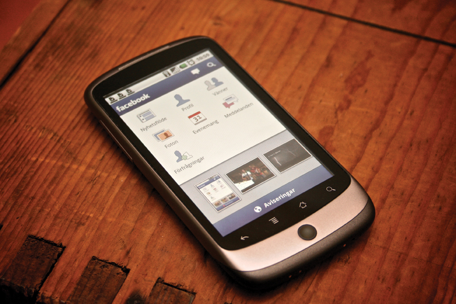

# 第1章 経済学の世界へようこそ

    図 1.1 Facebookは使いますか？経済学は情報がどれだけ上手く伝達されるかに大きく影響されます。今日ではTwitter、Facebook、Instagramといった大規模なソーシャルメディアは情報伝達の主力です。(Credit: Johan Larsson/Flickr)

    <h2>
        身の回りの経済学
    </h2>
    <h3>
        判断... ソーシャルメディアの時代の判断
    </h3>
    

        SNSに投稿するか投稿しないか。私たちは日々数々の判断をしています。朝ごはんに何を食べるか、どの授業を受けるかということから、「ダブルディグリーのために教育期間を1学期延長するか。」といったより複雑なこともあります。それらの選択にどう対処するかは、そのとき私たちの手元にある情報に依存します。完璧な判断を行うための情報が手元にあることはほとんどなく、経済学者はこの状態を「不完全」であると言いいます。完全な情報が手元にない中、私たちは一日の中で数百という判断を行っています。
    

    

        私たちはソーシャルメディアと呼ばれる、情報を集めるための新たな手段を持っています。FacebookやTwitterは、どのように時間を使うか、どの映画を見るか、どの商品を買うかといった私たちの選択に影響を及ぼしています。受験する大学を選ぶときにその大学のFacebookやTwitterを確認した人も多いのではないでしょうか。
    

    

        このコースでは、経済学では情報がどれだけ上手くそして早く広まるかに影響を受けるかということを学びます。News Corp Australiaの経済関連記事の編集を行っているJessica Irvineは、「経済学者は、完全情報のもとで機能している、深くて流動的な市場が大好きだ」と言います。
    

    

        この言葉は、判断を行う、情報を処理する、市場での人々の行動を理解する経済学の世界というこの章のトピックへとつながります。この本のすべての章ではまず、現在の、あるいは過去の出来事について話します。そして学んだコンセプトを身の回りのことに当てはめて理解するためにその章の最後で再度その出来事について確認します。
    

## はじめに
この章では以下の内容を学びます：
* 経済学とは何で、なぜ重要なのか
* ミクロ経済学とマクロ経済学について
* 経済学者がどのように仮説やモデルを使って経済学的な課題を理解するのか
* 経済はどのように整理できるか：経済システムの概要

経済学とは何で、なぜ時間を費やして学ぶ必要があるのでしょうか。経済学を勉強する時間を他の科目の勉強に使うことも可能なはずです。先程の「身の回りの経済学」でも述べたとおり、経済学者は人々がどのような選択を行うかを研究しています。そして、みなさんがこのコースを受けるかどうか、というのがまさに経済学的な判断なのです。

経済学はみなさんがイメージしているものとはきっと異なるでしょう。経済学は、お金や財務、ビジネスについての学問でも、数学でもありません。経済学は学問の領域であると同時に世界を観察するための1つの視点なのです。

[1.1 経済学とは何で、なぜ重要なのか](1-1-What-Is-Economics-and-Why-Is-It-Important)