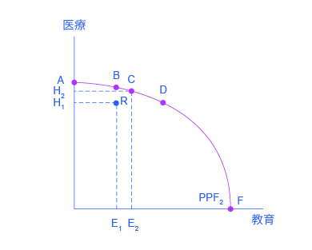
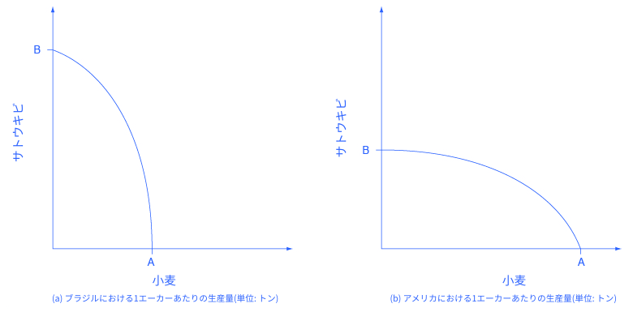

## 2.2 生産可能性フロンティアと社会の選択

この節の最後には、以下のことができるようになります。

* 生産可能性フロンティアグラフの解釈をする
* 予算制約と生産可能性フロンティアの比較をする
* 生産可能性フロンティアと収穫逓減の法則の関係性についての説明をする
* 生産効率性と配分効率性について解釈する
* 比較優位を定義する

ちょうど個人が欲しいものすべてを手に入れることができず、代わりに選択をしなければならないように、社会全体としてもすべてを手に入れることはできません。この章のセクションでは社会が直面する制限を、**生産可能性フロンティア**(Production Possibilities Frontier = PPF)と呼ばれるモデルを使って説明します。個人が為す選択と社会が為すそれは、相違点よりも、より多くの共通点があります。このセクションを読むときは、共通点に着目してみましょう。

いかなる時も、社会は限られた資源（例えば、労働力、資本、生産資材）しか持たないため、生産できる財やサービスの総量にも制限があります。ある社会が医療と教育の二つの製品を欲しいと仮定します。生産可能性フロンティアはこの図のようになります。

    

        図2.3 医療対教育の生産可能性フロンティアこの生産可能性フロンティアは医療に社会の資源を充てることと、教育にそれを充てることの間の折り合い（取引）を示しています。点Ａでは、すべての資源は医療に充てられ、点Ｂでは、ほとんどが医療に充てられます。点Ｄでは、ほとんどの資源は教育に充てられて、点Ｆでは、すべて教育に充てられます。
    

図2.3は縦軸が医療、横軸が教育を示しています。もし社会が全ての資源を医療に割り当てたとしたら、投資は点Aで行われることになります。しかしこれでは、教育を行うための資源は全くありません。もし全ての資源が教育に割り当てられた場合は、点Fになります。一方で、社会はこの生産可能性フロンティアの中で医療と教育の組み合わせを選ぶことができます。事実、生産可能性フロンティアはアルフォンソさんの予算制約と同じ役割を果たしています。社会は2つの要素に関してPPFライン上、またはライン内のどの組み合わせでも選ぶことができるのです。しかしながら、PPF外の生産を行うだけの資源はありません。

最も重要なことは、生産可能性フロンティアは医療と教育の間のトレードオフを明確に示しているということです。社会が点Bでの活動を選択し、そして同時により多くの教育を生み出そうとしているとしましょう。PPFは左から右に向かって下り坂になっているため、社会が教育を増やすためには医療の一部をあきらめなければなりません。これが、社会が直面するトレードオフです。点Bから点Cに移動したとしましょう。追加された教育に対する機会費用は何でしょうか。ここでの機会費用は、社会がやめなければならない医療です。アルフォンソさんの予算制約と同様に、生産可能性フロンティアにおける下り坂は機会費用を表しています。ここであなたは「このPPFは予算制約のようじゃないか」と言うかもしれません。もしそうでしたら、Clear It Upをご一読ください。

    <h3>
        予算制約と生産可能性フロンティア（PPF）の違いは何か？
    </h3>
    

        予算制約と生産可能性フロンティアには主に2つの違いがあります。一つ目は予算制約線は直線であるということです。これらの傾きは一人の消費者による二つの財の価格の比較によって求められるため、固定的であり変化しません。対照的に生産可能性フロンティアは収穫逓減の法則によって曲線を描きます。それゆえ傾きは曲線の様々な点で異なります。二つ目の違いは生産可能性フロンティアの軸は、特定の数値を持たないということです。私たちはこれらの想像上の経済についての正確な資源の量を把握できませんし、どれほどの資源を医療や教育に用いることができるかを知らないため、フロンティアに特定の数値は入りません。もしこれが現実の例であれば、それらのデータは利用可能です。
    

    

        私たちが特定の数値を用いることができるかどうかにかかわらず、概念上では私たちは上記の生産可能性フロンティアにおいて、教育への社会的費用の追加（点Bから点Cへの移動）によってその機会費用を測ることができます。私たちは点B、Cの水平距離によって教育費用の追加を測ります。またそれによって失った医療への費用は点B、Cの垂直距離になります。点B、C間の傾きは（おおよそ）垂直距離分の水平距離です。この傾きが教育への追加的費用による機会費用です。
    

### PPF(生産可能性フロンティア)と機会費用逓増の法則

予算制約についてはこの章の最初に説明をしました。個人の選択は消費する財の量によるので、予算制約線は全て直線になります。この線が直線である理由は予算制約の中で消費するときに二つの財の相対価格によって予算制約線の傾きが決定するためです。しかし、医療と教育への生産可能性フロンティアを書くと曲線になります。なぜ生産可能性フロンティアは異なる形なのでしょうか？

なぜ生産可能性フロンティアが曲線なのかを理解するために、生産可能性フロンティアの左端の頂点Ａについて考えていきます。点Ａでは、全ての利用可能な資源を医療に充て、教育には一切充てません。このような状況は極端であり、おかしいです。例えば、子供たちが病気であろうとなかろうと毎日医者に会い、学校には全く出席しないような状況です。人々がすべての身体の部位に美容外科を施しているのに、高校や大学の教育を受けていないようなものです。このような資源が医療から教育に転換されたことを想定すると経済は点Ａの代わりに点Ｂの位置になります。いくつかの資源がＡからＢに転換することによって相対的に医療に向けられていたものが縮小します。なぜなら、最後の少しの限界費用を医療に向けたとしても、追加的な効用はあまり得られないからです。しかし、完璧に点Ａで資源がない状態で極めて少ない費用を教育に向けた場合、効用は比較的大きなものになります。このような理由から、生産可能性フロンティアの点Ａから点Ｂの形状は比較的平らで、医療の低下は比較的小さく、教育の効用の増加は比較的大きくなっています。

次に、生産可能性フロンティアの右下の部分について考えてみましょう。社会が今点D（ほとんど全ての資源を教育のために使い、ほんの少しの資源を医療のために使っている状態）を選択していて、点F（全ての資源を教育に使い、医療のためには使わない状態）に移ろうとしていると想像してください。話を具体的にするために、点Dから点F点へ移るとき、最後の医者が高校の科学の先生にならければいけなかったり、最後の看護師がワクチン等を打つよりも、学校の図書館員にならなければといけなかったり、最後の集中治療室が幼稚園にならなければいけなかったりする状況を想像してください。そういった最後の資源をほんの少し追加して得られる教育の向上は非常に小さいものです。しかしながら、医療に対して失われる機会費用は非常に大きく、それゆえ、点Dから点Fに移ると、PPFの傾きは急になります。これが意味するところは、医療が大きく減少した一方で教育はほんの少ししか増加しなかったということです。

以上で学べることは、社会がA点上のように教育に資源を投入しなかったり、F点上のように医療に資源を投入しなかったりするような極端な選択がされる可能性があるということではありません。ほんの少しの資源を追加的に教育に投入することによって得られる教育の変化量は、すでにどの程度支払われたかに依存するということです。現在ごくわずかな資源が教育のために投入されているとしたら、使用される資源が増加することによって相対的に大きな変化量が得られます。しかし一方で、すでに大量の資源が教育のために投入されているとしたら、資源を教育に追加することによって得られる変化量は相対的に小さくなります。

このパターンは頻繁に見られるものであり、経済学者は**機会費用逓増の法則**と名付けました。機会費用逓増の法則とは、財あるいはサービスの生産が増加すると、それを作り出すための限界機会費用も増加することを示しています。これは、ある資源が、特定の財やサービスを生み出すのにより適しているために起こります。例えば、政府がある量の資源を、犯罪を減らすことに費やすとき、犯罪を減らすための最初の機会費用の増加量は比較的小さいかもしれません。しかしながら、さらに資源の投入量を増やすことによって、犯罪を減らすための機会費用は通常、比較的大きな増加となります。そして、犯罪が一切発生しないように、警察と警備に費用を割くことは、ものすごく高い機会費用となります。

図の左上においては医療に投資することによる機会費用は大きいですが、左から右に移動するにつれ次第にそれは小さくなります。ゆえに、PPFの傾斜は垂直軸の切片の近くで比較的平らです。逆に、図の右下においては教育に投資することによる機会費用は大きいですが、右から左に移動するにつれ次第にそれは小さくなります。ゆえに、PPFの傾斜は、水平軸切片の近くで比較的急になります。このように、機会費用逓増の法則は、生産可能性フロンティアを外側に曲がった形にします。

### 生産効率性と配分効率性
経済学の研究は社会に、生産可能性フロンティアに沿ってどんな選択をすべきかということを目的としているわけではありません。民主主義政府と市場志向型の経済において、選択は個人・会社・政府の判断が混ざりあったものとなります。しかし、経済学はある選択が他に比べて明らかによいということを指摘することは可能です。この見解は効率性という概念に基づいています。日常的な用法として、効率性とは無駄がないことを意味します。非効率的な機械は高いコストで稼働し、一方で効率的な機械は低いコストで稼働します。それは効率的な機械はエネルギーや資材の無駄な消費がないからです。非効率な組織は締切の先延ばしや高いコストで営業をし、一方で効率的な組織は予算に沿って、スケジュール通りにこなします。

生産可能性フロンティアは生産効率性と配分効率性の二種類の効率性を説明することができます。 図2.4はこの考えを医療と教育の間の生産可能性フロンティアを用いて説明しています。

    

        図 2.4 生産と配分の効率性生産効率性とは他の財生産量を減らすことなく、ある財をさらに生み出すことはできないことを意味しています。そのため、点B,C,Dのように生産可能性フロンティア上に示された全ての選択は高い生産効率性を表しており、点Rはそれよりも低い生産効率性を表します。配分効率性は、生産される財の特定の組み合わせが社会が所望する配分を表すことを意味しています。生産される財の特定の組み合わせというのは、生産可能性フロンティア上に存在する点のことです。
    

**生産効率性**とは、利用可能な資源と技術を用いる前提で、ある財の生産数量を減少させずにもう片方の財の生産量を増加させることは不可能であることを言います。PPF上の点A, B, C, D, Fはいずれも生産効率性を示しています。ある主体がこれら一つの選択肢からもう一方の選択肢に移る場合、医療が増加して教育が減少する、あるいはその逆が起こります。ただし、生産可能性フロンティア内の選択肢は、片方あるいは両方の財の生産量を増加させることが可能であるため生産は非効率で、無駄であるといえます。

例えば点Rでの生産は非効率で、点Cにおいてより多くの両方の財を得ることができます。点Cでは点Rよりも横軸の教育も大きく(E2はE1より大きい)、縦軸の医療も大きい(H2はH1よりも大きい)のです。

生産可能性フロンティア上の医療と教育の組み合わせを、原点からの直線として表すことができます。医療が多い(つまり教育が少ない)場合の組み合はより垂直に近い直線となり、教育が多い(つまり医療が少ない)場合の組み合わせはより水平に近い直線になります。

**配分効率性**は、社会が生産可能性フロンティア上で生産する財やサービスの特定の組み合わせが、社会が最も求めているものであるということです。社会が求めているものをどう特定するかは物議を醸す問題で、現在政治学、社会学、哲学、経済学において議論されています。配分効率性の基本的な意味は、消費者が求める数量を生産者が生産する、ということです。生産効率の高い一つの選択のみが社会全体において配分効率の高い選択となります。

### なぜ社会は選択しなければならないのか

第1章で、私たちは全ての社会が希少性の問題に直面していること、限りある資源が無際限のニーズとウォンツと衝突していることを学びました。生産可能性曲線はこのジレンマに関わる選択をよく表しています。

全ての経済において、全ての財の消費を拡大することができる状況は2つ存在します。1つ目の状況は、社会が資源を非効率的に使いつづけてきたことを発見した場合です。この状況では、生産効率フロンティアに基づいて効率と生産を向上させることによって、その社会はすべて、あるいは一部の財をより多く持つことができます。2つ目の状況は、数年間にわたって資源の量(例えば労働力や資本)が増加し、経済が成長する場合です。資源が増加すると、社会においける生産可能性フロンティアは外側へシフトし、社会は全ての財をより多く手に入れられるでしょう。

しかし生産効率の向上はその発見と取り組みに時間がかかり、経済成長は徐々にしか起こりません。それゆえに社会は現在におけるトレードオフの中で選択しなければならないのです。政府においてこの過程はしばしば、どこに追加費用を費やすのが最も多くの財を生み出せるか、どこの費用を減少させるのが最もリスクが少ないか、についてを明らかにするという困難を伴います。個人と企業において、市場経済が、人々が求める数量、質、価格に基づいて企業が財やサービスを生産するように調整を行います。しかし政府においても、短期的な市場経済においても、1つの財の生産量の増加は基本的に、経済の他のどこかの財の減少と相殺することを意味します。

### PPFと比較優位

あらゆる社会ではそれぞれの財やサービスがどのくらい生産されるべきかを選択する必要があります。消費する財の1つ1つをすべて生産する必要はありません。しばしば、国がある財をどのくらい生産するのかを決める際、その財を生産するのにかかるコストと他の国から買うコストの比較が影響を及ぼします。これまでのことから分かるように、ある国のPPFの屈曲率は、ある財を生産するための資源投資と別の財への資源投資との間のトレードオフに関する情報をあらわします。特に、その傾きはx軸の財をy軸の別の財よりも1単位多く生産する機会費用をあらわします。特定の財を生産する際の機会費用はそれぞれの国によって異なることが多いです。なぜならそれぞれの国で気候や地形、テクノロジー（科学技術）やスキル（技能）が異なるからです。

アメリカとブラジルという2つの国において、サトウキビと小麦という2つの植物をどのくらい生産するべきかを判断する必要があるとします。。気候条件の影響でブラジルは1エーカーあたりかなり多くのサトウキビを生産することができますが、小麦の1エーカーあたりの生産量はそこまで多くありません。反対にアメリカは1エーカーあたり非常に多くの小麦を生産することができますが、サトウキビの1エーカーあたりの生産量はそこまで多くはありません。明らかに、ブラジルは（小麦に対する）サトウキビの生産においてはアメリカよりも低い機会費用を有しています。逆もまたそうで、アメリカは小麦の生産においてはブラジルよりも低い機会費用を有しています。図の2.5では2つの国のPPFによってこれが示されています。

    

        図 2.5 アメリカとブラジルの生産可能性フロンティアアメリカの生産可能性フロンティアはブラジルのものよりも平坦です。これはサトウキビに対する小麦の機会費用がアメリカの方がブラジルよりも低いことを示しています。逆にサトウキビの機会費用はブラジルの方が低いです。アメリカは小麦、ブラジルはサトウキビにおいて比較優位を持っています。
    

ある国がある財を他の国よりも低い機会費用で生産することがてきることを、ある国がその財において**比較優位**を持つと言います。比較優位は、ある財の生産可能な絶対量が多いことを意味する絶対優位とは違い、ある財に対して他より生産性を持つということを意味します。この例では、ブラジルはサトウキビ、アメリカは小麦に絶対優位を持ちます。これは、両国の生産可能性フロンティアの極端な点を観察することでわかります。ブラジルが全ての資源を小麦の生産に向けた場合、その時の生産は点Ａになります。しかしながら、全ての資源をサトウキビの生産に向けた場合、その時の生産は点Ｂになり、サトウキビの生産量はアメリカよりも大きくなります。

PPFの傾きは小麦の生産量を増やした場合の機会費用を示しています。PPFの傾きはPPF全体を通じて変化しますが、アメリカのPPFよりもブラジルのPPFの方が傾きが急であることがわかります。つまり、小麦の機会費用はアメリカよりもブラジルの方が高いと言えます。この教科書の国際貿易の章では、各国の比較優位の違いが、ある国が生産して貿易を行う財を決めるということを学びます。国々が貿易を行うとき、それぞれの国は比較優位のある財の生産に特化します。そして、その生産されたものの一部を自分たちが比較優位を持たない財と交換するのです。貿易では、総生産量を増加させ、貿易を行っている両者に対し利益を生むために製造業者は機会費用が最も低い場所で財を生産を行います。

    <h2>
        批判的思考のための問題
    </h2>
    <ol>
        <li>第二次世界大戦でドイツの工場の多くが破壊されました。同時に多くの兵士と市民の人的被害が生じました。戦争はドイツの生産可能曲線にどのような影響を与えたでしょうか。</li>
        <li>生産効率が低いことは、ある国が生産可能な財やサービスよりも少ない数量を生産することを意味するので、無駄が生じていることが明白です。配分効率が低い場合も無駄が生じますが、それはなぜでしょうか。</li>
    </ol>

    <h2>
        用語(工事中)
    </h2>
    

        <strong></strong>
         
    
    

[2.3 経済学的アプローチに対する批判を乗り越える >>](2-3-Confronting-Objections-to-the-Economic-Approach)