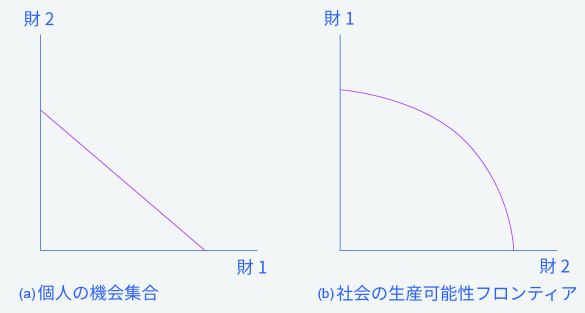

## 2.3 経済学的アプローチに対する批判を乗り越える

この章の最後には、以下のことができるようになります。

* 意思決定における経済的アプローチに対する反論を分析すること
* トレードオフ図を解釈すること
* 規範的主張と実証的主張を対比すること

意思決定における経済的アプローチを理解することと、それを抵抗感なく適用する事は別のことです。通常、（経済的アプローチの）抵抗感の原因は二つに分類されます。人々が経済的な思考に基づいて行動しない場合と、たとえ基づいて行動したとしても、そうすべきでない場合です。それぞれを順番に考えてみましょう。

### 一つ目の主張：人々や企業、社会はこのように行動しない
意思決定への経済的アプローチはほとんどの個人が所有するよりも多い情報と、ほとんどの個人が実際にふるまうよりも慎重な意思決定を必要とします。結局のところ、あなたやあなたの友人はショッピングモールに向かう前に、予算制約線を描き効用の最大化についてあれこれとつぶやくでしょうか？アメリカ議会の議員が毎年の予算を可決する前に、生産可能性フロンティアについて熟慮するでしょうか？人々や社会がとる乱雑な活動は、どうも予算制約線や生産可能性フロンティアのようにきちんと整理されているようには見えません。

しかしながら、経済学的アプローチは経済的意思決定のトレードオフを分析し理解するための有用な方法になり得ます。この点を理解するために、あなたがバスケットボールをしているときを想像してください。あなたは右にドライブした後、リングに向かって走っている左側のチームメイトにバウンドパスをします。物理学者や工学者はボールの重さや弾力性から、パスの正確なスピードや軌道を計算することができます。しかしあなたがバスケットボールをしている時には、このような計算は一切しませんね。ただボールをパスし、もし良いプレイヤーであったならそれを高精度に行うだけです。

ある人は主張するかもしれません：「科学者のバウンドパスの式は、ずっと多くの物理に関する知識と、バスケットボール選手が実際に持っている以上の動きのスピードと重さに関する具体的な情報を必要とします。なので、それは実際にどのようにバスケットボールのパスが起こるかという非現実的な説明であるに違いありません」と。この反応は、考え方を誤っているでしょう。良い選手が練習と技術のおかげで、物理的な計算をすることなく正確にパスを投げることができるという事実は、物理的な計算自体が間違っているということを意味しません。

同様に、経済的視点から見ると、毎週日用品雑貨の買い物をする人々は、その人にとって効用の大きい商品の組み合わせを購入するかに関してかなり多くの練習をしていると言えます。そしてそれは予算制約といった単語を使うことなく行っていることです。政府機関の判断は遅く、不完全かもしれませんが、全般的に、民主主義のもとで成立している政府は、その社会で最も広く好まれる選択を下すように投票者からプレッシャーを感じることでしょう。このように、人々、会社、社会の経済的行動について考えるとき、第一歩の予測としてそれらを経済的分析の手段を用いて分析することは、理にかなっています。これに関してもっと知りたい場合は、消費者選択の章の行動経済学について読んでみましょう。

### 第二の主張：人々、会社、社会はこのように行動するべきではない
経済学的アプローチは、人々を利己的な存在としてとらえています。このアプローチに対する一部の批判家は、たとえ人々が利己的な行動を取るという想定が現実においても事実であったとしても、それらの行動は倫理的ではないと主張します。代わりに、批判家は、人々は他人をより深く気遣うことを教育すべきであると主張します。経済学者たちはこれらの問題にいくつかの答えを提供します。

まず初めに、経済学とは道徳教育ではありません。むしろ、実際に存在する経済的な活動を説明することを主題としています。哲学者は、世界がどのようであるかという**実証的主張**と、世界はこうあるべきだという規範的主張を区別します。実証的主張は事実であるかもしれないし間違いであるかもしれませんが、少なくともそれらは原則として検証することができます。**規範的主張**は、主観的な意見です。我々は、それらの意見が正しいのか間違いなのかを証明することができないので、それらを検証することができません。それらは個人の価値観に基づく意見に過ぎないのです。例えば、ある経済学者はとある都市で提案されている地下鉄システムについて分析することができます。もし期待される利益が費用を上回るならば、彼はそのプロジェクトとが有益であると結論付けるでしょう。これは実証的な分析の例です。別の経済学者は、アメリカのような裕福な国家はより不幸な国民の世話をするべきであるため、大恐慌の間の失業補償の拡張を主張しています。これは規範的な分析の例です。

実証的主張と規範的主張の間の線引きはいつも明確なわけではありませんが、経済学における分析は実際の経済に住んでいる実際の人々に根付いた研究であり続けようとしています。しかし幸運なことに、個人が純粋に利己的であるという仮定は、人間の本性を単純化したものです。この証拠は、現代経済学の父であるアダム・スミスがまさに言ったことにあります。彼の著書である「道徳情操論」の書き出しの文では、それが明確に述べられています：「どんなに人間がわがままに思えても、彼の本性には明らかに、それをただ見ること以外の喜びを得られないとしても、他人の幸福に興味を抱かせ、さらにその他人の幸福が彼にとって必要なものとするいくつかの原則がある。」明らかに、個人は利己的であると同時に、利他的なのです。

第2に、私たちは、利己的な行動と利潤追求に別の名前を付けることができます。例えば、「個人の選択」や「自由」などの名前です。買うこと、働く事、そして貯金することについて個人の選択が可能であることは重要な個人にとっての自由です。何人かの人々は、多くの額のお金を稼いで使うために、プレッシャーが強く給料の高い仕事を選ぶかもしれません。一方で他の人々は、稼ぎの大部分をチャリティや、友達や家族のために使うかもしれません。さらに他の人は、多くの時間、エネルギー、専門知識を必要とする一方、お金の報酬が大きくない仕事に従事するかもしれません。例えば、小学校の先生や、ソーシャルワーカーなどがそれに当たるかもしれません。何人かの人々は、自分の時間の多くを使って高い収入をもたらす仕事を選ぶかもしれませんが、家族、友達、物静かに考えるためにも時間を残すかもしれません。何人かの人々は、大企業で働くのを好む一方で、自身でビジネスを始めたい人もいます。人々が自身の経済的な選択を行う自由は、尊重されるべき倫理的な価値を持つのです。

    <h3>
        違う名前の同じ図表はあるのか？
    </h3>
    

        予算制約と生産可能性フロンティアには主に2つの違いがあります。一つ目は予算制約線は直線であるということです。これらの傾きは一人の消費者による二つの財の価格の比較によって求められるため、固定的であり変化しません。対照的に生産可能性フロンティアは収穫逓減の法則によって曲線を描きます。それゆえ傾きは曲線の様々な点で異なります。二つ目の違いは生産可能性フロンティアの軸は、特定の数値を持たないということです。私たちはこれらの想像上の経済についての正確な資源の量を把握できませんし、どれほどの資源を医療や教育に用いることができるかを知らないため、フロンティアに特定の数値は入りません。もしこれが現実の例であれば、それらのデータは利用可能です。
    

    

        経済学を勉強するとき、図表がたくさんあることにストレスを感じるかもしれません。図表を見る際の目標は、図表に共通するロジックやパターンを理解することであり、一つ一つの図表を覚えることではありません。
    

    

        この章では、異なる表記で表されていますが、ただ一つの基礎的な図表しか用いていません。社会の予算制約と生産可能性フロンティアは、概して同じ基礎的な図表です。図2.6は2つの財(財1と財2)についての予算制約と生産可能性フロンティアを示しています。トレードオフの図表は、どんなときも３のテーマを描いています。それは、希少性、トレードオフ、そして経済的な効率性です。
    

    

        最初のテーマは希少性です。両方の財を無限に持つことは現実的ではありません。予算制約線あるいはPPFが移動した場合も、程度は変化しますが希少性は存在します。2つ目のテーマはトレードオフです。予算制約線とPPFで描かれているようにある財をより多く得るためにはもう片方の財を諦める必要があります。このトレードオフの内容は変化します。予算制約線では、2つ財の相対的な価格によってトレードオフが決定します。これらのトレードオフは直線で表されます。一方で多くのPPFではトレードオフは曲線で表されます。なぜなら、限界効用逓減の法則に従い、ある分野に投入する資源の量が増加するに連れ限界効用が減少するからです。線の形状にかかわらずトレードオフは存在します。
    

    

        3つ目のテーマは経済的な効率性、つまり希少な資源から最大限の利益を得ることです。PPF上のすべての選択は生産効率が最大となります。なぜなら、ある財の数量を減らすことなくもう片方の財の数量を増加させることができない状態だからです。同様に、ある個人が予算制約線上の選択を行うとき、ある財の数量を減らすことなくもう片方の財の数量を増加させることはできません。社会的に望まれているPPF上の点、あるいは個人に望まれている予算制約線上の点は高い配分効率性を示します。
    

    

        予算制約と生産可能性フロンティアの図は、この本の中に何度も出てきます。いくつかの例では、取引、環境保護と経済的な生産活動、所得の平等と経済的な生産活動、そして、消費と投資の間のマクロ経済学的なトレードオフを分析するためにこれらのトレードオフ図を使います。それぞれのグラフのラベルに気を取られて混乱してはいけません。予算制約と生産可能性フロンティアの図はいつも、特定の状況における欠乏やトレードオフ、効率性を考える上での単なる道具に過ぎないのです。
    

    
    

        

            図2.3 医療対教育の生産可能性フロンティアこの生産可能性フロンティアは医療に社会の資源を充てることと、教育にそれを充てることの間の折り合い（取引）を示しています。点Ａでは、すべての資源は医療に充てられ、点Ｂでは、ほとんどが医療に充てられます。点Ｄでは、ほとんどの資源は教育に充てられて、点Ｆでは、すべて教育に充てられます。
        

    

三つ目に、個人の利己的な行動は、社会にとって良いの結果を導き得るのです。例えば、人々が、生計を立てるために頑張って働くとき、彼らは経済的なアウトプットを作り出します。最も良い取引を望む消費者は、自分のニーズにあった財やサービスを提供するようビジネスに対して促します。アダムスミスは、この特性のことを彼の著書である国富論の中で、**見えざる手**と名付けています。消費者と生産者が市場経済においてどのように相互作用するかについてスミスは以下のように書きました。

各個人は、普通は、実際のところ、公共の利益を向上させようとはしていないし、自分がどれくらい公共の利益を向上させているのかは知りません。外国の産業よりも国内の産業を支持することを選好することで、自分自身の安全のみを意図しています。また、最大の価値を産むような生産の方法にその産業を方向付けることで、自分自身の利得をのみを求めているのです。そして、他のたくさんの事象と同じように彼もこの中にいて、見えざる手に導かれて、彼の意図しない部分の一端を促進していたのです。つまり、自身の興味を追求することによって、自分が本当に社会振興をしようと思った時よりも効果的に、彼はたびたび社会を振興しているのです。

その見えざる手のメタファー（隠喩）はより広い社会全体への利益は利己的な各個人の行動からもたらされるという素晴らしい可能性を示唆します。

第4に、人生における経済活動の局面で私利私欲を重視する人々でさえ、人生の経済活動以外の局面では私利私欲を求めない場合もよくあります。例えば、あなたが雇用者に対し昇給を求めたり、車を買うことを求める場合、あなたは私利私欲を重視するかもしれません。あなたが地元の図書館でボランティアで本の読み聞かせをしたり、新しいアパートに引っ越す友人の手伝いをしたり、慈善団体にお金を寄付したりするときには、あなたは打って変わって他の人のことを重視するかもしれません。私利私欲というのは、たくさんの経済的な選択を考える際の一つの妥当な出発点なのです。

    <h2>
        身の回りの経済学
    </h2>
    <h3>
        選択...どの程度まで？
    </h3>
    

        ここまでの議論で、希少性は私たちの全ての選択において影響を与えることがわかりました。ある経済学者は、人々は学位を得る選択をするための資源を持たないため、または収入がとても低く学位の費用がとても高いために、学士や修士の学位を得ることができないと主張するかもしれません。学士や修士の学位は、彼らの機会集合の中では手に入らないものかもしれないのです。
    

    

        これらの学位の費用が高すぎるのは、授業料(そしてもしかすると家賃や食費も)などの実質費用だけが原因ではないかもしれません。経済学者は、大勢のの人々にとって学士や修士の学位の機会費用が高すぎる、というかもしれません。これらの人々にとって、学位を得るために、働いて収入を得る年月を失うのは不本意、またはできないことなのです。
    

    

        最後に、私たちがこの章の初めに紹介した統計は、異時点間の選択に関する情報に触れています。ある経済学者は、人々は大学に通うためにお金を借りなければいけないことを理由に学位を得ないことを選択しており、さらに彼らが将来そのローンに対して払わなければならない利子が彼らの現在における選択に影響していると主張するかもしれません。また、将来の消費よりも現在の消費を好む人がいるかもしれません。すると彼らは消費を大学卒業後まで延期するよりも、より低い給料で今働き、今消費することを選ぶのです。
    

    <h2>
        批判的思考のための問題
    </h2>
    <ol>
        <li>見えざる手がはたらくためには経済についてどのような仮定をする必要があるでしょうか。現実世界ではこれらの仮定はどの程度妥当なのでしょうか。</li>
        <li>経済学者は規範的主張を行うために必要な専門知識を持っていると言えるでしょうか。言い換えると、経済学者はある経済政策に関する実証的主張(例えばその政策で何が起こるかという主張)を行うことはできますが、その政策が行われるべきであるかどうかを判断するための専門知識を持っているでしょうか。</li>
    </ol>

    <h2>
        用語(工事中)
    </h2>
    <table>
  <tr>
    <td>実証的主張</td>
    <td>positive statements</td>
  </tr>
  <tr>
    <td>規範的主張</td>
    <td>normative statements</td>
  </tr>
  <tr>
    <td>見えざる手</td>
    <td>invisible hand</td>
  </tr>
</table>    

[第2章について >>](Reference)