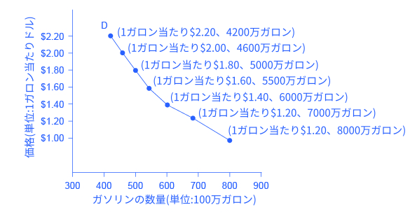
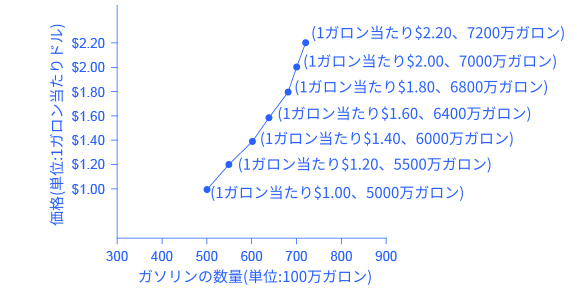
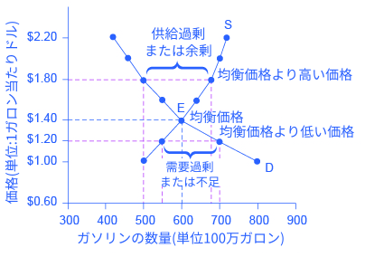

## 3.1 需要、供給、財とサービスの市場における均衡

この節の最後には、以下のことができるようになります。

* 需要、需要量、需要法則を説明する
* 需要曲線と供給曲線を判別する
* 供給、供給量、供給法則を説明する
* 均衡、均衡価格、均衡数量を説明する

まずはじめに、経済学者が需要、供給という単語を使ったときに何を指しているかに焦点を当て、それぞれが市場でどのように相互作用するかを見ていきます。

### 財とサービスに対する需要
経済学者は、消費者が各価格において進んで購入する、あるいは購入できる財やサービスの量を表すのに**需要**という単語を使います。需要は根本的にニーズとウォンツに基づいています。もし皆さんがニーズやウォンツを持っていなければ買い物をしないでしょう。消費者はニーズとウォンツに区別をつけることができるかもしれませんが、経済学者の視点からはそれらは同じものです。需要はまた支払い能力にも基づいています。もし代金を払えなければ有効需要は発生しません。この定義からするとホームレスの人々はおそらく家に対して有効需要を持たないでしょう。

購買者が特定の1単位の財やサービスのために支払うものを**価格**と呼びます。その価格において消費者が購入する全単位は**需要量**と呼ばれます。財やサービスの価格の上昇はほとんどいつもその財やサービスの需要量を減少させます。反対に価格の減少は需要量を増加させるでしょう。ガソリン1ガロンの価格が増加したとき、人々はその消費を減らす方法を探します。例えばいくつかの出かける用事を合わせて1回で済ましたり、車の相乗りや公共交通機関に切り替えたり、家の近くで週末や休暇の旅行をしたりします。経済学者はこの価格と需要量の負の関係を**需要の法則**と呼びます。需要の法則では、（次の節でより詳しく説明しますが）需要に影響を与える他のすべての要因は固定されてると仮定しています。

表や図を用いて、ガソリン市場を例にとって考えてみましょう。それぞれの価格で受容される量を表す表を（表3.1のように）**需要表**と呼びます。この場合では、1ガロンのガソリンにおける価格を表します。ある期間中（例えば、1日や1年など）や地域（州や国）における百万ガロン単位の需要量を測ります。**需要曲線**は図3.2のように、価格と需要量との関係表します。図3.2の場合、横軸が需要量、縦軸が1ガロン当たりの価格を表します。（以上のルールは、独立変数（X）を横軸にとり、従属変数（Y）を縦軸にとるという数学の通常のルールと異なります。経済学は数学ではないという事です。）

表3.1は需要表を表し、図3.2は需要曲線を表します。同じ価格と需要量の関係を表す方法が2つあります。

<table>
  <tr>
    <th>価格 (ガロン当たり)</th>
    <th>需要量 (100万ガロン)</th>
  </tr>
  <tr>
    <td>$1.00</td>
    <td>800</td>
  </tr>
  <tr>
    <td>$1.20</td>
    <td>700</td>
  </tr>
  <tr>
    <td>$1.40</td>
    <td>600</td>
  </tr>
  <tr>
    <td>$1.60</td>
    <td>550</td>
  </tr>
  <tr>
    <td>$1.80</td>
    <td>500</td>
  </tr>
  <tr>
    <td>$2.00</td>
    <td>460</td>
  </tr>
  <tr>
    <td>$2.20</td>
    <td>420</td>
  </tr>
</table>

    

        表 3.1ガソリンの価格と需要量
    

    

        図3.2 ガソリンの需要曲線需要表が示すものは、価格が上がるにつれて需要量が減少するということ、及びその逆のことです。図のように点を描き、その上を繋いだ線が需要曲線（D）です。需要曲線における下向きの傾きは需要の法則（価格と需要量との負の関係）を表します。
    

需要曲線はそれぞれの製品について異なる形を表します。傾きが比較的急だったり緩やかだったり、直線的だったり曲がっていたりするかもしれません。ほとんど全ての需要曲線は、左から右にかけて傾いているという似た特徴を共有します。需要曲線は需要の法則を表しており、価格が増加すると需要量が減少し、逆に価格が減少すると需要量が増加します。

    <h3>需要と需要量は同じ？</h3>
    

        経済用語において、需要と需要量は同じではありません。経済学者が、需要の話をするとき、彼らは需要曲線や需要表によって描かれた価格における価格の範囲とその価格の範囲での需要量との関係性を意味しています。経済学者が需要量について話しているときは、彼らは需要曲線上の特定の点や、需要表のある量を意味しています。つまり、需要は曲線を表し、需要量はある特定の曲線上の点を意味します。
    

### 財とサービスの供給
経済学者が**供給**について話すとき、彼らは生産者が各々の価格で供給したいと考えている財やサービスの量を意味しています。価格は、生産者が一連の財サービスを売ったことで得られるお金です。価格の上昇は、ほとんどいつも財やサービスの**供給量**の増加をもたらします。一方、価格が下落すると供給量は減少します。ガソリンの値段上がったととします。この価格の上昇は、利潤を追求したい会社に対して、石油埋蔵地の探索の拡大、より多くの石油を採掘する、より多くのパイプラインや石油タンカーに投資して、精製してガソリンにするため石油プラントへ運ぶ、新たな石油精製所を創設する。ガソリンスタンドへガソリンを運ぶための追加のパイプラインやタンカーを購入する、そしてもっとガソリンスタンドをオープンさせ、既存のガソリンスタンドの営業時間を長くする、といったいくつかの行動を促します。経済学者は、この価格と供給量の正の関係、つまり高い価格が供給量を増加させ、低い価格が供給量を減少させることを**供給の法則**と呼びます。供給の法則は、供給に対して影響与えるすべての変数は固定されていることを仮定しています。詳しくは次の節で説明します。

異なる供給の種類について混乱していますか？以下の文章が参考になるかもしれません

    <h3>供給と供給量は同じ？</h3>
    

        経済用語では供給と供給量は意味が違います。経済学者が供給について言及する時、彼らはある価格帯とその価格帯における供給量の関係性を意味しています。この関係性は供給曲線と供給表を使って説明することができます。経済学者が供給量について言及する時、彼らは供給曲線上のある特定点または供給表中のある供給量だけを意味しています。つまり、供給はその曲線を、供給量はその曲線の特定の点を意味します。
    

図3.3はガソリンの市場を例にして、供給の原理を説明しています。需要と同じように、供給を表やグラフで説明することができます。**供給表**は表3.2のような異なる価格の価格帯における供給量を示した表です。ガソリンの需要曲線のときと同じようにガソリンの価格を1ガロン当たりの価格で、供給量を100万ガロン単位で見ます**供給曲線**は縦軸で表されている価格と横軸で表されている数量の関係性を表したグラフです。供給表と供給曲線は同じ情報を異なる形で表現したものです。また、図3.3の供給曲線のグラフの縦軸と横軸が、図3.2の需要曲線の縦軸と横軸と同じであることに注目しましょう。

    

        図3.3 ガソリンの供給曲線供給表は、それぞれの価格におけるガソリンの供給量を示した表です。価格が上がるにつれて供給量は上昇し、逆も然りです。供給曲線（S）は供給表の各点をグラフ化し、それらをつないだものです。供給曲線の右上がりの傾きは供給の法則、つまりより高い価格はより多くの供給につながり、逆も成り立つということを示しています。
    

<table>
  <tr>
    <th>価格 (ガロン当たり)</th>
    <th>供給量 (100万ガロン)</th>
  </tr>
  <tr>
    <td>$1.00</td>
    <td>500</td>
  </tr>
  <tr>
    <td>$1.20</td>
    <td>550</td>
  </tr>
  <tr>
    <td>$1.40</td>
    <td>600</td>
  </tr>
  <tr>
    <td>$1.60</td>
    <td>640</td>
  </tr>
  <tr>
    <td>$1.80</td>
    <td>680</td>
  </tr>
  <tr>
    <td>$2.00</td>
    <td>700</td>
  </tr>
  <tr>
    <td>$2.20</td>
    <td>720</td>
  </tr>
</table>

    

        表 3.2ガソリンの価格と供給量
    

供給曲線の形は、生産物が何であるかによってさまざまです。急であったり、なだらかであったり、あるいは、真っ直ぐであったり、曲がっていたりします。しかしながら、ほとんどすべての供給曲線は基本的な類似性を持っています。供給曲線の傾きは右肩上がりで、供給の法則を表します。価格が上がるにつれて、例えば、1ガロン当たりのガソリン価格が1.00ドルから2.20ドルになると、供給される量は500ガロンから720ガロンへ上昇します。反対に、価格が減少するにつれて、供給量は減少します。

### 均衡: 需要と供給が交わる点
需要曲線と供給曲線のグラフがどちらも縦軸に価格、横軸に数量をとっているため、ある特定の財やサービスの需要曲線と供給曲線を同じグラフ上にとることができます。需要と供給は市場で売買が行われる価格と数量を決定します。

図3.4は、ガソリンの市場における需要と供給の相互作用を表しています。需要曲線（D)は図3.2と同じです。供給曲線（S）は図3.3と同じです。表3.3は同じ情報を表にしたものです。

    

        図3.4 ガソリンの需要と供給需要曲線(D)と供給曲線(S)は均衡点Eで交わっており、その時の価格は1.40ドルで量は600（million）です。均衡とは需要量と供給量が等しい唯一の価格です。1.80ドルのような均衡よりも高い価格では、供給量は需要量を超過します。よって供給過剰となります。1.20ドルのような均衡よりも低い価格では、需要量が供給量を超過します。よって超過需要となります。
    

<table>
  <tr>
    <th>価格 (ガロン当たり)</th>
    <th>需要量 (100万ガロン)</th>
    <th>供給量 (100万ガロン)</th>
  </tr>
  <tr>
    <td>$1.00</td>
    <td>800</td>
    <td>500</td>
  </tr>
  <tr>
    <td>$1.20</td>
    <td>700</td>
    <td>550</td>
  </tr>
  <tr>
    <td>$1.40</td>
    <td>600</td>
    <td>600</td>
  </tr>
  <tr>
    <td>$1.60</td>
    <td>550</td>
    <td>640</td>
  </tr>
  <tr>
    <td>$1.80</td>
    <td>500</td>
    <td>680</td>
  </tr>
  <tr>
    <td>$2.00</td>
    <td>460</td>
    <td>700</td>
  </tr>
  <tr>
    <td>$2.20</td>
    <td>420</td>
    <td>720</td>
  </tr>
</table>

    

        表 3.3価格、需要量、供給量
    

図上で2つの線が交わるとき、この交わりには通常何らかの意味があります。供給曲線(S)と需要曲線(D)の交わる点が図3.4の点Eで示されていますが、これは**均衡**と呼ばれます。**均衡価格**は消費者の意図と生産者の意図が合致した唯一の価格、つまり、消費者が買いたい商品の量（需要量）が生産者が売りたい量（供給量）と等しくなる唯一の価格なのです。経済学者はこの一般的な量を**均衡量**と呼びます。ほかのどんな価格においても、需要量が供給量と等しくなることはありません。市場はそれらの価格において、均衡ではないのです。

図3.4では、ガソリンの均衡価格は1.40ドルで均衡量は600です。もし需要曲線と供給曲線の図が手元になく、需要表と供給表しかない場合、需要表と供給表の中で、2つの表で価格に対する数量が同一である価格を探すことで均衡を見つけることができます。
「均衡」という言葉は、「バランス」を意味します。もし市場が価格と量の均衡点にあるならば、その地点から離れる理由はありません。しかしながら、市場が均衡点にない場合、均衡価格と均衡数量へ向かって市場を動かそうとする経済的圧力が発生します。

例えば、1ガロンのガソリンの価格が均衡価格より高い場合、つまり、1ガロンあたり1.4ドルの代わりに、1ガロンあたり1.8ドルだと想像してみてください。図3.4の1.8ドル地点における水平方向の破線は、この価格が均衡価格よりも高いことを示しています。この高い価格では、需要量は600から500へと下がります。この数量の下降は、消費者が、高い価格ではガソリンの消費量を減らそうとすることを反映しています。

さらに、より高い価格はガソリン生産者が出荷を拡大することをより有益にするため、この1.8ドルという高い価格においては、ガソリンの供給量は600から680へと増加します。ここで、需要量と供給量がこの均衡価格以上の点でどのように関係しているのかを考えてみましょう。供給量が680へと上がる一方で、需要量は500へと減少しています。実際には、どの均衡価格以上の点においても、供給量は需要量を上回ります。私たちはこれを**供給過剰**、または**余剰**と呼びます。

供給過剰の際、余ったガソリンは、ガソリンスタンド、タンカートラック、パイプライン、製油所に蓄積されます。この蓄積は、ガソリン販売業者に圧力をかけます。余剰分が売れ残った場合、ガソリンの製造・販売に関係する業者は労働者への賃金やその他支払いをまかなうのに十分な収入を得ることができません。売れ残るよりも、安くでも販売出来た方がいいので、いくつかの製造業者と販売業者は価格を下げることを望むでしょう。いくつかの販売業者が値下げを始めると他の業者も売上を失わないために同じようにするでしょう。この値下げは高い需要量を引き起こします。したがって、均衡点よりも価格が高い場合は需給と供給の構造に組み込まれたインセンティブによって価格が均衡点に向かって下がるように圧力をかけます。

図3.4の水平の点線が示す価格のように、価格が1ガロンあたり1.20ドルで均衡価格を下回っているとします。この低価格では、運転手が長距離移動をするようになり、冬には車を温めることに時間をかけたり、仕事用の乗り物を共有することをやめたり、燃費が低い大型車を購入したりするために需要量は600から700に増加しす。しかしながら、均衡以下の価格はガソリン生産者が製造・販売するインセンティブを減少させ、供給量は600から550に減少します。

価格が均衡価格よりも低い場合、**需要過剰**または**供給不足**が発生していることになります。つまり、価格低下により増加した需要量が、価格低下により減少した供給量を上回った状況です。この状況下では、ガソリンを欲している人々はガソリンスタンドに殺到し、他の多くのガソリンスタンドでもガソリンが不足していることに気づくでしょう。また石油会社は、手元にあるガソリンをより高い値段で販売することでより多くの利益を得ることができることに気づくでしょう。結果として価格は均衡に近づきます。需要供給モデルの重要性については、「需要、供給、効率性」の節でより詳しく説明しています。

    <h2>
        批判的思考のための問題
    </h2>
    <ol>
        <li>図3.4を見てみましょう。政府が、ガソリンは必需品であるという理由からその価格を1.30ドル以下に抑える法律を作ったとします。ガソリン市場ではどのようなことがおこると考えられるでしょうか。</li>
        <li>次の文が誤っているのはなぜでしょうか。 
        「財の市場では、均衡価格以上の価格で物を買おうとする買い手はいない」
        </li><li>次の文が誤っているのはなぜでしょうか。 
        「財の市場では、均衡価格以下の価格で物を売ろうとする売り手はいない」
        </li>
    </ol>

  <h2>
    対訳表
  </h2>
  <table>
    <tr>
      <td>需要</td>
      <td>demand</td>
    </tr>
    <tr>
      <td>価格</td>
      <td>price</td>
    </tr>
    <tr>
      <td>需要量</td>
      <td>quantity demanded</td>
    </tr>
    <tr>
      <td>需要の法則</td>
      <td>law of demand</td>
    </tr>
    <tr>
      <td>需要表</td>
      <td>demand schedule</td>
    </tr>
    <tr>
      <td>需要曲線</td>
      <td>demand curve</td>
    </tr>
    <tr>
      <td>供給</td>
      <td>supply</td>
    </tr>
    <tr>
      <td>供給量</td>
      <td>quantity supplied</td>
    </tr>
    <tr>
      <td>供給の法則</td>
      <td>law of supply</td>
    </tr>
    <tr>
      <td>供給表</td>
      <td>supply schedule</td>
    </tr>
    <tr>
      <td>供給曲線</td>
      <td>supply curve</td>
    </tr>
    <tr>
      <td>均衡</td>
      <td>equilibrium</td>
    </tr>
    <tr>
      <td>均衡価格</td>
      <td>equilibrium price</td>
    </tr>
    <tr>
      <td>均衡量</td>
      <td>equilibrium quantity</td>
    </tr>
    <tr>
      <td>供給過剰</td>
      <td>excess supply</td>
    </tr>
    <tr>
      <td>余剰</td>
      <td>surplus</td>
    </tr>
    <tr>
      <td>需要過剰</td>
      <td>excess demand</td>
    </tr>
    <tr>
      <td>供給不足</td>
      <td>shortage</td>
    </tr>
  </table>

[3.2 財・サービス市場における需要と供給のシフト >>](3-2-Shifts-in-Demand-and-Supply-for-Goods-and-Services)