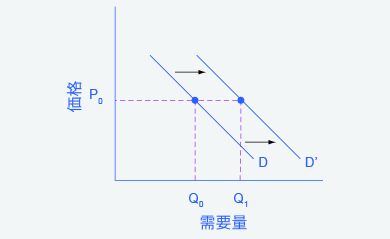
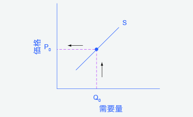
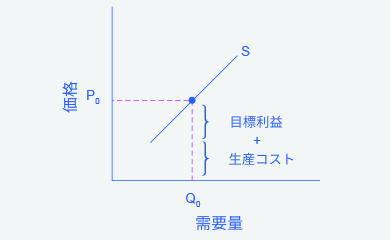

## 3.2 財・サービス市場における需要と供給のシフト

この節の最後には以下のことができるようになります。

* 需要に影響する要素を見極める
* 需要曲線と需要シフトを図示する
* 供給に影響する要素を見極める
* 供給曲線と供給シフトを図示する

前節ではどのように価格が需要量と供給量に影響するかを説明しました。それらはそれらは需要曲線と供給曲線に示されます。しかし需要や供給に影響する要素は価格だけではありません。例えば健康への関心が多くの消費者に肉を食べることを回避させる効果をもたらしたとしたときの菜食の需要はどうなるでしょうか。ダイアモンド採掘者がいくつか新しいダイアモンド鉱山を発見したときのダイアモンド供給はどうなるでしょうか。価格に加えて需要と供給に影響する主要な要因には何があるのでしょうか。

    

        <a href="https://openstax.org/l/toothfish">こちらのサイト</a>でマーケティング戦略が製品の供給や需要にどのようにどのように影響しているかについて読むことができます。
    

### 需要に影響している要素には何があるか？
各価格において消費者が購入したいもしくは購入可能である製品の量を需要と定義しました。価格に加えて需要に影響する要素は二つあります。購買意欲は、経済学者が趣味や嗜好に基づく欲望を表します。もし皆さんがあるものを必要ともせず、欲しくもなければそれを買わないでしょう。何かを購入するには収入が重要ですす。教授は普通生徒よりも良い住まいと車を持っているでしょう。なぜなら教授は収入がより高いからです。関連する財の価格もまた需要に影響しえます。皆さんが新しい車を購入するとき、Honda社の車の価格はFord社の車のあなたの需要に影響するかもしれません。最後に、人口のサイズや構成が需要に影響し得ます。ある家族が子供を多く持つほどその家族の服への需要は大きくなります。あるある家族が車を運転できる年齢の子供を多くもつほど、車保険への需要は大きくなり、またおむつや赤ちゃん用の調整ミルクの需要は小さくなります。

これらの要因は個人の需要と市場全体の需要の両方で見られます。これらの多様な要因はどのように需要に影響を与えているのでしょうか、そして私達はどのようにそれをグラフで示すことができるでしょうか？それらの問いに答えるためには、私たちは"ceteris paribus(セテリス・パリブス)"（その他の条件が不変であるという仮定）を必要とします。

### Ceteris Paribus 仮定
需要曲線か供給曲線はあるある二つの、そしてその二つだけの変数（横横軸は量、縦縦軸は価格）の間の関係性です。需要曲線や供給曲線の背後には製品の価格以外の関連する経済的要因が変化していないという仮定が存在します仮定が存在します。経済学者はこの仮定を**Ceteris Paribus**と名付けました。ラテン語で「その他の条件が一定である」という意味です。すべての需要・供給曲線では、他の要因は一定であるというこの仮定に基づいています。需要曲線や供給曲線は他の全ての変数が一定の際の、二つの（二つだけの）変数の関係性を表しています。以下で解説をしますが、もしその他の変数が一定でなければ、需要と供給の法則は機能しません。

    <h3>
        いつCeteris Paribusを適用するか？
    </h3>
    

        私達は価格の変化がどのように需要や供給に影響するかを観察するときに、ceteris paribusを用いますが、より一般的にこの仮定を適用することができます。現実世界では、需要と供給は価格だけではないより多くの要因に依存します。例えば、消費者の需要は所得に、生産者の供給は製品の生産コストにそれぞれ依存します。多様な要因が同時点で変化するとき（例えば商品の価格が上がったと同時に消費者の所得が減少した場合など）、私たちはどのように需要と供給の要因を分析することができるでしょうか？その答えは、私たちが一つの要因の変化を観察する際、その他の要素が一定である仮定することです。
    

    

        例えば、（所得やその他の需要に影響を与えるものが変化しないという仮定を置いた場合）価格の増加によって消費者の買う量が減るということが言えます。加えて、（価格やその他の需要に影響を与えるものが変化しないという仮定を置いた場合）（価格やその他の需要に影響を与えるものが変化しないという仮定を置いた場合）所得の減少によって、消費者が買うことのできる量が減るということも言えます。これがceteris paribusが意味している事です。この特定の場合において、それぞれの要因を別々に分析した後、それらの結果を組み合わせることができます。消費者が買う量は2つの理由から減少します。1つ目は価格が高くなること、2つ目は所得が低くなることです。
    

### 所得が需要にどのように影響を与えるか
価格以外の要因がどのように需要に影響を与えるのかを知る例として所得を用いましょう。図3.5では、車の初期需要量がD0で示されています。Q点では、例えば、車1台あたりの価格が2万ドルだとすると、車の需要量は1800万台です。D0は車の需要量が価格変化によって変わり得るということも示しています。例えば、もしも車の価格が2万2,000ドルに増加したとき、需要量はR点上の1700万台に減少します。

初期需要曲線D0はceteris paribusに基づいており、他の経済的な要因が変化しないという仮定が置かれています。今、経済が改善され、多くの人々の所得が増加し、人々が多くの車を買えるようになったと考えましょう。この状況を図でどのように表せるでしょうか？

図3.5に戻りましょう。車の価格は2万万ドルのままですが、所得が高くなると点Sが示すように需要量は2000万台に増加しています。所得水準が高くなると需要曲線は右へシフトし新しい需要曲線D1になります。これは需要の増加を意味します。図3.5は需要の増加が、ある価格でだけでなくすべての価格で起こることを明確に示しています。

    

        図3.5 需要のシフト：車を例にして需要の増加は全ての価格において需要量が大きくなることを意味し、需要曲線はD0からD1へと右へシフトします。需要の低下は全ての価格において需要量が小さくなることを意味し、需要曲線はD0からD2へ左にシフトします。
    

<table>
  <tr>
    <th>価格</th>
    <th>D2への減少量</th>
    <th>もとのD0での需要量</th>
    <th>D1への増加量</th>
  </tr>
  <tr>
    <td>$16,000</td>
    <td>17.6 (百万)</td>
    <td>22.0 (百万)</td>
    <td>24.0 (百万)</td>
  </tr>
  <tr>
    <td>$18,000</td>
    <td>16.0 (百万)</td>
    <td>20.0 (百万)</td>
    <td>22.0 (百万)</td>
  </tr>
  <tr>
    <td>$20,000</td>
    <td>14.4 (百万)</td>
    <td>18.0 (百万)</td>
    <td>20.0 (百万)</td>
  </tr>
  <tr>
    <td>$22,000</td>
    <td>13.6 (百万)</td>
    <td>17.0 (百万)</td>
    <td>19.0 (百万)</td>
  </tr>
  <tr>
    <td>$24,000</td>
    <td>13.2 (百万)</td>
    <td>16.5 (百万)</td>
    <td>18.5 (百万)</td>
  </tr>
  <tr>
    <td>$26,000</td>
    <td>12.8 (百万)</td>
    <td>16.0 (百万)</td>
    <td>18.0 (百万)</td>
  </tr>
</table>

    

        表3.4 価格と需要のシフト：車を例にして 
    

多くの人々が職を失ったり、就業時間が少なくなったりして所得が減少し、景気が低迷している状況を想像して下さい。このような状況では所得の減少が、すべての価格において車の需要量の減少を引き起こします。オリジナルの需要曲線D0はD2へ左へシフトします。D0からD2へのシフトは、すべての価格帯での需要量の低下を表します。この例では、初期需要曲線では2万ドルの価格で1,800万台の車が売れることを示していますが、需要の低下の後ではたった1,440万台の車しか売れません。

需要曲線がシフトするとき、すべての個人の需要量が同じ量だけ変化することを意味しません。この例において、すべての人が、高所得・定所得を得ているわけではなく、すべての人が、追加的に車を買うか買わないかを選択するわけではありません。需要曲線のシフトは、市場全体のパターンを捉えています。

前回の節節で、私たちは所得の向上所得の向上が、どの値段においても多くの需要を引き起こすと主張しました。これはほとんどの財やサービスにおいて真実です。高級車、ヨーロッパでのバカンス、宝石など、一部の財では所得の上昇の影響は特に顕著です。所得が上がった場合に需要が増加する、または所得が下がった場合に需要が減少する製品は、**正常財(または普通財)**と呼ばれます。このパターンに対するいくつかの例外が存在します。所得が上がったとき、多くの人は、ノーブランドのものは買わず、有名ブランドのものを買うでしょう。また人々は、中古車を買うよりも、新車を買うようになるでしょう。また、マンションを借りるよりも、自分の家を持つようになるでしょう。所得が下がった場合に需要が減少する、または所得が上がった場合に需要が増加する製品は、下級財(または劣等財)と呼ばれます。下級財では所得が上がったとき、需要曲線が左にシフトします。

### 需要曲線がシフトするほかの要因
所得だけが、需要をシフトさせる要因ではありません。需要を変えるほかの要因には、趣味嗜好や、人口の構成や規模、関連商品の価格、予想さえも含みます。人々がある価格帯で購入しようとする数量に影響を与える要因のうち一つにでも変化が生じた場合、需要のシフトが起こります。グラフ上では、新需要曲線は初期需要曲線の右（増加）、あるいは左（減少）どちらかに現れます。これらの要因を見てみましょう。

#### 趣味嗜好の変化
アメリカ農務省によると1980年から2014年にかけて、アメリカ人１人あたりの鶏肉年間消費量は48ポンドから85ポンドに増加し、牛肉年間消費量は77ポンドから54ポンドに減少しました。このような変化は、嗜好の動きによるものであり、すべての価格帯において需要量が変化します。そのため商品の需要曲線が鶏肉の場合は右に、牛肉の場合は左にシフトします。

#### 人口構成の変化
アメリカの高齢者人口は増加しています。国政調査局によると高齢者割合は1970年には9.8％だったのが2000年には12.6％に上昇しており2030年には20％になるとされています。相対的に子供が多かった1960年代のアメリカのような社会では、三輪車や保育所のような財やサービスの需要が大きくなります。相対的に高齢者が多いと予想される2030年の2030年のような社会では在宅介護や補聴器の需要が大きくなると考えられます。よって、人口構成の変化は住宅やその他の様々な物の需要に影響を与えます。このような需要の変化は需要曲線のシフトとして示されるでしょう。

代替財や補完財の価格の変化も財の需要に影響を与えることがあります。**代替財**は他の財やサービスの代わりになる財やサービスのことです。電子書籍が増えるに連れ、従来の印刷された書籍の需要は減ることが予想されます。代替材の価格が低い場合、他方の需要は減ります。例えば、近年タブレット端末の価格が低下しており、その需要量が(需要の法則により)増えています。このため、ノートパソコンの需要が減っています。これはノートパソコンの需要曲線が左側にシフトした図として図示することができます。代替財の価格が高い場合は逆の効果が現れます。

ある財の消費が他の財の消費を促す場合、それらを**補完財**と呼びます。例えばシリアルと牛乳、ノートとペンや鉛筆、ゴルフボールとゴルフクラブ、ガソリンと自動車、複数の財の場合としてベーコンとレタスとトマトとマヨネーズとパンなどがあります。ゴルフクラブの価格が上がった場合、ゴルフクラブの需要量が(需要の法則により)減少し、ゴルフボールといった補完財の需要も減少します。同様に、スキー板の価格が上昇した場合、その補完財となるスキー旅行の需要曲線を左にシフトさせます。補完財の価格が低下した場合逆の効果が現れます。

#### 将来価格の予測の変化と需要に影響を与えるその他の要因
財の価格が需要量に影響を与えることは明確ですが、将来価格(または将来の趣味嗜好、所得、その他)の予測も需要に影響を与えることがあります。例えば、台風が接近しているという情報を耳にした人々は懐中電灯用の乾電池やペットボトルの水を会に店に押し寄せるかもしれません。コーヒーのような保存が効く財の価格が将来上がると予想される場合、人々は買いだめするかもしれません。これらのような需要の変化は需要曲線のシフトとして表します。よって、**需要のシフト**は(価格以外の)経済的な要因の変化が起こり、すべての価格帯で需要量が変化した際に発生します。次の段落でこれがどのように起こるかを説明しています。

    <h3>
        需要のシフト
    </h3>
    

        需要のシフトとは、すべての価格において、それ以前よりも需要量が変化することを意味します。例えば、所得の増加による需要のシフトです。
    

    

        ステップ1：ピザのような正常財の需要曲線のグラフを書いてみましょう。ある価格を選びます（例えばP0）。対応しているQ0を確認します。 図3.6.を見てみましょう。
    

    
    

        

            図3.6 需要曲線需要曲線を使うことで消費者がある価格帯で購入する数量を確認することができます。
        

    

    

        ステップ2：所得が増加したときのことを考えてみましょう。所得が増加すると、消費者がピザを買う量は増えるでしょうか、それとも減るでしょうか。答えは、「増える」です。先ほど選んだ価格（P0）から水平に、元の需要量（Q0）を通り過ぎて、新しいQ1となる点まで点線を引きます。さらに、水平軸まで垂直に点線を下ろし、これをQ1とします。図3.7を見てみましょう。
    

    
    

        

            図3.7 所得の増加と需要曲線所得の増加に伴って、消費者はより多くの量を買うようになり、需要を右側に動かします。
        

    

    

        ステップ3：需要曲線を新しい点にシフトさせましょう。所得の増加が需要曲線を上向き（右向き）のシフトを引き起こすことが分かります。そして、どんな価格であっても需要量が高まることを図3.8は表しています。
    

    
    

        

            図3.8 右にシフトした需要曲線所所得の増加とともに、消費者はより多くの量を購入します。そして需要を右に移動させ、結果として需要曲線を右にシフトさせます。
        

    

### 需要を変化させる要因のまとめ
図3.9は需要曲線をシフトさせうる6つの要因をまとめています。矢印の方向は需要曲線のシフトする方向が需要の増加あるいは需要の減少を表すかどうかを説明しています。財とサービスの価格変化それ自体は需要曲線をシフトさせうる6つの要因の中に挙げられていないことに注目してみましょう。財とサービスの価格変化は特定の需要曲線の線上の移動をもたらし、需要量の変化をもたらしますが、需要曲線をシフトさせることはありません。

    

        図3.9 需要曲線がシフトする要因(a)D0からD1への需要増加を引き起こす要因(b)向きが逆の場合、同じような要因がD0からD1への需要減少を引き起こします。
    

需要曲線がシフトする時、異なる均衡価格と均衡数量で供給曲線と交差するでしょう。しかし、この話はもう少し後で議論します。需要の変化が価格と量の均衡にどう影響を与えるかを議論する前にまず供給曲線のシフトについて議論する必要があります。

### 生産コストが供給にどのように影響するか
ほかの全ての経済学的に関連した要因が変わらないように他の事情が同じであるならとceteris paribusを仮定すると、供給曲線は、価格の増減に応じてどれくらい供給量が変化するかを示しています。供給に関連する他の要因が変わるならば、供給曲線全体がシフトします。需要の変化をあらゆる価格帯において需要される数量の変化として表現したとき、**供給のシフト**はあらゆる価格帯で供給される数量の変化を意味します。

供給に影響を及ぼす要因について考えるとき、何が企業にモチベーションを与えるかを思い出してください。それは、収益から費用を引いた利益です。企業は、労働力、材料、機械、など、私たちが**インプット**や**生産要素**と呼ぶものを組み合わせて使用することで財やサービスを生産します。もし、企業の生産コストがより低くなり、企業が生産する財やサービスの価格に変化がない場合企業の利益は増加します。企業の利益が増加するとき、生産すればするほど企業はより多くの利益を得られるため、企業は生産量を増やす動機を与えられます。生産コストが下がるとき、企業はどの価格帯においてもより多くの数量を供給する傾向にあります。これは供給曲線が右にシフトすることで示すことができます。

たとえば、都市で荷物の配達を行う配達会社を挙げてみましょう。その会社はガソリンを購入することが主な費用の一つであると気づいたとします。もし、ガソリン価格が下がった場合、その会社は今までよりもより安価に配達物を運ぶことができると気づくでしょう。費用がより低くなることは利益がより高くなることと一致するので、今やその配達会社はいかなる価格でもより多くのサービスを供給するでしょう。例えば、ガソリン価格が低くなれば、その会社はより広い地域でサービスを提供することができ、供給を増やすことができるのです。

反対に、もし生産コストが上がると、その商品の売価が一定の下で得られる利益は減少します。結果として生産コストの上昇は一般的にすべての価格帯での下で供給量の減少を引き起こします。この場合、供給曲線は左側にシフトします。

図3.10の曲線S0を用いて、車の供給について考えてみましょう。点Jは、もし車の価格が20,000ドルなら、供給量は1800万台となることを示しています。もし一台当たり22,000ドルに価格が上昇するならば、他の条件が変わらないとすると、供給量は2000万台に上昇することが曲線S0の点Kでは表されています。同じことが表3.5でも確認できます。

    

        図3.10 供給のシフト：車を例に供給の減少は、すべての価格で、供給量が低くなることを意味し、そのため供給曲線はS0からS1というように左にシフトします。供給の増加は、すべての価格で、供給量が高くなることを意味し、そのため供給曲線はS0からS2というように右にシフトします。
    

<table>
  <tr>
    <th>価格</th>
    <th>S1への減少量</th>
    <th>もとのS0の供給量</th>
    <th>S2への増加量</th>
  </tr>
  <tr>
    <td>$16,000</td>
    <td>10.5 (百万)</td>
    <td>12.0 (百万)</td>
    <td>13.2 (百万)</td>
  </tr>
  <tr>
    <td>$18,000</td>
    <td>13.5 (百万)</td>
    <td>15.0 (百万)</td>
    <td>16.5 (百万)</td>
  </tr>
  <tr>
    <td>$20,000</td>
    <td>16.5 (百万)</td>
    <td>18.0 (百万)</td>
    <td>19.8 (百万)</td>
  </tr>
  <tr>
    <td>$22,000</td>
    <td>18.5 (百万)</td>
    <td>20.0 (百万)</td>
    <td>22.0 (百万)</td>
  </tr>
  <tr>
    <td>$24,000</td>
    <td>19.5 (百万)</td>
    <td>21.0 (百万)</td>
    <td>23.1 (百万)</td>
  </tr>
  <tr>
    <td>$26,000</td>
    <td>20.5 (百万)</td>
    <td>22.0 (百万)</td>
    <td>24.2 (百万)</td>
  </tr>
</table>

    

        表3.5 供給のシフトと価格：車を例に
    

鉄鋼の価格について考えてみると、鉄鋼は車を製造することにおいて非常に重要な成分になりますが近年その価格は上昇しています。それに伴って車の製造費もさらに高騰しています。車の製造側はすべての販売価格において供給量を減らすことで対応します。グラフ上では、S0からS1の供給曲線の左方向へのシフトとしてあらわすことが出来ます。この例でいえば、20,000ドルという価格に対して供給量が最初の供給曲線S0では1800万(点J)だったのが供給曲線S1では1650万(点L)に減少しています。

逆に鉄鋼の価格が低下すれば、車の製造費も低下します。車の製造側はより高い利益を求めるので、すべての販売価格において高い供給を行います。S0からS2の供給曲線の右方向へのシフトはどの価格においても供給量が増加するということを意味します。この例で言えば20,000ドルという価格に対して供給量が最初の供給曲線S0では1800万(点J)だったのが供給曲線S2では1980万(点M)に増加しています。

### 供給に影響を与えるその他の要因
上記の例では、生産過程における原料価格の変化が製造費、そして結果として供給に影響を与えることがわかりました。 他にもいくつかの要因、例えば天候やその他の自然条件の変化、生産のための新技術、そしていくつかの政府の政策などが製造費に影響を与えます。

天気や気候の変化は多くの農業生産物の生産コストに影響するでしょう。例えば中国の北東にある満州平野では国内の小麦、とうもろこし、大豆のほとんどを生産していますが、2014年にここ50年で最も酷い干ばつが起きました。干ばつは農業生産物の供給を減少させます。つまりすべての価格において供給量を減少させます。反対に特別良い天気は供給曲線を右にシフトさせるでしょう。

企業がより低いコストでの生産を可能にする新技術を発見したときも、同様に供給曲線は右にシフトするでしょう。例えば1960年代の緑の革命と呼ばれる品種改良に焦点を当てた主要な研究成果は、小麦や米のような基礎的な穀物の種子の性能を向上させました。1990年の初頭までに、世界中の低所得国の3分の2以上の小麦や米がこれらの緑の革命の種子を使っており、その収量は1エーカー当たり2倍になりました。生産コストを減少させる技術向上は供給曲線を右にシフトさせ、どの価格においても供給量をより大きくさせるでしょう。

政策も、税や規制、補助金を通じて、生産コストや供給曲線に影響し得ます。例としてアメリカ政府がアルコール飲料生産者に1年につき800万ドルの税を課すことが挙げられます。企業は税をコストととして扱います。高いコストはこの節で議論した理由から生産を減少させます。他のコストに影響し得る政策の例として、環境を保護したり、職場環境を安全にするための、企業に負担を求める数々の規制が挙げられます。規制に従うことはコストを増加させるのです。

一方、政府の補助金は税金とは真逆です。補助金は、企業が特定の行動をとった際に政府が直接企業に支払ったり、その企業の税金を減らすことを指します。企業にとって、税金や規制は供給を左に移動させうる追加のコストとなり、企業が全ての価格帯において、より少ない量を生産することにつながります。政府の補助金は生産に係るコストを削減し、全て価格帯における供給を増加させ、供給を右へシフトさせます。どのようにしてこのシフトが起こるのかを下のコラムで説明しています。

    <h3>
        供給のシフト
    </h3>
    

        供給曲線が、企業がある供給量を生産するために受け入れる最低価格を示すことは学びました。では、生産コストが増加した場合、供給曲線はどう変化するのでしょうか。以下は、生産コストの増加による供給におけるシフトの例です
    

    

        ステップ1：ピザの供給曲線を描いてみましょう。Q0のように量を取り出してみましょう。Q0から供給曲線に垂直に線を引けば、企業が選択する価格がわかります。図3.11がこの例を示しています。
    

    0)において受け入れる最低価格(P0)を示します。">
    

        

            図3.11 供給曲線供給曲線は、ある量を生産するために企業が受け入れる最低価格を示すのに使うことができます。
        

    

    

        ステップ2：なぜ企業は他の価格ではない、その価格を選択したのでしょうか。これについて考える方法として、価格は2つの要素で構成されている、という考え方はあります。1つ目の構成要素は、限界点でピザを生産するコストです。この場合、（生地やソース、チーズやペパロニなどの）材料費や、ピザ窯、店のレンタル、従業員の賃金といったコストを含めたピザの生産コストのことです。2つ目の構成要素は、とりわけその特定の業種における利益率によって規定される企業の目標利益です。（目標利益はチャプター7で説明する経済的利益と必ずしも同じではありません。）もしこれら2つの構成要素を結び付けると、企業が希望する価格が得られます。Q0の量と関連する価格P0は図3.12で示されるように、企業の供給曲線の一点を表します。
    

    0)から示される、会社が設定したい価格（P0）は、生産コストに目標利益を足し合わせたものと一致します。">
    

        

            図3.12 価格設定生産コストと目標利益を合わせた金額が企業が生産物に設定する価格と一致します。
        

    

    

        ステップ3：生産コストが上がることを考えてみましょう。チーズは一つのピザにつき0.75ドル分高価になったとします。このような場合、企業はピザの価格を増加したコストの分（0.75ドル）だけ上げたいはずです。この点を供給曲線の0.75ドル分だけ上に描いたのが図3.13です。
    

    
    

        

            図3.13 コストの上昇は価格の上昇を引き起こす生産コストと目標利益は企業が設定するであろう製品価格と等しくなるため、もし生産コストが上昇すれば、製品価格も同様に引き上げる必要があります。
        

    

    

        ステップ4. 供給曲線がこの点を通通るように動かします。コストの上昇によって、どの価格においても供給される量が減少し、供給曲線の上向きの（もしくは左向きの）シフトを引き起こすことがわかります。これは図3.14で示しています。
    

    
    

        

            図3.14 供給曲線のシフト 生産コストが上昇するとき、供給曲線は上向きの新たな価格帯にシフトさせます。
        

    

### 供給を変化させる要因についてのまとめ
資源投入の費用、自然災害、新技術、そして政策の決定はすべて生産コストに影響を与えます。同様に、これらの要因は所与の価格において企業が供給しようとする数量に影響します。

図3.15は財とサービスの供給を変化させる要因を手短に説明しています。製品価格の変化それ自体は供給曲線のシフトの要因にはならないことに留意してください。財およびサービスの価格の変化は一般的に供給量もしくは供給曲線上の動きを引き起こしますが、供給曲線自体のシフトは引き起こしません。

    

        図3.15 供給曲線をシフトさせる要因(a) 供給をS0からS1へ増加させる要因のリスト。 (b) 同じ要因が、逆の方向に働くと供給をS1からS0へ減少させることがあります。
    

需要曲線と供給曲線は価格と数量を軸に持つ二次元の図で表されるため、経済学をよく知らない人からすると、経済学は需要・供給・価格・数量の4つのトピックのみについての学問であると考えるかもしれません。しかし需要と供給は包括的な概念で、「需要」という単語は需要に影響を与える要素を含み、「供給」という単語は供給に影響を与える要素を含みます。価格以外の、需要と供給に影響を与える要因は需要曲線と供給曲線のシフトによって組み込まれます。これにより、需要と供給の二次元モデルは幅広い経済の状況を分析するための強力なツールとなるのです。

    <h2>
        対訳表
    </h2>
    <table>
      <tr>
        <td>ceteris paribus</td>
        <td>ceteris paribus</td>
      </tr>
      <tr>
        <td>正常財、普通財</td>
        <td>normal good</td>
      </tr>
      <tr>
        <td>代替財</td>
        <td>substitute</td>
      </tr>
      <tr>
        <td>補完財</td>
        <td>complements</td>
      </tr>
      <tr>
        <td>需要のシフト</td>
        <td>shift in demand</td>
      </tr>
      <tr>
        <td>供給のシフト</td>
        <td>shift in supply</td>
      </tr>
      <tr>
        <td>インプット</td>
        <td>inputs</td>
      </tr>
      <tr>
        <td>生産要素</td>
        <td>factors of production</td>
      </tr>
    </table>

    <h2>
        批判的思考のための問題
    </h2>
    <ol>
        <li>ハンバーガーの需要について考えましょう。代替財(ホットドッグなど)の価格が上がり、補完財(ハンバーガーのバンズなど)の価格が上がった場合、ハンバーガーの需要がどのように変化するかを確実に予想することは可能でしょうか。また、それはなぜでしょうか。グラフを用いて説明してください。</li>
        <li>アメリカの「ベビーブーマー世代」の高齢化が牛乳の需要にどのような影響を与えるでしょうか。</li>
        <li>ある財の価格の変化が供給曲線上の動きを表すことは学びました。それでは例えば、将来的に価格が上がると消費者が考えている場合、現在の財の需要においてどのような影響を与えるでしょうか。これを図示することは可能でしょうか。</li>
        <li>肥満対策としてソーダ税が現在導入されているとします。ソーダ税が軽減された場合、ソーダの供給と均衡価格と均衡数量にどのような影響があるでしょうか。この状況を図示することは可能でしょうか。ヒント：ソーダ税は売り手が支払うものとして考えてみましょう。</li>
    </ol>

[3.3 均衡価格と均衡数量の変化：その4つの工程 >>](3-3-Changes-in-Equilibrium-Price-and-Quantity-The-Four-Step-Process)