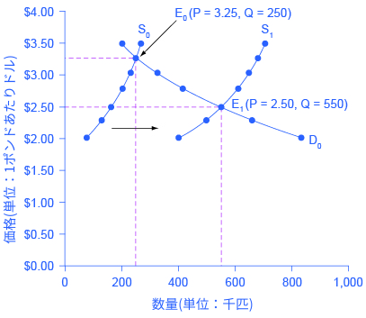
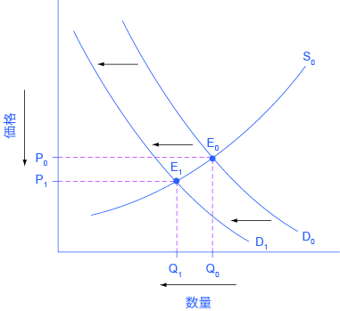
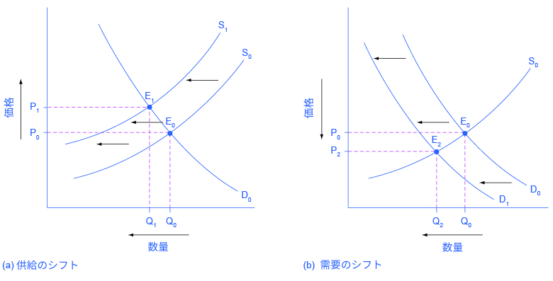
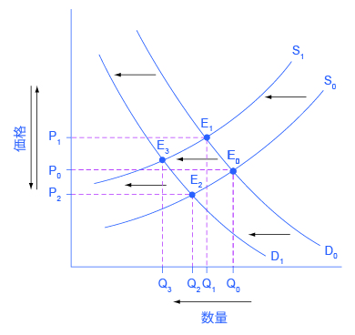
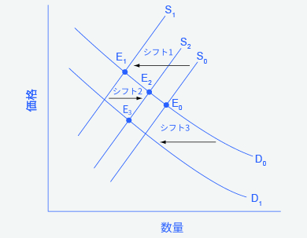

## 3.3 均衡価格と均衡数量の変化：4工程からなる分析

この節の最後には以下のことができるようになります。

* 4つの工程から均衡価格と均衡数量を特定する。
* 均衡価格と均衡数量の図を描く。
* 需要や供給のシフトと需要曲線や供給曲線上の動きを対比する。
* 現実の世界における例に即して、均衡価格と均衡数量を含んだ需要曲線と供給曲線の図を描く。

まずはじめに単一の経済現象について考えてみましょう。需要に影響する可能性のある現象としては、収入、好み、代替材や補完財の価格、予想される将来価格の変化等が考えられます。供給に影響する可能性のある現象としては、自然条件、生産要素価格、生産技術、生産に影響する政策の変化等が考えられます。こういった経済現象はどのようにして均衡価格と均衡数量に影響を与えるのでしょうか。この疑問を4つの工程に沿って分析してみましょう。

ステップ1：経済の変化が起こる前の需要と供給のモデルを描きましょう。モデルを構築するには4つの標準的な情報が必要とされます。それらは、需要の法則（需要曲線の傾きを定義します）、供給の法則（供給曲線の傾きを定義します）、需要曲線をシフトさせる変数、供給曲線をシフトさせる変数です。このモデルから、初期の均衡価格と均衡数量を見つけます。

ステップ2：今分析しようとしている経済の変化が需要と供給のどちらに影響を与えるかを確かめましょう。すなわち、その現象は前の節で見た需要に影響する要因なのか、供給に影響する要因なのかという事です。

ステップ3：需要や供給における影響がどの方向にそれぞれの曲線をシフトさせるのかを確かめ、新しい需要、供給曲線を描きましょう。すなわち、その現象は消費者が購入したいと思う数量や、生産者が売りたいと思う数量を増加させるのか減少させるのか、という事です。

ステップ4：新しい均衡を確認し、元の均衡価格、均衡数量を新しい均衡価格均衡数量と比較しましょう。

まずは供給のシフトに関する例と、需要のシフトに関する例について考えていきます。次に、需要と供給の両方が変化する例について考えます。

### 鮭漁に良い天気
2015年の夏、気象条件がカリフォルニア沖での鮭漁に適していたと仮定しましょう。例えば、激しい雨で川の水は平常時の水位よりも高くなり、それが鮭の繁殖を助け、わずかに冷たい海の温度は海の食物連鎖の土台となるプランクトンの生育を促し、これにより海に生息するあらゆる生物は豊富な食料にありつくことが可能で、海は漁の時期に穏やかであったので、悪天候で漁に出ることができないということがなかったとしましょう。このような気象条件が鮭の量と価格にどのように影響するのでしょうか。図3.16はこの問題を解決するための4つのアプローチを表しており、下で説明しています。表3.6もまた、この問題に取り組むための情報を載せています。

    

        図3.16 鮭漁にいい天気：4つの工程めったにないほどの良い天気が鮭の価格と数量を変える。
    

<table>
    <tr>
        <th>1ポンドあたりの価格</th>
        <th>2014年に供給された数量</th>
        <th>2015年に供給された数量</th>
        <th>重要量</th>
    </tr>
    <tr>
        <td>$2.00</td>
        <td>80</td>
        <td>400</td>
        <td>840</td>
    </tr>
    <tr>
        <td>$2.25</td>
        <td>120</td>
        <td>480</td>
        <td>680</td>
    </tr>
    <tr>
        <td>$2.50</td>
        <td>160</td>
        <td>550</td>
        <td>550</td>
    </tr>
    <tr>
        <td>$2.75</td>
        <td>200</td>
        <td>600</td>
        <td>450</td>
    </tr>
    <tr>
        <td>$3.00</td>
        <td>230</td>
        <td>640</td>
        <td>350</td>
    </tr>
    <tr>
        <td>$3.25</td>
        <td>250</td>
        <td>670</td>
        <td>250</td>
    </tr>
</table>

    

        表3.6 鮭漁
    

ステップ1：鮭漁に向いている天気が始まる前の、鮭市場を表す需要曲線と供給曲線を描きましょう。需要曲線D0と供給曲線S0は、初期の均衡価格が1ポンド当たり3.25ドルで、初期の均衡数量が250,000匹だったことを示します（この価格は商業目的の業者が水揚げ場で購入する際の価格です。消費者が食料品店で支払う価格はこの価格より高くなるでしょう）。

ステップ2：経済現象は供給や需要に影響を与えるのでしょうか。ここで考えている鮭漁に向いている天気というのは、供給に影響する自然条件の1例です。

ステップ3：供給は増加したのでしょうか、それとも減少したのでしょうか。鮭漁向きの天気は、すべての価格において供給される数量を増加させる自然現象だと考えることができます。もとの供給曲線S0から新しい供給曲線S1に動くように供給曲線は右にシフトします。このことは図3.16と表3.6に示されています。

ステップ4：新しい均衡価格と均衡数量をもとの均衡値と比べましょう。新しい均衡点E1では、均衡価格が3.25ドルから2.50ドルに減少しています。一方で均衡数量は250,000匹から550,000匹に増加しています。需要曲線は動いていませんが、需要均衡数量は増加したという事に注目しましょう。

すなわち、鮭漁向きの天気のおかげで、カリフォルニアにおける商業用の鮭の供給が増えたと言えます。結果として、市場において鮭はより多くの均衡数量で、より低い均衡価格で売り買いされたという事です。

### 新聞とインターネット
Pew Research Centerによると、ますます多くの人々（特に若者）がニュースをインターネット上から得ています。今では、アメリカの成人の大多数が自分のスマートフォンやタブレットを持ち、そのうちのほとんどが、ニュースを知るためにスマートフォンやタブレットを使うことがあると答えています。2004年から2012年において、電子媒体でニュースを得ると答えたアメリカ人の割合は24%から39%へと増加しました。これはラジオやテレビのニュースや新聞の消費にどう影響するのでしょうか。図3.17とその下に続く文章が4工程からなる分析を用いて説明しています。

    

        図3.17新聞市場：4工程からなる分析新聞からデジタルな情報源への趣向の変化は、新聞の需要を左側へシフトさせます。結果として、均衡価格と均衡数量の減少をもたらします。
    

ステップ1：情報源の趣向の変化が起こる前は、その市場がどうなっていたのかを考えるために需要と供給のモデルを考えてみましょう。需要曲線D0と供給曲線S0が元の関係を表します。今回は、価格と量の特定の数字を軸に取らずに分析をします。

ステップ2：先に述べた変化は需要や供給に影響したのでしょうか。伝統的な媒体（新聞やラジオやテレビ）から電子媒体への趣向の変化は伝統的な媒体の需要の変化を引き起こします。

ステップ3：需要に対する変化は需要を増加させたのでしょうか、それとも減少させたのでしょうか。電子媒体への移行はすべてのの価格において伝統的な媒体の需要量を低下させ、新聞やその他の伝統的な媒体の需要曲線を左に(D0からD1へ)シフトさせます。

ステップ4：新しい均衡価格と均衡数量をもとの均衡価格と比べてみましょう。新しい均衡点（E1）はもとの均衡点(E2)よりも均衡数量と均衡価格が低くなっていることがわかります。

印刷された新聞の減少は2004年以前にすでに起こっていました。新聞紙の発行部数は1973年をピークに、テレビやラジオとの競争によって減少し続けています。1991年では55%のアメリカ人が印刷物からニュースを得ていしたが、2012年ではたったの29%に減少しています。ラジオのニュースも最近数十年で同じような道をたどっており、ニュースをラジオから得ているアメリカ人の割合は1991年では54%でしたが、2012年には33%に減少しています。テレビのニュースは最近15年間は市場占有率を50%代の中間から後半までで保っています。30歳以下のアメリカの3分の2の人がニュースをテレビから全く得ていないと答えていることを考慮すると、将来どのような変化が起こると考えられるでしょうか。

### 現実市場での相互接続と調整の速度
現実世界では需要と供給に影響を与える多くの要素がすべて同時に変化する可能性があります。例えば車の需要は人口や人口の増加を理由に増加するかもしれませんし、（補完財である）ガソリン（補完財）価格の上昇を理由に減少するかもしれません。同様に車の供給は、車の製造コストを減少させる新技術を理由に増加するかもしれませんし、高価な汚染制御技術の導入を強いる政府の新しい規制の結果として減少するかもしれません。

さらに、所得や人口の増加、ガソリン価格の変動は車以外の多くの市場に影響を与えます。経済学者はこれらの繋がりあった事柄をどのようにして整理するのでしょうか。その答えは、ceteris
paribusの仮定にあります。まず一つ一つの経済における事柄がそれぞれの市場にどのような影響を与えるかを、その他の事柄を固定して観察します。そしてその次に分析を組み合わせ、全体の影響を見るのです。

### 分析の組み合わせの例
アメリカ合衆国郵便公社は難題に直面しています。生活費の上昇により配達員の報酬は多くの年で上昇する傾向にあります。同時に、eメール、FacebookやTwitterといったデジタル形式で家族や友人と情報のやり取りを行う人が急速に増えています。このことは、郵便公社の存続についてどのようなことを示唆しているのでしょうか。図3.18と、以下の文章が、4工程からなる分析を使うことでこの問に答える方法を示しています。

    

        図3.18 配達員の報酬：4工程からなる分析(a) 労働に対する報酬の増加は供給曲線を左にシフトさせ、均衡数量は低下し、均衡価格は上昇します。(b) 郵便公社から利用者が離れる動きは、需要曲線を左にシフトさせ、均衡数量は低下し、均衡価格は低下します。
    

この問には2つの変化が含まれるため、4工程からなる分析を2回行う必要があります。1つ目は配達員に対する報酬の増加が与える影響を分析するため、2つ目は多くの人々が従来の手紙からeメールなどのデジタル形式のやり取りへの移行が与える影響を分析するために行います。

図3.18の(a)は以下の工程で説明される供給のシフトを示しています。

ステップ1：このシナリオが始まる前、アメリカの郵便の市場がどのようになっていたかを説明するために、需要と供給モデルを描きます。需要曲線D0と供給曲線S0はもとの関係性を表しています。

ステップ２：先ほど記述されていた変化は供給または需要に影響を与えたのでしょうか。労働に対する報酬は生産コストです。生産コストの変化は郵便公社にとって供給の変化をもたらしました。

ステップ3：この変化によって供給は増加したのでしょうか、それとも減少したのでしょうか。報酬を高くすると、すべての価格において郵便業務の量が減少します。このため郵便業務における供給曲線はS0からS1へとシフトします。

ステップ4：新しい均衡価格と均衡数量をもとの均衡価格と均衡数量を比較してみましょう。新しい均衡点(E1)は、もとの均衡点(E0)よりも低い数量で、高い価格であることがわかります。

図3.18(b)は以下の工程で説明される需要のシフトを示しています。

ステップ1：このシナリオが始まる前、アメリカの郵便の市場がどのようになっていたかを説明するために、需要と供給モデルを描きます。需要曲線D0と供給曲線S0はもとの関係性を表しています。この説明は（a)の説明とは独立したものであることに注意してください。

ステップ2：先ほど記述されている変化は供給か需要に影響があったのでしょうか？従来の郵便ではない電子メッセージへの嗜好の変化が郵便業務における需要の変化を引き起こします。

ステップ3：この変化によって需要は増加したのでしょうか、それとも減少したのでしょうか。従来の郵便から電子メッセージへの嗜好の変化によって、すべての価格において郵便配達の需要量が減少し、郵便配達の需要曲線がD0からD1へ左にシフトします。

ステップ4：新しい均衡価格と均衡数量をもとの均衡価格と均衡数量と比較してみましょう。新しい均衡点(E2)ではもとの均衡点(E0)より低い数量と低い価格であることがわかります。

需要と供給の両方がシフトするシナリオでの最後の工程では、均衡数量と均衡価格において起きた事を説明する2つの独立した分析、すなわち供給と需要のシフトに関する分析が組み合わされます。図3.19に見られるように、これまでの2つの図を併せて1つにします。

    

        図3.19 減少した需要と減少した供給を組み合わせた効果供給と需要のシフトによって、均衡価格と均衡数量が変化します。
    

その結果は以下のとおりです。

数量に対する影響：郵便配達の労働報酬を高くすることによって、その報酬が生産のコストを増加させると考えることができるため、均衡数量が減少します。同様に、従来の郵便から電子メッセージへの嗜好の変化によって、均衡数量が減少します。両方のシフトが左向きであるため、全体として郵便配達の均衡数量の減少が見られました（Q3)。このことは図の中で容易に確かめることができます。図から分かるように、Q3はQ0より左にあります。

価格への影響：価格に対する全体的な影響はより複雑です。郵便配達の労働報酬を高くすることによって、生産コストが上がるため、均衡価格が上昇します。従来の郵便から電子メッセージへの嗜好の変化によって、均衡価格は下がります。これらの2つの影響は逆向きであるので、これら2つの影響の大きさを知らない限り、私達は全体の影響を知ることはできません。これは珍しいことではありません。両方の曲線が動くとき、一般的に価格あるいは数量についての影響を知ることはできますが、その両方について判断することはできません。今回の場合、私たちは均衡数量に対する全体の影響を判断できましたが、均衡価格についてはできませんでした。ほかの場合では逆の状況になるかもしれません。

次の段落では、需要供給のシフトと曲線上の動きとの違いについて焦点を当てて取り上げます。

    <h3>需要供給のシフトと曲線上の移動との違いは何でしょう。</h3>
    

        需要供給の枠組みを適応する際のよくある間違いに、需要供給曲線のシフトと需要供給曲線上の動きとを混同しているということがあります。例として、干ばつが小麦の均衡量と均衡価格を増減させるかどうかという問題を考えましょう。経済学の入門コースの学生であるLeeさんは次のように論じるかもしれません。
    

    

        「確かに干ばつによって供給が減少するのは明らかなので、図の元の供給曲線S0
        からS1にシフトするように供給曲線が左にシフト（シフト1）。均衡点もE0からE1に動き、均衡数量は減少しますが、均衡価格は上昇します。その時、高い価格は生産者が供給を増やすように作用するので供給曲線はS1からS2のように右にシフトします。（シフト2）ここでは、均衡点はE1からE2に動きます。高い価格は、需要を減少させ需要曲線を左にシフトさせます。それはもとの需要曲線D0からD1のようにシフトすること（シフト3）であり、この時均衡点はE2からE3に移動します。」
    

    
    

        

            表3.20 需要と供給のシフトと需要曲線と供給曲線上の移動片方の曲線のシフトは、もう片方の曲線のシフトを引き起こすことはありません。どちらかというと、片方の曲線のシフトはもう片方の曲線上の移動をあらわします。
        

    

    

        この時点で、Leeさんはこの答えが異なる方向へ向かっているのではないかと疑っています。Leeさんの論理がどこで間違っているか考え、次の答えを読みましょう。
    

    

        答え：Leeさんの最初のステップは正しいといえます。つまり、干ばつは小麦の供給曲線を後退させ、より低い均衡量とより高い均衡価格が予想されます。 これは元の需要曲線（D0）に沿ったE0からE1への移動に対応します。
        しかし、Leeさんの主張の残りの部分は間違っています。なぜなら、それは供給のシフトと供給量、需要のシフトと要求量を混同しているからです。
        Leeさんの説明におけるS1からS2への供給のシフトのように、より高いまたはより低い価格が供給曲線をシフトさせることはありません。 その代わり、価格の変化は与えられた供給曲線上の動きをもたらします。
        同様に、Leeさんの説明におけるD0からD1へのシフトのように、より高いまたはより低い価格が需要曲線をシフトさせることはありません。 代わりに、価格の変化は与えられた需要曲線上の動きにつながります。
        ある財の価格の変化がその商品の需要曲線または供給曲線の変化を引き起こすことは決してないことを覚えておきましょう。
    

    

        出来事の時系列について、注意深く考えましょう：何が最初に起き、次に起きるのは何でしょうか。何が原因で、何が結果でしょうか。正しい手順を守れば、正しい分析をできる可能性が高くなります。
    

経済事象が均衡価格と均衡量にどのように影響するかの4工程からなる分析では、もとの均衡から新しい均衡への動きは即時的に見えます。 しかし、現実では、、価格と数量がすぐに均衡にたどりつかないことがよくあります。
より現実的には、経済的な出来事が需要または供給をシフトさせるとき、価格と数量は大まかな均衡の方向に移動し始めます。それらが一つの新しい均衡に向かって動いている最中でも、次の需要または供給の変によって別の均衡に向かって価格が移動することはしばしばあります。

    <h2>
        対訳表
    </h2>

    <h2>
        批判的思考のための問題
    </h2>
    <ol>
        <li>4工程からなる分析を使って、iPodなどの携帯音楽プレーヤーの登場がソニーのウォークマンなどの携帯カセットプレーヤーの均衡価格と均衡数量に与えた影響を分析しましょう。</li>
        <li>
            4工程からなる分析を使って、iPodの輸入に関する関税の引き下げが携帯カセットプレーヤーの均衡価格と均衡数量に与える影響を分析しましょう。
        </li>
        <li>
            これら2つのことが同時に起こったと仮定しましょう。それぞれの分析を組み合わせ、iPodの登場と関税の引き下げが携帯カセットプレーヤーの均衡価格と均衡数量に与えると考えられる影響を考えましょう。また、答えを図で示しましょう。
        </li>
    </ol>

[3.4 上限価格と下限価格 >>](3-4-Price-Ceilings-and-Price-Floors)