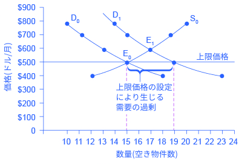
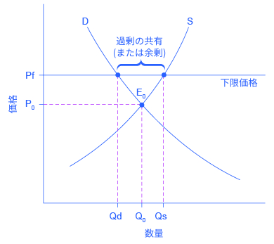

## 上限価格と下限価格

この節の最後には、以下のことができるようになります。
* 価格統制、上限価格、下限価格を説明する。
* 社会適応機構としての需要と供給を分析する。

この章の中で、前の節まででは、私たちは市場は自由だと仮定してきました。つまり、市場に政府が介入することは考えませんでした。この節では、ある財やサービスの価格が異常に高騰または暴落することを防ぐ目的で、政府が市場に介入する際に期待される結果と、期待される結果が得られない場合を見ていきます。

経済学者たちは、異なる状況下の中で経済主体がどう反応するのかを説明するいくつかの基本原理があると信じています。それらの原理のうちの二つはすでに紹介した、需要と供給の法則です。

政府は市場の動向に影響を及ぼす法律を制定することができますが、法律は経済原理を阻止することはできません。むしろ、経済原理は予想されていない方法で明らかになり、結果として政策の意図とは反する結果をもたらす場合もあります。これがこの節における主要な結論の中の１つなのです。

需要と供給によって決まる価格と数量に関して、特に必需品とされるものに関して議論が巻き起こることがあります。ときに、価格に関する議論は政治家への圧力となり、ある価格が「高すぎ」たり「低すぎ」たりしないように防ぐ法律を制定することに繋がります。

需要と供給のモデルは、これらの価格を操作する法律に対して人々と企業がどのように反応(多くの場合これらの反応は望ましくない結果につながる)するかを図示することができます。そのほかの代替となる政策では、価格統制の法律によって生じる費用とトレードオフの一部を避けながら価格統制で期待される目標を達成することができます。

### 上限価格
政府が価格を規制することを**価格統制**といいます。価格統制には2つの種類があります。**上限価格**は、ある価格がある基準を超えるることを防ぎます。一方**下限価格**は、ある価格がある基準を下回ることを防ぎます。このセクションでは上限価格を分析するために、需要と供給の枠組みを用います。次のセクションでは下限価格に言及します。

上限価格は、何かしらの財やサービスに対して支払う金額として法的に許される最大の値です。政府は必要不可欠な財やサービスを手頃な価格に保つために上限価格を課します例えば、2005年のハリケーンカトリーナによる災害の際、ペットボトルの水の価格は1ガロン当たり5ドル以上に上昇しました。そのことから、人々はペットボトルの水の価格が高くなりすぎないよう価格統制を求めました。この特定の事例において、政府は上限価格は課しませんでしたが、他の事例で、上限価格が発生したものもあります。

財とサービスにおける様々な市場において、需要者は供給者の数を上回ります。潜在的な投票者でもある消費者は時に価格を抑えるように政策を提案することがあります。アルバニーのような都市では、貸借人が政治家に対し、家賃統制の法律を成立させるよう求めてきました。家賃統制は、貸主が毎年上げることのできる貸借料の割合に上限を設けることによって行われます。家賃統制の例としてニューヨークやワシントンD.C.、サンフランシスコといった都市地域が挙げられます。

地代が急激に上がり始めるとき、家賃統制は政治的にホットなトピックとなります。誰もが手頃な価格の住む場所を必要とします。ひょっとしたら嗜好の変化によって、特定の郊外あるいは町が住む場所としてより人気になるかもしれません。また、地元密着型の企業の規模が拡大し、より高い収入とより多くの人々をその地域にもたらすかもしれません。そのような変化は、図3.21に示されているように、賃貸住宅需要に変化をもたらす可能性があります。元の均衡（E0）は供給曲線S0と需要曲線D0の交点で、均衡価格は500ドル、均衡数量は賃貸住宅15,000件です。表3.7のデータとグラフ上のD0からD1へのシフトが示す通り、より多くの収入、あるいは嗜好の変化によって、賃貸住宅の需要曲線は右側へシフトします。この市場の場合、新しい均衡E1において、賃貸一戸の価格は600ドルに値上がりし、均衡量は17,000件まで増加するでしょう。

    

        図3.21 上限価格の例：家賃統制需要と供給はもともとE0において交わります。需要がD0からD1までシフトする場合、上限価格が価格上昇を妨げない限り、新たな均衡はE1になるでしょう。価格上昇が制限される場合、供給量は15,000のままです。しかしながら、需要に変化が起こると、需要量は19,000まで増加するので、結果的に不足が生じます。
    

<table>
  <tr>
    <th>価格</th>
    <th>もとの供給量</th>
    <th>もとの需要量</th>
    <th>新しい需要量</th>
  </tr>
  <tr>
    <td>$400</td>
    <td>12,000</td>
    <td>18,000</td>
    <td>23,000</td>
  </tr>
  <tr>
    <td>$500</td>
    <td>15,000</td>
    <td>15,000</td>
    <td>19,000</td>
  </tr>
  <tr>
    <td>$600</td>
    <td>17,000</td>
    <td>13,000</td>
    <td>17,000</td>
  </tr>
  <tr>
    <td>$700</td>
    <td>19,000</td>
    <td>11,000</td>
    <td>15,000</td>
  </tr>
  <tr>
    <td>$800</td>
    <td>20,000</td>
    <td>10,000</td>
    <td>14,000</td>
  </tr>
</table>

    

        図3.7 上限価格の例：家賃統制
    

典型的なアパートの家賃をもとの$500の平衡価格に保つために、政府が賃貸管理法を可決させるとします。3.21の図では、$500の水平方向の線は、賃貸管理法により設定された、法定最高価格を示しています。しかし、需要曲線を右へシフトさせた根本的な原因は未だ残っています。$500という価格において、供給量は同じく15,000件のままですが、求められている量は19,000件です。言い換えれば、需要量は供給量を超過しているため、賃貸住宅が不足しているのです。上限価格の1つの皮肉は、上限価格は借り手を助けることを目的としているものの、上限価格以下で借りられているアパートの数(15000件)は、市場において$600で借りられる場合(17000件)よりも少ないということです。

上限価格は、単に家主の費用でもって借り手に利益をもたらす訳ではありません。むしろ、家主がアパートをマンションなどに変えることによって一部の借り手(もしくは潜在的借り手)は家を失うのです。家が賃貸市場にまだ残っていたとしても、家主はメンテナンスや冷暖房、お湯、照明などの必需品にあまりお金をかけなくなる傾向にあります。経済学における第1のルールは、何もなしに何かを手に入れることはできないということであり、全てのものには機会費用があるのです。従って、もし借り手が市場が求めるのよりも「安い」家を手に入れたとしても、彼らはより低い質の家に行きつくことになるのです。

上限価格は、生産物を必要とする人のために価格を低く保つための試みとして制定されました。しかしながら、市場価格が均衡レベルを上げることが許されない場合、需要量が供給量を超過し、不足が発生します。上限価格によって与えられた低い価格で生産物を購入できた人は利益を得るでしょうが、生産物を購入できなかった人と、その生産物の売り手は苦しみます。さらに、質も悪化するのです。

### 下限価格
下限価格は、何かしらの財やサービスに対して支払う金額として法的に許される最少の値です。もしかすると下限価格の最も知られた例は最低賃金かもしれません。それはフルタイムで働く人は基本的な日常生活を送ることができるべきだという視点に基づいています。2016年における連邦政府の最低賃金は（いくつかの州や地域ではそれよりも高い最低賃金でしたが）時給7.25ドルでした。連邦の最低賃金は一人当たり年間15,080ドルの所得を生み出していますが、これは連邦の貧困ラインである11,880ドルをわずかに上回ります。時代を経て人々の生活にかかる費用が増えていくと、議会は定期的に連邦の最低賃金を引き上げます。

下限価格は度々「価格支持」と呼ばれます。何故ならそれらは価格の一定以下への暴落を妨げることによって価格を支持しているからです。世界中では多くの国々で農産物の価格支持に関する法律が制定されています。農家の価格、すなわち所得はしばしば大きく変動します。もし平均で農家所得が安定していたとしても、いくつかの年ではそれらはとても低くなることがあります。価格支持の目的はそれらの変動を抑制することです。

価格支持の最も一般的な方法は、政府が市場に介入して生産物を買い上げることで需要を増やし、そうしない場合よりも価格が高くなるように保つ方法です。2013年に通過した欧州共通農業政策の改正によると、EUは年間600億ユーロ、米国ドルにして(2016年11月時点での為替レートで)670億ドル、つまりEU予算の約38％を2014年から2020年の間ヨーロッパ農家のための価格支持に充てるとしている。

図3.22はヨーロッパの小麦市場において高い価格を保証する政策による影響を示しています。政府介入がなければ需要量と供給量が同じになる均衡点E0において価格はP0、量はQ0になります。しかし、政府による農家のための高価格維持の方針によって市場の均衡価格よりも高い図の水平の点線で表されるPfの価格が保たれます。その結果供給量は需要量（Qd）に対して過剰となります。この時、需要量から過剰となった分の供給量は余剰となります。

経済学者はアメリカ・ヨーロッパ・日本などの世界でも高収入な国では農家に対して1日あたり約1億ドルを価格支持を通して支援していると推定しました。政府が過剰となった供給分を積極的に購入（または購入を促進させるよう資金を投入）した場合、農家は最低限の価格よりも利益を得ることになりますが、一方で納税者や食料品の消費者がその分の費用を負担することになります。農業経済学者と政策立案者は農業補助金を減らそうと多くの提案を行ってきました。しかし、多くの国々では政治的な農業支援は依然として力を持っています。これは、国民が伝統的な地方での生活を守る方法とみなしているか、あるいは農業関連産業のロビー活動の強さによると考えられます。

    

        図3.22 下限価格の例：ヨーロッパの小麦価格需要曲線（D）と供給曲線（S）が交差する点が均衡点E0です。しかし下限価格がE0よりも高いPfに固定されており、価格がこれより低下しないように補助されています。結果的に下限価格では供給量はQsとなり、需要量のQdに対して過剰になります。この供給の過剰分を余剰と呼びます。
    

    <h2>
        批判的思考のための問題
    </h2>
    <ol>
        <li>政策の多くは勝者と敗者を生みます。最低賃金を上げることの影響はどのようなものでしょうか。単に生産者が損をし労働者が利益を被るという構図よりも複雑です。勝者と敗者は誰で、それぞれ何を得て、何を失うのでしょうか。政策の遂行はどの程度その目標を達成できるでしょうか。</li>
        <li>農産物の価格支持政策は、政府が多くの農産物を抱えることになります。政府がこれらの農産物を貧困の人々に単に配れば良い、ということにはならないのはなぜでしょうか。</li>
        <li>市場における物件の供給を増やす政策としてどのようなものが考えられるでしょうか。</li>
    </ol>

    <h2>
        対訳表
    </h2>
    <table>
  <tr>
    <td>価格統制</td>
    <td>price control</td>
  </tr>
  <tr>
    <td>上限価格</td>
    <td>price ceiling</td>
  </tr>
  <tr>
    <td>下限価格</td>
    <td>price floor</td>
  </tr>
  <tr>
    <td>価格支持</td>
    <td>price support</td>
  </tr>
</table>

[3.5 需要、供給、効率 >>](3-5-Demand-Supply-and-Efficiency)