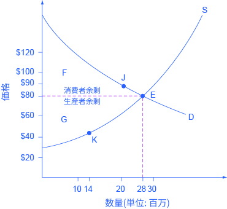
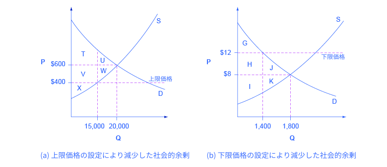

## 需要、供給、効率性
この節の最後には、以下のことができるようになります。
* 消費者余剰、生産者余剰、社会的余剰を把握する。
* なぜ下限価格と上限価格が非効率であることがあるかを説明する
* 需要と供給を社会調整メカニズムとして分析する
見慣れた需要と供給の図は経済的効率性の概念を持っています。経済学者が効率性を定義する典型的な1つの方法は、ある状況を改善する際、ある一方にコストを負わせることなくもう一方の状況を改善できるかどうかです。反対にもし状況が非効率である場合、ほかの集団へコストを負わせることなくある1集団の利益を上げられることが可能です。

需要と供給モデルの効率性も同じ基本的な意味を持っています。つまり効率的な市場では、希少な資源から可能な限りの利益を得ており、交換による利得も最大限になっています。言い換えれば財とサービスは理想的な数量で生産され、消費されます。

### 消費者余剰、生産者余剰、社会的余剰
図3.23が示しているタブレットコンピューターの市場について考えましょう。均衡価格は80ドルで均衡数量は2800万ドルです。消費者の利益を把握するには、需要曲線の均衡点の左上の部分を見ます。この部分の需要曲線は、少なくともいくつかの需要者はひとつのタブレットに対して80ドルよりも多くのお金を進んで支払うことを示しています。

例えば、点Jはもし価格が90ドルなら、2000万個のタブレットが売れるだろうということを示しています。タブレットから得られる期待される効用に基づいて、タブレットに90ドル払いたいという消費者は、均衡価格の80ドルで購入できた場合、明らかに彼らが支払った金額を上回る利益を得ることになります。需要曲線が、異なる数量において消費者が支払いたいと考える意思を示すことを思い出してください。個人が支払いたいと思う金額から実際に支払った金額を引いた値を消費者余剰と言います。**消費者余剰**はFの範囲で表されます。つまり、市場価格より上で需要曲線より下の部分です。

    

        図3.23　消費者余剰と生産者余剰Fで示されるおおよそ三角形の範囲は消費者余剰の範囲を示し、市場の均衡価格が消費者の多くが支払いたい金額よりも低かったことを表します。需要曲線上の点Jが表すのは、90ドルであっても消費者たちは2000万個のタブレットを買う意思はあったということです。Gで示されたおおよそ三角形の範囲は生産者余剰を示し、市場の均衡価格が生産者の多くが商品の価格として受け入れようとしていた金額よりも高かったことを表します。例えば供給曲線上の点Kが表す45ドルでは、企業は1400万個のタブレットを供給したがっていたということです。
    

供給曲線は企業がそれぞれの価格で供給しようとする商品の数量を示しています。例えば、図3.23の点Kは、45ドルにおいて企業は1400万個のタブレットを供給する意思があったことを示しています。45ドルでタブレットを供給しようとしていたところ、均衡価格である80ドルでタブレットを販売することができた場合、明らかに予定していた以上の利益となります。売り手が受け取った金額から、財を生産するために発生した費用を差し引いた値を**生産者余剰**と呼びます。図3.23において、生産者余剰はGに分類された区画です。それは、市場価格と、供給曲線の均衡より下の部分のあいだにある区画です。

消費者余剰と生産者余剰の合計が**社会的余剰**です。社会的余剰は、**経済的余剰**や**総余剰**とも呼ばれます。社会的余剰は、図3.23の中ではF+Gの区画です。社会的余剰は、量と価格が均衡点である場合に最大となります。これは市場均衡において経済が効率的であることを示しています。さらに、アウトプットの効率が最大のとき、生産者余剰の減少なしにより多くの消費者余剰を生み出すことは不可能で、同様に、消費者余剰の減少なしにより多くの生産者余剰を生み出すことも不可能です。

### 下限価格と上限価格の非効率性
下限価格あるいは上限価格の設定は、市場が均衡価格と均衡数量に調整されることを妨げ、非効率な結果を引き起こします。さらに、下限価格あるいは上限価格の設定は非効率性を生み出すだけではなく、消費者余剰を生産者余剰に移動させたり、生産者余剰を消費者余剰に移動させたりします。

いくつかの企業が、背中の痛みに有効だと評価される一方で高価な新薬を開発する状況を考えてみましょう。もしもこの療法が市場に持ち込まれたとき、均衡価格は月当たり600ドルで20,000人がこの新薬を使用します（図3.24(a)）。初期の状態の消費者余剰はT+Uで、生産者余剰はV+W+Xです。しかし、新薬の普及拡大のために政府が価格引き下げを決定した場合、400ドルまで価格が下がります。この上限価格だと、企業はたった15,000人分しか新薬を生産しません。

結果として、2つの変化が起こります。第1に、非効率な生産が行われ、社会の総余剰は削減されます。経済主体が非効率な生産量で生産するときに発生する社会の総余剰の損失は、**死荷重**と呼ばれます。死荷重とは、何の利益を得る事もなく無駄にお金が捨てられた状況と同じ状況を指します。図3.24(a)では、死荷重はU+Wです。死荷重が存在するとき、消費者余剰と生産余剰の両方が大きくなる可能性が存在します。なぜなら、その場合は価格操作によって、取引に参加する意思のある供給者と需要者の何人かがその取引から阻害されているからです。

上限価格の設定による変化の2つ目にに、いくらかの生産者余剰が消費者側に移されます。上限価格が課された後、新しい消費者余剰はT+Vで表されます。一方新しい生産者余剰はXです。言い換えると、下限価格によって面積Vの余剰が生産者から消費者に移されると解釈できます。ここでは、生産者余剰の増加した面積(V-U)は生産者余剰の減った面積(V+W)より小さいという事に留意してください。これは死荷重を確認する別の方法です。

    

        図3.24　効率性と下限価格と上限価格(a)もともとの均衡価格は600ドル、均衡数量は20,000です。消費者余剰はT+Uで、生産者余剰はV+W+Xです。上限価格は400ドルで課された場合、市場において企業は15,000しか生産を行いません。その結果新しい消費者余剰はT+Vで、新しい生産者余剰はXとなります。(b)もともとの均衡点は8ドル、均衡数量は1,800です。消費者余剰はG+H+Jで、生産者余剰はI+Kです。下限価格は12ドルで課された場合、需要量は1,400まで減少します。結果として、新しい消費者余剰はGで、新しい生産者余剰はH+Iとなります。
    

図3.24(b)は、ある街の、経営難に陥っている複数の映画館において下限価格を設定した場合の例を示しています。現在の均衡点では、映画のチケット1枚が8ドルで、1,800人が映画に行きます。もともとの生産者余剰はG+H+Jで、生産者余剰はI+Kです。市議会は、このままでは映画館が廃業に追い込まれ、市民の娯楽が減るのではないかと心配し、市民に負担を転嫁して映画のチケットの下限価格を12ドルにすることを決定します。結果として、需要量は1,400席まで落ちます。新しい消費者余剰はG、そして新しい生産者余剰はH+Iとなります。事実上、下限価格が課されることによって、面積Hが消費者余剰から生産者余剰に移されます。その結果、J+Kの死荷重も生じます。

この分析は、家賃統制のような上限価格の設定は、生産者余剰を消費者に移動させることを示しています。このことから、消費者は上限価格を好む傾向にあります。反対に、農家が農産物に最低価格を保証するような下限価格の設定は、消費者余剰を生産者に移動させます。このことから、生産者は下限価格を好む傾向にあります。しかし、上限価格も下限価格も、購入者と販売者が行なったであろう取引を阻害することになり、死荷重を生みます。価格と数量が均衡に落ち着くようこれらの障壁を取り除くことは、経済の社会的余剰を増加させます。

### 社会調整メカニズムとしての需要と供給
需要と供給のモデルは、価格は需要または供給の片一方だけではなく、需要と供給の相互作用で決定することを強調します。1890年に有名な経済学者であるAlfred Marshallは、需要と供給のどちらが価格を決定するかを議論することは、「紙を切るのはハサミの上の刃か、下の刃か」を議論するようなことだと述べています。需要と供給の両方が常に関わっているというのが答えです。

市場志向型経済では、均衡価格と均衡数量は政府による指導や監督無しで調整されます。もしブラジルで冷害が発生しコーヒー生産量が落ちた場合、コーヒーの供給曲線は左にシフトし、コーヒーの価格は上昇します。コーヒーが大好きな一部の人達は、コーヒーの価格が上昇してもコーヒーを飲み続けます。コーヒー販売価格、販売を行う会社、コーヒーを飲む消費者などは、政府の指導がなくても決定します。市場経済において、価格変動に対する調整は常に発生しており、多くの場合それは私達がその変化に気づかないほどスムーズで素早いのです。

真夏の新鮮なとうもろこしのように、一年のうちのある期間においては手に入りやすく安価であっても、他の時期ではより高価になるような、旬の食べもの全般について少し考えてみましょう。このような価格の変動に応じて不平不満を言ったり大騒ぎしたりすることなく、人々は自身の食事を変えますし、レストランはメニューを変えます。米国経済、世界経済において市場、つまり需要と供給が、誰が何をどのように作るのかという基本的な疑問に答えるための主要な社会の仕組みなのです。

    <h2>
        身の回りの経済学
    </h2>
    <h3>
        なぜ私たちは、有機食品を多く手に入れられないのでしょうか？
    </h3>
    

        有機食品は、合成農薬、化学肥料、または遺伝子が組換えられた種を使わずに生産されます。ここ数十年間で、オーガニック製品の需要は劇的に増加しました。売上高が1990年の10億ドルから2013年には351億ドルまで増加し、それの90%以上は食品の売上高であるとOrganic Trade Associationは報告しました。
    

    

        ではなぜ、有機食品は従来の食品よりも高価なのでしょうか？その答えは、需要と供給の理論を応用すれば明確です。人々が大規模な工場的農業による化学肥料や成長ホルモン、農薬などの悪影響についてより多くのことを学ぶにつれ、私たちはより安全な有機食品を求めるようになりました。また、収入の増加により、人々はより高価な製品を購入することが可能となり、有機食品は主流となりました。これにより、自然食品の需要は高まってきたのです。グラフ上の動きで考えると、需要曲線は右にシフトし、生産者はその新しい、より高い価格に応えるかたちでより多くの量を供給し、均衡は供給曲線上を右上の方向に移動しました。
    

    

        供給曲線上の動きに加えて、有機農業に転向した農家数も増加しました。これは供給曲線の右へのシフトによって表されます。需要曲線と供給曲線の両方が右へシフトしたことにより、結果としての有機食品の均衡量は大幅に高くなります。一方均衡価格は供給の増加が需要の増加よりも大きかった場合にのみ、下がります。有機食品の価格が安くなるには、もう少し時間が必要です。あるいは、有機肥料や害虫防除が高価なことにより、これらの製造コストは慣行栽培よりも高いままとなる可能性があります。そのため、有機食品が非有機食品の低価格に完全に追いつくことは不可能かもしれません。
    

    

        最後の例として、2013年4月、The Environmental Working Groupという環境活動団体は、「Dirty Dozen」という、洗った後でも高い残留農薬を示すとされた野菜と果物のリストをリリースされました。このリストにイチゴが含まれていたことでは有機イチゴの需要はを増加し、結果的に均衡価格も均衡販売量も高くなりました。
    

    <h2>
        批判的思考のための問題
    </h2>
    <ol>
        <li>客がある商品について「お得な取引」ができたとき、経済学者はこの状況を示すためにどのような用語を用いるでしょうか。</li>
        <li>無償の取引が社会的余剰を増加させるのはなぜでしょうか。</li>
        <li>自由市場では均衡数量よりも多い数量で取引が行われないのはなぜでしょうか。ヒント：その数量で取引が行われるためには何が必要かを考えてみましょう。</li>
    </ol>

    <h2>
        対訳表
    </h2>
    <table>
  <tr>
    <td>消費者余剰</td>
    <td>consumer surplus</td>
  </tr>
  <tr>
    <td>生産者余剰</td>
    <td>producer surplus</td>
  </tr>
  <tr>
    <td>社会的余剰</td>
    <td>social surplus</td>
  </tr>
  <tr>
    <td>経済的余剰</td>
    <td>economic surplus</td>
  </tr>
  <tr>
    <td>総余剰</td>
    <td>total surplus</td>
  </tr>
  <tr>
    <td>死荷重</td>
    <td>deadweight loss</td>
  </tr>
</table>

[第3章について >>](Reference)