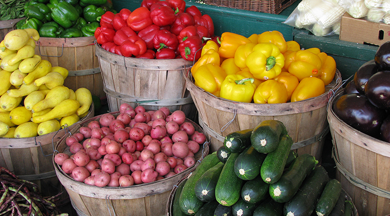

# 第3章 需要と供給

    

        図 3.1 選択とトレードオフ有機栽培の野菜や果物は地理的に限られた地域で生産・販売されている場合、理論上通常の生産物よりも輸送コストが小さくなることから価格も安くなるはずです。しかし、多くの場合有機農産物においてはこれは当てはまりません。（Credit: Modification of work by Natalie Maynor/Flickr Creative Commons）
    

    <h2>
        身の回りの経済学
    </h2>
    <h3>
        なぜ私たちは、有機食品を多く手に入れられないのでしょうか？
    </h3>
    

        有機食品は今やアメリカだけでなく全世界で人気になっています。以前は、消費者は有機食品が欲しいと思ったとき特別な店かファーマーズマーケットに行かなくてはいけませんでした。今や、多くの食料品店に行けば手に入ります。つまり、有機食品は主流となったのです。
    

    

        なぜ有機食品は通常の食品よりも高いのでしょうか？なぜ有機栽培のふじのリンゴは1ポンドあたり1.99ドルで、同じふじの通常栽培のリンゴは1ポンドあたり1.49ドルなのでしょうか？この価格の関係性は全ての有機食品においていえることです。有機食品が地元で栽培されているのであれば、市場に出されるまでの時間が短縮され、価格は安くなるのではないでしょうか？価格が下がらないように保つ力は何なのでしょうか？この力はこの章の題材である「需要と供給」に深く関係しています。
    

## はじめに
この章では以下の内容を学びます：
* 財やサービスの市場での需要、供給、均衡
* 財とサービスにおける需要と供給の移動
* 均衡価格と均衡数量の変化：4つの段階
* 価格の上限と下限

オークションの入札者がホイットニーヒューストンの着ていたドレスを千ドルで購入します。コレクターがジョンレノンの数少ない絵のために大金を使います。人々は通常これらの購買行動に2つの反応を示します。そのような財に対して支払う額としてはあまりにも高額だと驚く人と、それらの財は貴重で支払われた金gなくは妥当だと考える人がいます。

    

        著名な人と結びつくものとして購入された変わったもののリストを読むためには<a href="http://openstax.org/l/celebauction">こちら</a>のウェブサイトを見てください。この例は需要と供給の興味深い一面を表しています。
    

経済学者が価格について述べる時、かれらは判断を下すことより何が価格を決定し、なぜ価格が変化するのかについての実用的な理解を得ることに興味があります。多くの人が毎週利用しているガソリンの価格を考えてみましょう。なぜアメリカ合衆国での2014年6月時点のガソリンの平均価格が1ガロン当たり3.71ドルだったのでしょうか。なぜ2015年1月時点のガソリンの平均価格が1ガロン当たり2.07ドルに急落したのでしょうか。これらの価格変動を説明するために経済学者はどんなガソリンの消費者が積極的に購入し、どんなガソリンの売り手が快く応じているのかという価格決定要素に着目します。

どんな年の6月のガソリン価格も、常にその同じ年の1月のガソリン価格より高いことがわかっています。最近10年間は、夏半ばごろのガソリン価格は平均すると1ガロン当たり10セントほど冬の半ば頃よりも高くなります。この理由としては人々は夏のほうがドライブをし、ガソリンにさらにお金を払うことを気にしないからだと考えられます。しかし、この理由だけではガソリン価格が急激に下がったことは説明できません。この18ヶ月の間に、原油の供給量の増加、需要量の減少といった他の要因も関わっています。

この章では経済学において最も重要な経済モデルの一つである需要と供給の経済モデルの紹介をします。まずはじめに需要と供給が市場で販売される財やサービスの価格と数量をどう決めているか、また、需要と供給の変化が価格と数量にどのような変化を与えるかを見ていきます。

[3.1 需要、供給、財とサービスの市場における均衡 >>](3-1-Demand-Supply-and-Equilibrium-in-Markets-for-Goods-and-Services)