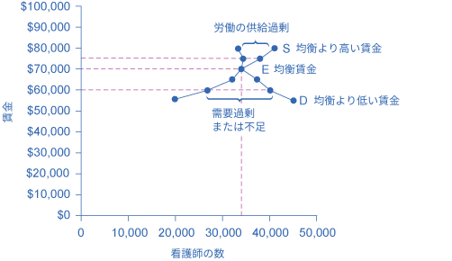

## 労働市場における需要と供給

この節の最後には以下のことができるようになります。

* 労働市場における需要曲線と供給曲線のシフトを予想する
* 新しい技術が労働市場における需要曲線と供給曲線に及ぼす影響を説明する
* 労働市場における最低賃金や生活賃金と言った下限価格の設定を説明する

労働市場では、財の市場と同様に需要曲線と供給曲線が存在します。需要の法則は次のような形で労働市場に当てはめられます：高い賃金、つまり労働市場における高い価格は雇い主によって需要される労働の数量の減少につながり、低い賃金は需要される労働の数量の増加につながります。供給の法則も労働市場において機能します。労働の価格が増加すると供給される労働の数量が増加し、労働の価格が低下すると供給される労働の数量は低下します。

### 労働市場における均衡
アメリカ合衆国労働省労働統計局によると、2015年の時点でミネアポリス・セントポール・ブルーミントンでは3万5000人の看護師が働いていました。これらの看護師は病院、医院、学校、診療所、介護施設といった多様な雇用主のもとで働いていました。図4.2は労働市場において需要と供給がどのように均衡を決めるかが示されています。表4.1は異なる賃金においての看護師の需要量と供給量を示しています。

    

        図4.2 労働市場の例：ミネアポリス・セントポール・ブルーミントンにおける看護師の需要と供給看護師を雇いたいと考えている雇い主の需要曲線(D)は、看護師の資格を有し働きたいと考えている看護師の供給曲線(S)と均衡点(E)にて交差します。均衡賃金は7万ドルで、均衡数量は看護師3万4000人です。均衡賃金より高い7万5000ドルでは供給量は3万8000人に増加しますが看護師の需要量は3万3000人に減少します。この均衡賃金以上の賃金では、供給過剰あるいは看護師の余剰が発生します。賃金が均衡価格より低い6万ドルの場合、需要量が4万人に増加する一方で供給量は2万7000人に減少します。この均衡賃金より低い賃金では需要過剰あるいは供給不足が発生します。
    

<table>
  <tr>
    <th>年間賃金</th>
    <th>需要量</th>
    <th>供給量</th>
  </tr>
  <tr>
    <td>$55,000</td>
    <td>45,000</td>
    <td>20,000</td>
  </tr>
  <tr>
    <td>$60,000</td>
    <td>40,000</td>
    <td>27,000</td>
  </tr>
  <tr>
    <td>$65,000</td>
    <td>37,000</td>
    <td>31,000</td>
  </tr>
  <tr>
    <td>$70,000</td>
    <td>34,000</td>
    <td>34,000</td>
  </tr>
  <tr>
    <td>$75,000</td>
    <td>33,000</td>
    <td>38,000</td>
  </tr>
  <tr>
    <td>$80,000</td>
    <td>32,000</td>
    <td>41,000</td>
  </tr>
</table>

    

        表4.1 ミネアポリス・セントポール・ブルーミントンの看護師の需要と供給
    

横軸は雇われた看護師の数を表します。この例では、労働者の数で労働量を測ります。縦軸は看護師の労働の価格、つまり賃金を表します。現実では「価格」とは賃金とその他利益を足し合わせた労働に対する報酬に当たります。明確ではありませんが、その他利益は労働に対する報酬の少なくない割合(多くて3割ほど)を占めます。この例では労働の価格を年間の賃金で測っています。他の事例では、労働の価格を月当たり、週当たり、時間当たりの賃金で測る場合があります。看護師の賃金が増加するにつれ需要量は減ります。病院や介護施設の中には雇用する看護師の数を減らしたり、すでに雇っている看護師を解雇するところが出てくるでしょう。また、雇用する側は看護師の役割を代替するような、コンピューターによる監視や診断システムといった物理的な機器類にお金を回したり、必要な看護師の数を減らすために低賃金の医療アシスタントを雇うなどする可能性があります。

看護師の賃金が増加するに連れ、供給量も増加します。ミネアポリス・セントポール・ブルーミントンでの看護師の賃金が他の街よりも高い場合、周辺の看護師は仕事を探すためにミネアポリス・セントポール・ブルーミントンに移り住み、看護師としての教育を受ける人も増え、フルタイムで看護師として働く人が増えるでしょう。言い換えると、この地域で仕事を探す看護師が増えることになります。

均衡では供給量と需要量が等しいので、看護師を雇いたい雇い主は看護師を雇う事ができ、仕事を探している看護師は雇用されます。図4.2では供給曲線(S)と需要曲線(D)は均衡点(E)で交差します。ミネアポリス・セントポール・ブルーミントンでの看護師の均衡数量は3万4000人で、均衡賃金は年給7万ドルです。この例は、「平均的な」看護師に焦点を当てることで看護師の労働市場を抽象化しています。もちろん現実では看護師の労働市場は、経験量や資格の違いによる、より小さな複数の市場で構成されています。多くの市場は質の異なる似た商品を扱っています。例えばガソリンと言ったシンプルな商品でも、レギュラーとハイオクのように異なる品質のものが異なる価格で提供されています。この場合でも、看護師の平均賃金を議論するのと同様に、ガソリンの平均価格を議論することは、多くの下位マーケットで起こっていることが反映されるため有益です。

労賃が均衡価格でないとき、経済的なインセンティブは賃金を均衡へ動かす傾向があります。例えば、ミネアポリス・セントポール・ブルーミントンの看護師の賃金が仮に年給7万5000ドルだったとしたら、3万8000人が看護師として働きたいと考えるでしょうが、雇用主は3万3000人しか看護師を雇いません。上記の均衡賃金において、供給過剰や余剰が起こります。労働市場が供給過剰の場合、あらゆる就職口にたくさんの志望者がいるため、雇用主は労働市場が供給過剰でなかったときより低い賃金で雇うインセンティブを持つことになるでしょう。看護師の賃金は均衡の方へ下がることになります。

対照的に、賃金が均衡よりも低かった場合、例えば年給6万ドルだったとき、需要過剰や供給不足が起こります。この場合、安い賃金を見た雇用主が4万人の看護師を雇いたくても、その賃金で看護師として働きたい人はたった2万7000人しかいません。供給不足の場合、雇用主の中には看護師を引き付けるため、より高い賃金を支払うものもいます。また、その他の雇用主は、自分たちの従業員をとどめておくためにより高い給料に合わせる必要があります。賃金が上がることで、より多くの看護師をミネアポリス・セントポール・ブルーミントンで研修を受け、働きたいと考えるでしょう。そうなることで労働市場における価格と数量は均衡価格へ移動します。

### 労働需要のシフト
労働における需要曲線が示すのは、セテリスパリブスの仮定のもと、全ての給料や賃金において雇用主が雇いたいと思う労働者数です。賃金や給料の変化によって、需要される労働者数が変わります。賃金率が増加するとき、雇用主はより少数の労働者を雇いたいと考えます。すると、需要される労働者数は減少し、均衡点は需要曲線に沿って上昇します。給料や賃金が減少するとき、雇用主はより多くの労働者を雇いたいと考えます。そして、需要される労働者数は増え、均衡点は需要曲線に沿って下方に移動します。

労働に対する需要曲線のシフトは様々な理由から起こります。１つの主要な理由は、労働需要は生産される財やサービスに対する需要に基づくという事です。例えば、より多くの新車を消費者が需要するとき、より多くの車を生産する人々が必要とされます。それゆえ、労働に対する需要は「派生需要」と呼ばれます。以下、労働に対する派生需要の例を紹介します。

* 料理人に対する需要はレストランの料理に対する需要に基づきます。
* 薬剤師に対する需要は処方箋に対する需要に基づきます。
* 弁護士に対する需要は法的サービスに対する需要に基づきます。

財やサービスに対する需要が増加するにつれて、雇用主が生産を行う上で必要とする要素を満たすために、労働需要も増加もしくは右にシフトします。財やサービスに対する需要が減少するにつれて、労働需要も減少もしくは左にシフトします。表4.2では、労働の派生需要に対する需要に加え、複数の要因によって需要が増減することを示しています。
アウトプットの需要
生産された財(アウトプット)の需要が増大した時は、その製品の価格と収益性も同時に増大します。結果的に、生産者は生産量を増やすために労働を需要します。

<table>
  <tr>
    <th>要因</th>
    <th>結果</th>
  </tr>
  <tr>
    <td>アウトプットの需要</td>
    <td>生産された財(アウトプット)の需要が増大した時は、その製品の価格と収益性も同時に増大します。結果的に、生産者は生産量を増やすために労働を需要します。</td>
  </tr>
  <tr>
    <td>教育と訓練</td>
    <td>労働者が良い訓練と教育を受けていれば、雇用主の労働者の需要は増加します。教育と訓練を受けた労働者によって生産力も向上すれば労働者に対する需要は右にシフトさせます。もし労働者が訓練や教育を十分に受けていなければ、雇用主はそのような労働者に対して多くの時間やお金をかけて必要な訓練を受けさせる必要があるため、雇用主はそれらの労働者を雇いません。教育と訓練を受けていない労働者の増加は需要を左にシフトさせます。</td>
  </tr>
  <tr>
    <td>技術</td>
    <td>技術の変化は労働の代替財と補完財のどちらにもなりえます。技術が代替財としてはたらく場合、雇用主が雇う必要のある労働者の代わりとなります。例えば、文字処理技術は、仕事場で必要とされるのタイピストの数を減少させました。これはタイピストの需要曲線を左にシフトさせます。ある特定の技術の利用が増えた場合、雇用の需要が増加する場合もあります。労働者を助ける技術特定の雇用の需要を増加させ、結果として需要曲線を右にシフトさせます。例えば、文字処理やその他のソフトウェアの利用の増加は、それらを利用する企業におけるソフトウェアやハードウェアのトラブルを解決できるIT技術者の需要を増加させました。。技術が進化していくほど仕事場での生産性を高める技術の使い方を知っている専門家の需要は増加します。技術の変化に対応できない労働者の需要は減少していくと考えられます。</td>
  </tr>
  <tr>
    <td>企業の数</td>
    <td>ある製品を生産している企業の数が増えると、労働需要が高まり、結果として労働者の需要曲線が右にシフトします。一方、ある製品を生産している企業の数が減少すると、労働需要は低下し、労働者の需要曲線は左にシフトします。</td>
  </tr>
  <tr>
    <td>政府の規制</td>
    <td>政府の規制により、すべての賃金において労働需要が増減することがあります。医療業界においては、政府のルールにより、特定の医療行為を行うために看護師を雇用することを求めるかもしれません。これは看護師の需要を増加させます。一方、十分に訓練されていない医療従事者はこれらの行為を行うことを禁止され、このような労働者における需要は左へシフトします。</td>
  </tr>
  <tr>
    <td>価格とその他の投入の可用性(Availability)</td>
    <td>生産手順における投入要素は労働だけではありません。たとえば、コールセンターのセールスマンは電話の他に、データと売り上げを入力するためのパソコンを必要とします。もしその他の投入物の価格が下がった場合、製品の利益率がより高くなり、供給者は生産を増やすためのより多くの労働力を求めます。これは労働需要曲線を右にシフトさせます。逆もまた然りです。他の投入物の価格の増加は労働需要を低下させます。</td>
  </tr>
</table>

    

        表4.2 需要をシフトさせる要素
    

    

        21世紀の仕事における傾向と課題についてもっと知りたい場合は<a href="http://openstax.org/l/Futurework">こちら</a>をクリックしてください。
    

### 労働供給力のシフト
労働の供給は右上がりで、供給の法則に従っています。価格が上がるほど供給量は増え、価格が下がるほど供給量は減ります。供給曲線はすべての賃金価格帯において市場に労働を供給することと娯楽に時間を費やすこととのトレードオフを示しています。賃金が高くなればなるほど、労働者は積極的に働こうとし、休暇をとりません。表4.3は供給の増減をひきおこす様々要因を表しています。

<table>
  <tr>
    <th>要因</th>
    <th>結果</th>
  </tr>
  <tr>
    <td>働く人の数</td>
    <td>働く人の数の増加は供給曲線を右にシフトさせます。働く人の数の増加は移民や人口増加、高齢者の増加、人口動態の変化というような様々な要因によって起こる可能性があります。移民を促す政策が労働供給量を増加させますし、逆もしかりです。出生率が死亡率を上回る時、人口は増加します。人口の増加分が働く年齢に到達したとき労働供給が増加します。一方人々が年を取り、退職する年齢とに達すると労働供給を減少させます。他の人口動態の変化の例としては、家の外で働く女性が増えることで労働供給量が増加ことが挙げられます。</td>
  </tr>
  <tr>
    <td>必要な教育の量</td>
    <td>必要な教育が増えると供給が減ります。博士の数学者の供給は高校の数学教師の供給よりも少なく、心臓専門医の供給は一次医療の医者の供給よりも少なく、医者の供給は看護師の供給よりも少ないでしょう。</td>
  </tr>
  <tr>
    <td>Government Policies</td>
    <td>Government policies can also affect the supply of labor for jobs. Alternatively, the government may support rules that set high qualifications for certain jobs: academic training, certificates or licenses, or experience. When these qualifications are made tougher, the number of qualified workers will decrease at any given wage. On the other hand, the government may also subsidize training or even reduce the required level of qualifications. For example, government might offer subsidies for nursing schools or nursing students. Such provisions would shift the supply curve of nurses to the right. In addition, government policies that change the relative desirability of working versus not working also affect the labor supply. These include unemployment benefits, maternity leave, child care benefits, and welfare policy. For example, child care benefits may increase the labor supply of working mothers. Long term unemployment benefits may discourage job searching for unemployed workers. All these policies must therefore be carefully designed to minimize any negative labor supply effects.</td>
  </tr>
</table>