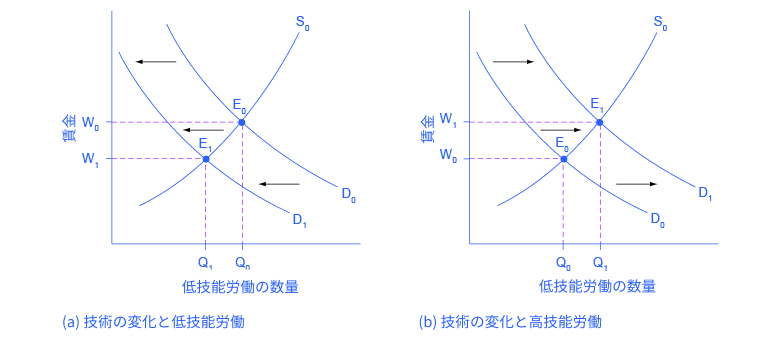
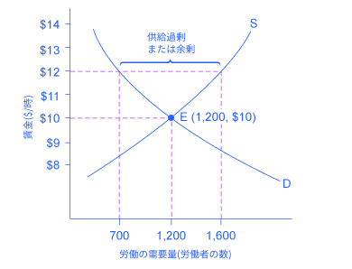

## 4.1 労働市場における需要と供給

この節の最後には以下のことができるようになります。

* 労働市場における需要曲線と供給曲線のシフトを予想する
* 新しい技術が労働市場における需要曲線と供給曲線に及ぼす影響を説明する
* 労働市場における最低賃金や生活賃金と言った下限価格の設定を説明する

労働市場では、財の市場と同様に需要曲線と供給曲線が存在します。需要の法則は次のような形で労働市場に当てはめられます：高い**給料**または**賃金**、つまり労働市場における高い価格は雇い主によって需要される労働の数量の減少につながり、低い賃金は需要される労働の数量の増加につながります。供給の法則も労働市場において機能します。労働の価格が増加すると供給される労働の数量が増加し、労働の価格が低下すると供給される労働の数量は低下します。

### 労働市場における均衡
アメリカ合衆国労働省労働統計局によると、2015年の時点でミネアポリス・セントポール・ブルーミントンでは3万5000人の看護師が働いていました。これらの看護師は病院、医院、学校、診療所、介護施設といった多様な雇用主のもとで働いていました。図4.2は労働市場において需要と供給がどのように均衡を決めるかが示されています。表4.1は異なる賃金においての看護師の需要量と供給量を示しています。

    

        図4.2 労働市場の例：ミネアポリス・セントポール・ブルーミントンにおける看護師の需要と供給看護師を雇いたいと考えている雇い主の需要曲線(D)は、看護師の資格を有し働きたいと考えている看護師の供給曲線(S)と均衡点(E)にて交差します。均衡賃金は7万ドルで、均衡数量は看護師3万4000人です。均衡賃金より高い7万5000ドルでは供給量は3万8000人に増加しますが看護師の需要量は3万3000人に減少します。この均衡賃金以上の賃金では、供給過剰あるいは看護師の余剰が発生します。賃金が均衡価格より低い6万ドルの場合、需要量が4万人に増加する一方で供給量は2万7000人に減少します。この均衡賃金より低い賃金では需要過剰あるいは供給不足が発生します。
    

<table>
  <tr>
    <th>年間賃金</th>
    <th>需要量</th>
    <th>供給量</th>
  </tr>
  <tr>
    <td>$55,000</td>
    <td>45,000</td>
    <td>20,000</td>
  </tr>
  <tr>
    <td>$60,000</td>
    <td>40,000</td>
    <td>27,000</td>
  </tr>
  <tr>
    <td>$65,000</td>
    <td>37,000</td>
    <td>31,000</td>
  </tr>
  <tr>
    <td>$70,000</td>
    <td>34,000</td>
    <td>34,000</td>
  </tr>
  <tr>
    <td>$75,000</td>
    <td>33,000</td>
    <td>38,000</td>
  </tr>
  <tr>
    <td>$80,000</td>
    <td>32,000</td>
    <td>41,000</td>
  </tr>
</table>

    

        表4.1 ミネアポリス・セントポール・ブルーミントンの看護師の需要と供給
    

横軸は雇われた看護師の数を表します。この例では、労働者の数で労働量を測ります。縦軸は看護師の労働の価格、つまり賃金を表します。現実では「価格」とは賃金とその他利益を足し合わせた労働に対する報酬に当たります。明確ではありませんが、その他利益は労働に対する報酬の少なくない割合(多くて3割ほど)を占めます。この例では労働の価格を年間の賃金で測っています。他の事例では、労働の価格を月当たり、週当たり、時間当たりの賃金で測る場合があります。看護師の賃金が増加するにつれ需要量は減ります。病院や介護施設の中には雇用する看護師の数を減らしたり、すでに雇っている看護師を解雇するところが出てくるでしょう。また、雇用する側は看護師の役割を代替するような、コンピューターによる監視や診断システムといった物理的な機器類にお金を回したり、必要な看護師の数を減らすために低賃金の医療アシスタントを雇うなどする可能性があります。

看護師の賃金が増加するに連れ、供給量も増加します。ミネアポリス・セントポール・ブルーミントンでの看護師の賃金が他の街よりも高い場合、周辺の看護師は仕事を探すためにミネアポリス・セントポール・ブルーミントンに移り住み、看護師としての教育を受ける人も増え、フルタイムで看護師として働く人が増えるでしょう。言い換えると、この地域で仕事を探す看護師が増えることになります。

**均衡**では供給量と需要量が等しいので、看護師を雇いたい雇い主は看護師を雇う事ができ、仕事を探している看護師は雇用されます。図4.2では供給曲線(S)と需要曲線(D)は均衡点(E)で交差します。ミネアポリス・セントポール・ブルーミントンでの看護師の均衡数量は3万4000人で、均衡賃金は年給7万ドルです。この例は、「平均的な」看護師に焦点を当てることで看護師の労働市場を抽象化しています。もちろん現実では看護師の労働市場は、経験量や資格の違いによる、より小さな複数の市場で構成されています。多くの市場は質の異なる似た商品を扱っています。例えばガソリンと言ったシンプルな商品でも、レギュラーとハイオクのように異なる品質のものが異なる価格で提供されています。この場合でも、看護師の平均賃金を議論するのと同様に、ガソリンの平均価格を議論することは、多くの下位マーケットで起こっていることが反映されるため有益です。

労賃が均衡価格でないとき、経済的なインセンティブは賃金を均衡へ動かす傾向があります。例えば、ミネアポリス・セントポール・ブルーミントンの看護師の賃金が仮に年給7万5000ドルだったとしたら、3万8000人が看護師として働きたいと考えるでしょうが、雇用主は3万3000人しか看護師を雇いません。上記の均衡賃金において、供給過剰や余剰が起こります。労働市場が供給過剰の場合、あらゆる就職口にたくさんの志望者がいるため、雇用主は**労働市場**が供給過剰でなかったときより低い賃金で雇うインセンティブを持つことになるでしょう。看護師の賃金は均衡の方へ下がることになります。

対照的に、賃金が均衡よりも低かった場合、例えば年給6万ドルだったとき、需要過剰や供給不足が起こります。この場合、安い賃金を見た雇用主が4万人の看護師を雇いたくても、その賃金で看護師として働きたい人はたった2万7000人しかいません。供給不足の場合、雇用主の中には看護師を引き付けるため、より高い賃金を支払うものもいます。また、その他の雇用主は、自分たちの従業員をとどめておくためにより高い給料に合わせる必要があります。賃金が上がることで、より多くの看護師をミネアポリス・セントポール・ブルーミントンで研修を受け、働きたいと考えるでしょう。そうなることで労働市場における価格と数量は均衡価格へ移動します。

### 労働需要のシフト
労働における需要曲線が示すのは、セテリスパリブスの仮定のもと、全ての給料や賃金において雇用主が雇いたいと思う労働者数です。賃金や給料の変化によって、需要される労働者数が変わります。賃金率が増加するとき、雇用主はより少数の労働者を雇いたいと考えます。すると、需要される労働者数は減少し、均衡点は需要曲線に沿って上昇します。給料や賃金が減少するとき、雇用主はより多くの労働者を雇いたいと考えます。そして、需要される労働者数は増え、均衡点は需要曲線に沿って下方に移動します。

労働に対する需要曲線のシフトは様々な理由から起こります。１つの主要な理由は、労働需要は生産される財やサービスに対する需要に基づくという事です。例えば、より多くの新車を消費者が需要するとき、より多くの車を生産する人々が必要とされます。それゆえ、労働に対する需要は「派生需要」と呼ばれます。以下、労働に対する派生需要の例を紹介します。

* 料理人に対する需要はレストランの料理に対する需要に基づきます。
* 薬剤師に対する需要は処方箋に対する需要に基づきます。
* 弁護士に対する需要は法的サービスに対する需要に基づきます。

財やサービスに対する需要が増加するにつれて、雇用主が生産を行う上で必要とする要素を満たすために、労働需要も増加もしくは右にシフトします。財やサービスに対する需要が減少するにつれて、労働需要も減少もしくは左にシフトします。表4.2では、労働の派生需要に対する需要に加え、複数の要因によって需要が増減することを示しています。
アウトプットの需要
生産された財(アウトプット)の需要が増大した時は、その製品の価格と収益性も同時に増大します。結果的に、生産者は生産量を増やすために労働を需要します。

<table>
  <tr>
    <th>要因</th>
    <th>結果</th>
  </tr>
  <tr>
    <td>アウトプットの需要</td>
    <td>生産された財(アウトプット)の需要が増大した時は、その製品の価格と収益性も同時に増大します。結果的に、生産者は生産量を増やすために労働を需要します。</td>
  </tr>
  <tr>
    <td>教育と訓練</td>
    <td>労働者が良い訓練と教育を受けていれば、雇用主の労働者の需要は増加します。教育と訓練を受けた労働者によって生産力も向上すれば労働者に対する需要は右にシフトさせます。もし労働者が訓練や教育を十分に受けていなければ、雇用主はそのような労働者に対して多くの時間やお金をかけて必要な訓練を受けさせる必要があるため、雇用主はそれらの労働者を雇いません。教育と訓練を受けていない労働者の増加は需要を左にシフトさせます。</td>
  </tr>
  <tr>
    <td>技術</td>
    <td>技術の変化は労働の代替財と補完財のどちらにもなりえます。技術が代替財としてはたらく場合、雇用主が雇う必要のある労働者の代わりとなります。例えば、文字処理技術は、仕事場で必要とされるのタイピストの数を減少させました。これはタイピストの需要曲線を左にシフトさせます。ある特定の技術の利用が増えた場合、雇用の需要が増加する場合もあります。労働者を助ける技術特定の雇用の需要を増加させ、結果として需要曲線を右にシフトさせます。例えば、文字処理やその他のソフトウェアの利用の増加は、それらを利用する企業におけるソフトウェアやハードウェアのトラブルを解決できるIT技術者の需要を増加させました。。技術が進化していくほど仕事場での生産性を高める技術の使い方を知っている専門家の需要は増加します。技術の変化に対応できない労働者の需要は減少していくと考えられます。</td>
  </tr>
  <tr>
    <td>企業の数</td>
    <td>ある製品を生産している企業の数が増えると、労働需要が高まり、結果として労働者の需要曲線が右にシフトします。一方、ある製品を生産している企業の数が減少すると、労働需要は低下し、労働者の需要曲線は左にシフトします。</td>
  </tr>
  <tr>
    <td>政府の規制</td>
    <td>政府の規制により、すべての賃金において労働需要が増減することがあります。医療業界においては、政府のルールにより、特定の医療行為を行うために看護師を雇用することを求めるかもしれません。これは看護師の需要を増加させます。一方、十分に訓練されていない医療従事者はこれらの行為を行うことを禁止され、このような労働者における需要は左へシフトします。</td>
  </tr>
  <tr>
    <td>価格とその他の投入の可用性(Availability)</td>
    <td>生産手順における投入要素は労働だけではありません。たとえば、コールセンターのセールスマンは電話の他に、データと売り上げを入力するためのパソコンを必要とします。もしその他の投入物の価格が下がった場合、製品の利益率がより高くなり、供給者は生産を増やすためのより多くの労働力を求めます。これは労働需要曲線を右にシフトさせます。逆もまた然りです。他の投入物の価格の増加は労働需要を低下させます。</td>
  </tr>
</table>

    

        表4.2 需要をシフトさせる要素
    

    

        21世紀の仕事における傾向と課題についてもっと知りたい場合は<a href="http://openstax.org/l/Futurework">こちら</a>をクリックしてください。
    

### 労働供給力のシフト
労働の供給は右上がりで、供給の法則に従っています。価格が上がるほど供給量は増え、価格が下がるほど供給量は減ります。供給曲線はすべての賃金価格帯において市場に労働を供給することと娯楽に時間を費やすこととのトレードオフを示しています。賃金が高くなればなるほど、労働者は積極的に働こうとし、休暇をとりません。表4.3は供給の増減をひきおこす様々要因を表しています。

<table>
  <tr>
    <th>要因</th>
    <th>結果</th>
  </tr>
  <tr>
    <td>働く人の数</td>
    <td>働く人の数の増加は供給曲線を右にシフトさせます。働く人の数の増加は移民や人口増加、高齢者の増加、人口動態の変化というような様々な要因によって起こる可能性があります。移民を促す政策が労働供給量を増加させますし、逆もしかりです。出生率が死亡率を上回る時、人口は増加します。人口の増加分が働く年齢に到達したとき労働供給が増加します。一方人々が年を取り、退職する年齢とに達すると労働供給を減少させます。他の人口動態の変化の例としては、家の外で働く女性が増えることで労働供給量が増加ことが挙げられます。</td>
  </tr>
  <tr>
    <td>必要な教育の量</td>
    <td>必要な教育が増えると供給が減ります。博士の数学者の供給は高校の数学教師の供給よりも少なく、心臓専門医の供給は一次医療の医者の供給よりも少なく、医者の供給は看護師の供給よりも少ないでしょう。</td>
  </tr>
  <tr>
    <td>政府の政策</td>
    <td>政府の政策も仕事における労働の供給に影響を与えます。また、政府は特定の職業に対して教育、資格、経験といった条件を課すルールを支持するかもしれません。これらの条件がより厳しいものとなれば、すべての賃金の価格帯においても条件を満たす労働者の数は減少する。一方で、政府は職業訓練を助成したり、必要な条件を緩和したりするかもしれません。例えば、政府は看護学校や看護学生に対し助成金を提供するかもしれません。このような資金提供は看護師の供給曲線を右にシフトさせます。これに加え、働くことと働かないことの相対的な願望を変える政府の政策も労働供給に影響を与えます。これらは失業手当、出産休暇、子育て手当、福祉政策などです。例えば、子育て手当は働く女性の労働供給を増加させるかもしれません。長期的な失業手当は、失業中の労働者が仕事を探すことを思いとどませるかもしれません。これらの政策はすべて、労働供給に対する望ましくない効果を最小限に抑えるように設計される必要があります。</td>
  </tr>
</table>

    

        表4.3 供給をシフトさせる可能性のある要因
    

給料の変化は労働の需要曲線または供給曲線上の動きにつながりますが、曲線をシフトさせることはありません。しかし、ここで挙げたような出来事は労働の需要または供給のシフトを引き起こし、労働市場は新しい均衡賃金と均衡数量に移ります。

### 技術と賃金の不平等：4工程からなる分析
経済的な出来事は均衡給料(または賃金)と労働の均衡数量を変化させることがあります。コンピューターや遠隔通信ネットワークがアメリカ経済の中の、低技能労働者と高技能労働者に与えた影響を考えてみましょう。労働を受容している雇用主の視点からするとこれらの技術は、例えば紙媒体の取引記録いっぱいの戸棚を整理していた文書整理係のような、低技能労働者の代替材となります。しかし、管理職のような、より多くの情報を監視でき、コミュニケーションを容易にし、広範囲に渡って責任を果たすことを可能とする技術を手に入れることで得をする高技能労働者にとっては補完財となります。新しい技術は高技能労働者と低技能労働者にどのような影響を与えるでしょうか。この問に答えるために、市場における需要と共有のシフトを分析するための4工程からなる分析(需要と共有の節で登場)を用いることができます。

ステップ1：新しい技術が導入されるより前では低技能労働者と高技能労働者の市場はどのようになっていたのでしょうか。図4.3の(a)と図4.3の(b)では、それぞれの労働市場においてS0が元の供給曲線でD0が元の需要曲線です。それぞれのグラフでは元の均衡点はE0で、均衡価格がW0、均衡数量がQ0となっています。

    

        図4.3　技術と賃金：需要と供給の適用(a) 技術が低技能労働者の仕事を代替し得る時には低技能労働者の需要は左側にシフトします。(b) 情報技術やネットワーク管理のような分野においては新しい技術は高技能労働者の需要を上昇させることがあります。
    

ステップ2：新しい技術は家計からの労働の供給と企業の労働の需要、どちらに影響を与えるのでしょうか。ここに述べている技術の変化は労働者を雇う企業による労働者の需要に影響を及ぼします。

ステップ3：新しい技術は需要を増加させるでしょうか、それとも減少させるでしょうか。先に述べたことに基づくと、低技能労働者の代替となるようなものが利用できるようになると、低技能労働者の需要はD0からD1へと左側にシフトします。高技能労働者を補完するような技術が安くなると、高技能労働者の需要はD0からD1へと右側にシフトします。

ステップ4：低技能労働者の市場の新しい均衡点はE1で、均衡価格はW1、均衡数量はQ1で表され、元の均衡点E0の時よりも低い賃金、低い雇用量となります。高技能労働者の市場の新しい均衡点はE1で、均衡価格はW1、均衡数量はQ1で表され、元の均衡点E0の時よりも高い賃金、高い雇用量となります。

つまり、需要と共有のモデルは、新しいコンピューターや通信技術は高能力の労働者の収入を増加させるが、低能力の労働者の収入を低下させると予想します。1970年代から2000年中頃にかけて高能力と低能力の労働者の賃金の差は広がりました。National Center for Education Statisticsによると、1980年には大学の学位を持っている人は高校の学位を持っている同程度の職業経験のある人に比べ30%以上稼いでいましたが、2014年にはその差は66%にまで増加しました。多くの経済学者はアメリカ経済で見られる、賃金格差が増加に向かう傾向は技術の進歩によるものであると考えています。

    

        現代の労働環境において見られなくなったテクノロジーに関する能力10個について読むにはこちらのサイト<a href="http://openstax.org/l/oldtechjobs">こちらのサイト</a>を見てみましょう。
    

### 労働市場における加減価格：生活賃金と最低賃金
財やサービスの市場とは異なり、労働市場において上限価格は滅多に見られません。なぜなら所得を制限するルールは政治的に人気がないためです。例外的に、投資信託団体や株主は企業トップに収入に制限を課すことがあります。

しかしながら、労働市場においては下限価格の有名な例がいくつかあります。それは給料の低い労働者の賃金を増やすための試みです。アメリカ政府は、**最低賃金**（雇用主が従業員に対してその時給以下を支払うことは違法になるという下限価格）を定めています。2009年の中頃には、アメリカの最低賃金は、時給で7.25ドルまで上がりました。アメリカの多くの都市で起こった地方政治運動では、最低賃金をより高めるよう求めました。そして、その賃金のことを彼らは**生活賃金**と呼びます。生活賃金法のプロモーターは、最低賃金が妥当な生活水準を保証するにはあまりに低いと主張します。彼らは、時給7.25ドルの最低賃金で週40時間、年に50週働くと、年収は14,000ドルになるという計算にこの結論の基礎を置いていますが、この金額は、アメリカ政府公式の貧困家庭を定義する金額よりも低いのです。（最低賃金で共働きをする2人の大人と2人の子供の家庭では、1人の親が収入のために働いている間にもう1人の親が育児をするというのが、よりコスト効率が高いと考えるでしょう。すると、世帯所得は14,500ドルで、これは連邦が定める4人世帯の貧困のラインの24,250ドル（2015年）と比べてかなり低いのです。）

生活の必需品（食物、衣服、最低限の住まい、医療）を得る余裕ができるように、常勤労働者には十分に高い賃金が保証されなければならないと、生活賃金の支持者は主張します。
メリーランド州のボルチモア市が1994年に最初の生活賃金法を可決してから、数十の都市で1990年代後期、2000年代にかけて類似の法律を制定しました。生活賃金条例がすべての雇用主に適用されるわけではありませんが、市の職員や市が雇っている会社の従業員に関しては、アメリカの最低賃金より時給あたり数ドル高い一定の賃金が少なくとも支払われるよう指定しました。

図4.4は、ある市が生活賃金法を検討している状況を図解しています。話を簡単にするため、政府が定める最低賃金がないと仮定しましょう。賃金は労働市場における価格にあたるため、縦軸に表します。生活賃金法が通過する前、均衡賃金は1時間当たり10ドルで、その市はその賃金において1200人の労働者を雇用しています。しかし、関係する市民団体が市議会に対し生活賃金法を制定するよう要求し、雇用者に対して少なくとも1時間当たり12ドル以上を支払うよう求めたとします。高い賃金に呼応し、その市では1600人の労働者が仕事を求めます。高い賃金に対し、雇用者側としては、雇用したいのは700人だけです。下限価格において、供給量は需要量を超過し、市場には余剰の労働力が存在します。高い給料で仕事を持ち続けられた労働者は生活が好転しますが、古い賃金での仕事を求めながらも賃金上昇に伴い仕事を失った労働者は、生活は好転しません。表4.4は異なる賃金における供給と需要の差を表しています。

    

        図4.4　生活賃金：下限価格の例この労働市場におけるもとの均衡は、点Eに示される賃金が時給12ドル、数量が1200人の点です。課された1時間当たり12ドルという下限価格は、労働の超過供給を生み出します。この賃金において、供給された労働量は1600人で、必要とされた労働量はたったの700です。
    

<table>
  <tr>
    <th>賃金</th>
    <th>労働の需要量</th>
    <th>労働の供給量</th>
  </tr>
  <tr>
    <td>$8/時</td>
    <td>1,900</td>
    <td>500</td>
  </tr>
  <tr>
    <td>$9/時</td>
    <td>1,500</td>
    <td>900</td>
  </tr>
  <tr>
    <td>$10/時</td>
    <td>1,200</td>
    <td>1,200</td>
  </tr>
  <tr>
    <td>$11/時</td>
    <td>900</td>
    <td>1,400</td>
  </tr>
  <tr>
    <td>$12/時</td>
    <td>700</td>
    <td>1,600</td>
  </tr>
  <tr>
    <td>$13/時</td>
    <td>500</td>
    <td>1,800</td>
  </tr>
  <tr>
    <td>$14/時</td>
    <td>400</td>
    <td>1,900</td>
  </tr>
</table>

    

        表4.4 生活賃金：下限価格の例
    

### 下限価格の例である最低賃金
アメリカの最低賃金は均衡賃金にとても近いか、場合によってはそれよりも少し低い金額で設定される下限価格です。アメリカの労働者のおよそ１％が実際に最低賃金を支払われています。違う言い方をすると、大多数のアメリカの労働人口の賃金は政府の下限価格に起因するものではなく、労働市場で決められた賃金になります。しかし、高校を修了した人や10代の人たちのように低い技能と少しの経験しかもたない、労働者にとって最低賃金はかなり重要です。多くの都市では、連邦政府が指定する最低賃金は低技能労働の市場価格を下回っていると考えられます。なぜなら、雇用主は政府からの促しなど無くともスーパーのレジなどの低技能労働に対して最低賃金以上の賃金を与えているからです。

経済学者は最低賃金が低い能力の労働者の需要量をどのくらい減少させるかを概算しようと努めてきました。こうした研究の代表的な結果として、最低賃金が10%上昇すると低技能労働者の雇用が1~2％程度しか減少しないとするものがあります。それどころか、物議の的となっている研究ではありますが、いくつかの研究では、特定の時期や場所においては最低賃金を引き上げることは雇用率に全く影響しないという結果も出ています。

最低賃金が均衡賃金をほんのわずかに下回っていると仮定しましょう。賃金は市場原理によってこの下限価格よりも高い値を取ることはありますが、下限価格を下回ることはありません。このような状況下では下限価格である最低賃金は制約的でないのです。つまり下限価格は市場取引量を決定していません。もしも最低賃金がほんのわずかに上昇しても、それが均衡賃金を下回ったままである限り、経済の中の雇用の量には影響しません。たとえ政府が最低賃金を均衡賃金をわずかに上回るように上昇させ、制約的にしてもそれは需要量と供給量の間でほんの少しの供給過剰をもたらすだけでしょう。

これらの見識はなぜアメリカの最低賃金法が歴史的に雇用に対して小さい影響しかもたらさなったのかを説明しています。最低賃金は基本的に低技能労働における均衡賃金の近く、場合によってはそれ以下の金額で設定されてきたため、労働の供給過剰をもたらすような大きな効果を及ぼしませんでした。しかし最低賃金が劇的に上がった場合(アメリカのいくつかの市が検討した、最低賃金を生活賃金の2倍にしたような場合)、最低賃金が及ぼす、雇用の需要量を減少させる影響はとても大きくなるでしょう。2017年では多くのアメリカの州が最低賃金を1時間あたり15ドルまで増やすことが決定しています。。これがどのような影響を及ぼすかは注視していく必要があります。次の段落では最低賃金に対する賛成と反対の双方の意見をより詳しく見ていきます。

    <h3>最低賃金を上げることにどのような弊害があるのか</h3>
    

      需要の法則から高い賃金は低技能労働の数量を従業員数あるいは労働時間の形で減少させます。数字には議論の余地がありますが、最低賃金の10%の上昇は低技能労働者の雇用率を2%減少させるとしましょう。これは最低賃金を10%上げることは公的な政策として良くないということを意味するのでしょうか。必ずしもそうとは言えません。
    

    

      最低賃金で働いている98%の人々が賃金の10%の賃上げの恩恵を受ける一方で2%の人々が職を失う場合、社会全体としてその利益は損失を上回るのでしょうか。職を失うことによる苦痛は、少人数であってもその他大勢の人の賃金上昇による利益よりも上回る可能性があるため、これに対する答えは明白ではありません。一つ考慮しなければならないことは、最低賃金で働いている人のうちどの人たちが職を失っているのか、です。もし最低賃金で働いている人のうち職を失う2%の人々が家族を支えることに苦労しているのならばそれは由々しき事態ですが、もし職を失う人々が夏休みに使うためのお金を稼いでいる高校生である場合話は変わるでしょう。
    

    

      もう一つ自体を複雑にしている要因として、最低賃金で働いている人々の多くは一年を通じて常勤雇用でない場合が多いことです。複数のパートタイムの労働をそれぞれ数ヶ月おきに行ったいる最低賃金で働いている労働者を想像してみてください。このような労働者は10%の賃上げを受けますが、同時に高い賃金は雇用主が求める労働量を減らすため2%だけ少ない時間働くことになります。最終的には、10%の賃上げは2%減少した労働時間による減収を上回るため、この労働者の所得は増加します。
    

    

      もちろん、これらの主張は最低賃金を上げることが良いことであると証明しているわけではありません。低賃金労働者を援助するためのより良い公的な政策が存在する可能性があります。(後の、貧困と経済格差の章でそのいくつかを見ていきます。)これらの最低賃金に関する話から得られる教訓は、複雑な社会問題について、単純な答えが存在することはほとんどないということでしょう。提案された経済政策が需要量と供給量に及ぼす影響については同意した人も、その政策が良い考えかどうかについては反対する可能性は大いにあるのです。
    

    <h2>
        批判的思考のための問題
    </h2>
    <ol>
        <li>労働の需要の他に「派生需要」にはどのようなものがあるでしょうか。</li>
        <li>最低賃金が5%上がることで雇用率が5%下がると仮定します。これは雇用する側とされる側にどのような影響を与えるでしょうか。あなたはこれを良い政策だと考えますか。</li>
        <li>どのような状況であれば最低賃金は制約的な下限価格ではないのでしょうか。どのような状況であれば生活賃金は制約的な下限価格となるのでしょうか。</li>
    </ol>

    <h2>
        対訳表
    </h2>
    <table>
  <tr>
    <td>給料</td>
    <td>salary</td>
  </tr>
  <tr>
    <td>賃金</td>
    <td>wage</td>
  </tr>
  <tr>
    <td>労働市場</td>
    <td>labor market</td>
  </tr>
  <tr>
    <td>最低賃金</td>
    <td>minimum wage</td>
  </tr>
  <tr>
    <td>生活賃金</td>
    <td>living wage</td>
  </tr>
</table>

[4.2 金融市場における需要と供給 >>](4-2-Demand-and-Supply-in-Financial-Markets)