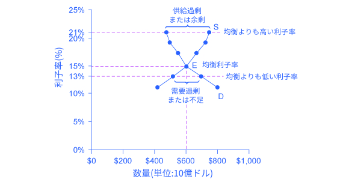
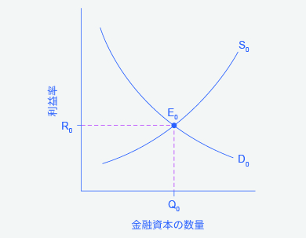
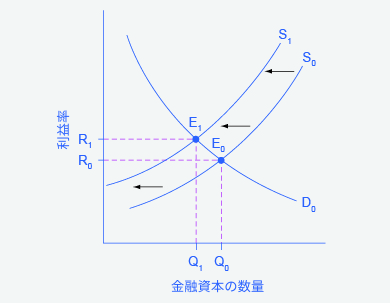
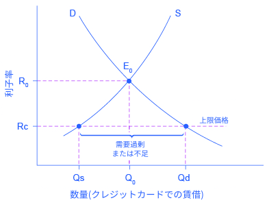

## 4.2 金融市場における需要と供給

この節の最後には以下のことができるようになります。

* 金融市場における需要者と供給者を理解する。
* 金利が需要と供給にどう影響するのかを説明する。
* アメリカの借金が及ぼす経済的な効果を国内金融市場の観点から分析する。
* アメリカにおける上限価格と利息制限法の役割を説明する。

アメリカの世帯、機関、および国内事業は2015年におよそ1.3兆ドルを貯蓄していました。このお金はどこに行って、どう使われたのでしょうか。その貯蓄のうちのいくらかは銀行でお金を借りたい個人や企業のための融資金となります。またいくらかは、民間企業に投資されたり、道路や公共交通機関を建設する目的で融資を募っている政府機関に貸し付けられたりします。貯蓄を自らの事業に再投資する企業もあります。

この節では、需要と供給のモデルが、**金融資本**を供給したい人（お金を預けたい人）と金融資本を要求する人（お金を借りたい人）とをどう結び付けるかを見ていきます。お金を預ける人（もしくは金融投資をするのも同じことです）は個人であろうと企業であろうと金融市場の供給側になります。お金を借りる人は金融市場の需要側になります。銀行口座や有価証券のような様々な種類の金融投資の詳細については金融市場の章を見てください。

### 金融市場では誰が需要し、誰が供給するのか
どんな市場でも価格は供給者が受け取り需要者が支払うものです。金融市場では金融資本を供給する人はお金を預けることでその後利益率を受け取ることを想定します。一方で、金融資本を要求する人は融資を受けることでその後利益率を支払うことを想定します。利益率は投資の種類によって様々な形態をとります。

最も単純な利益率は**利子率**です。例えば皆さんがお金を銀行の普通預金に預けたとすると、預金に対して金利を受け取れます。銀行が皆さんに金利として支払う預金額に対する割合が利子率です。同様に皆さんが車やコンピューターを買うためにローンを組むとすると、借りたお金に対して金利を払う必要があるでしょう。

クレジットカードでお金を借りるときの市場について考えてみましょう。2015年ではほぼ2億人のアメリカ人がクレジットカード保持者でした。クレジットカードはカード発行会社からお金を借りることを可能にします。そして借りた分と金利を合わせて払い戻ししますが、ほとんどのカードは金利無しでローンを返済することができる期間を設けています。典型的なクレジットカードの金利の範囲は１年に12%から18%です。2016年5月ではアメリカ人は約9430億ドルの未払いクレジットカード負債を抱えていました。クレジットカードを持っているアメリカの世帯の約半分がほぼいつも期間内に全額返済していましたが、クレジットカードを持っているアメリカの世帯の約4分の1は「めったに」全額返済しないと記録されています。実際2014年では56%の消費者が過去12ヶ間に未払いの負債を抱えていました。クレジットカード負債の年間金利の平均は15%だとしましょう。そうすると、アメリカ人は毎年数百億ドルの金利に加え、基本料金と延滞金を支払っていることになります。

図4.5はクレジットカードにおける金融市場の需要と供給を示しています。図の金融市場の横軸はローンまたは貸借したお金の量を示しています。縦軸は利益率を示しています。クレジットカードの場合これは利子率で測ることができます。。表4.5は消費者が様々な利子率において、消費者が需要する金融資本の数量と、クレジットカード会社(多くの場合銀行)が供給しようと考える数量を示しています。

    

        図4.5 クレジットカードでお金を借りる場合の需要と供給看このクレジットカード借入における金融市場について、金融資本の借入を示す需要曲線（D）が金融資本の貸付を示す供給曲線（S）と均衡点Eで交差しています。均衡点では利子率（この市場における「価格」）は15%、そしてローン及び借入された金融資本の数量は6000憶ドルです。均衡価格は需要量と供給量が同等な点です。利子率21%のような、利子率が均衡利子率より高いとき、金融資本の供給量は7500憶ドルに上昇する一方で、需要量が4800憶ドルに下がります。利子率13%のような、利子率が均衡利子率より低いとき、金融資本の需要量は7000憶ドルに上昇する一方で、金融資本の供給量は5100憶ドルに下がります。
    

<table>
  <tr>
    <th>利子率 (%)</th>
    <th>金融資本の需要量(借入) (単位:10億ドル)</th>
    <th>金融資本の供給量(貸付) (単位:10億ドル)</th>
  </tr>
  <tr>
    <td>11</td>
    <td>$800</td>
    <td>$420</td>
  </tr>
  <tr>
    <td>13</td>
    <td>$700</td>
    <td>$510</td>
  </tr>
  <tr>
    <td>15</td>
    <td>$600</td>
    <td>$600</td>
  </tr>
  <tr>
    <td>17</td>
    <td>$550</td>
    <td>$660</td>
  </tr>
  <tr>
    <td>19</td>
    <td>$500</td>
    <td>$720</td>
  </tr>
  <tr>
    <td>21</td>
    <td>$480</td>
    <td>$750</td>
  </tr>
</table>

    

        表4.5 クレジットカードでお金を借りる場合の需要と供給
    

需要と供給の法則は依然として金融市場において適用されます。**需要の法則**により、高い収益率(つまり高い価格)は需要量を減少させます。利子率が上がると消費者は借りる数量を減らします。供給の法則により、高い価格は供給量を増加させます。結果として、クレジットカードによる借り入れの利子率が上がると、より多くの企業がクレジットカードの発行数を増やし、顧客の利用を増やすことに積極的になります。反対に、クレジットカードによる借り入れの利子率が下がると、クレジットカード市場に供給されている金融資産の数量は減少し、需要量は増加します。

### 金融市場における均衡
図4.5のクレジットカードの金融市場では、供給曲線(S)と需要曲線(D)は均衡点(E)で交わります。均衡は資金の需要量と供給曲線が均衡数量6000億ドルで一致する、利子率15%で起こります。

もし、利子率（これは金融市場において「価格」を測るものだということを思い出してください）が均衡レベルを超え、金融資本の過剰供給あるいは余剰がこの市場で起こるとします。たとえば、利子率21%では、資金の供給量は7500億ドルまで増加する一方で、資金の需要量は4800億ドルまで減少します。この均衡を上回る利子率において、企業はクレジットカード借用者に融資を貸したがりますが、それに比べ借りようと思う人々や企業は比較的少なくなります。その結果、より多くの人々あるいは企業を融資に引き付けるため、一部のクレジットカード会社は利子率（あるいは他の料金）を下げるでしょう。この戦略は、利子率を均衡へと押し下げます。

金利が均衡よりも下回れば、需要過剰あるいは資金の不足がこの市場で起こります。13%の利子率で、クレジットカード借用者による資金の需要量は7000億ドルまで増加します。しかし、クレジットカード会社が供給する意思がある量はわずか5100億ドルです。この状況で、クレジットカード会社はお金を借りたいと思う人々が許容量を超えていると認識し、利子率や料金を上げる機会があると結論づけます。利子率は、均衡レベルに近づくよう経済的な圧力に直面します。

FREDデータベースは、クレジットカード、自動車ローン、個人ローン、抵当融資、その他多くの金利を含む、約24の金利評価を公表します。これらは[FREDのウェブサイト](https://openstax.org/l/FRED_stlouis)で見ることができます。

### 需要の変動と金融資本の供給
金融資本を供給する人々は、2つの大きな決断に直面します。いくら貯金するか、という決断と、異なる財政投資形態の間でどうやって貯金を分割するか、という決断です。これらについてそれぞれ順番に検討しましょう。

金融市場の参加者は、財をどの時期に消費するかを決める必要があります。経済学者は、これが時間を考慮して行われる選択であることから、これを**異時点間の選択**と呼びます。食料品店で何を購入するか決定する場合とは異なり、人々はある期間、ときには長い期間を考慮して投資や貯金を選択をします。

ほとんどの労働者は退職に向けて貯金をしています。なぜなら、彼らの現在の収入は彼らが必要とするよりも多い一方で、退職するとそれが逆転するからです。したがって、彼らは貯金をし、金融市場に供給します。もし彼らの収入が増えれば、彼らはもっと貯金をします。もし彼らが将来に対する考えが変化すれば、彼らは貯金額を変化させます。例えば、労働者お金を払い、退職後に政府からお金を得る社会保障制度は、労働者が蓄える金融資本を減少させる傾向があるといういくつかの証拠があります。もしこれが正しければ社会保障は金利の金融資本の供給を左にシフトさせたことになります。

対照的に、大学生の多くは所得が少ない(または無い)中で大学の費用を払うためのお金を必要としています。結果的に彼らは金融市場から需要し、お金を借入します。彼らが卒業し、働きはじめた時彼らはそのローンを返済することになります。個人は、住宅や車を購入するためにお金を借ります。企業は場合によっては5年、10年、又はそれ以上の期間が経つまで元を取れない工場の設立や研究開発のための資金を確保するために金融投資を求めます。そして、消費者と企業が将来的に返済が可能であるという革新が高まると、すべての金利での金融資本の需要量は右にシフトします。

例えば、1990年代後半の技術革新ブームのとき、多くの企業は新しい技術に対する投資が大きな収益を生むという極端な自信を持ちました。そして、そういった企業の金融資本に対する需要は右にシフトしました。一方、2008年や2009年の大恐慌時においては、金融資本に対する需要は全ての金利において左にシフトしました。

ここまでで、私たちは貯金に注目してきました。次は、様々な金融投資における貯金に何が影響を与えるかを考えてみましょう。異なる種類の金融投資先がある中からどの投資を選ぶかを決める際、金融資本の供給者は投資の収益率とリスクを考える必要があります。収益率は投資における正の側面ですが、リスクは負の側面です。もしも投資Aのリスクが増加するか、あるいは収益が減ると、貯金する人々は自らの資金を投資Bへ移動させます。これにより、投資Aの供給曲線は左にシフトし、投資Bの供給曲線は右にシフトします。

### 国際的な借り手としてのアメリカ合衆国
国際経済において、毎年、国境を越えて何兆ドルもの金融投資が行われています。2000年代前半では、外国人投資家がアメリカ経済で行ってきた投資額は、アメリカ人投資家が国外で行ってきた額よりも年間で数100兆ドル上回っていました。次の段落では、近年におけるアメリカ合衆国のマクロ経済の課題の1つを考えます。

  <h3>増え続けるアメリカ合衆国の債務の影響</h3>
  

    もしも、外国人投資家が、アメリカ合衆国の成長に関して懸念を持ったために、資産の投資先としてアメリカ経済を評価しなくなったらどうなるでしょうか？4工程の分析を用いて供給と需要の変化が均衡にどのような影響を与えるのかを分析しましょう。増加するアメリカ合衆国の債務は、アメリカ合衆国の金融市場における資本の均衡価格と均衡数量にどのような影響を与えるのでしょうか？
  

  

    ステップ1：外国人投資家が資産をアメリカ経済に投資しているというもとの状況を表す金融資本の需要と供給の図を描きましょう。図4.6は需要曲線Dと供給曲線Sを示し、ここでは資本の供給として外国人投資家からの投資を含みます。もとの均衡点E0は、利子率R0と金融投資Q0で起こります。
  

  
  

    

      図4.6 アメリカ合衆国の債務の不安定さが問題となる前における国際的な借り手としてのアメリカ合衆国図は、アメリカ合衆国の債務の不安定さが増加する前における、アメリカ合衆国からの金融資本需要と、海外諸国によるアメリカ合衆国への金融資本供給を示しています。もとの均衡E0は、均衡利益率R0と均衡数量Q0で起こります。
    

  

  

    ステップ2：投資先としてのアメリカ経済の信頼が失われることによって、金融資本の需要や供給は影響を受けるのでしょうか？実際、供給は影響を受けます。多くの外国人投資家の評価では、アメリカ金融市場は、資産運用を行う上でローリスクで安定した収益を達成する安全資産としてみなされています。したがって、投資先としての信頼が失われるという事は、アメリカ合衆国の資産がよりリスキーだとみなされるという事です。
  

  

    ステップ3：供給は増加するのでしょうか、それとも減少するのでしょうか？外国人投資家がアメリカ経済に対して投資する意欲が減少するとき、金融資本の供給は左にシフトします。図4.7では、供給曲線がS0からS1にシフトすることが示されています。
  

  
  

    

      図4.7　アメリカ合衆国の債務の不安定さが問題となる前後における国際的な借り手としてのアメリカ合衆国図が示すのは、アメリカ合衆国の債務の不安定さが増加する前後における、アメリカ合衆国からの金融資本需要と、海外諸国によるアメリカ合衆国への金融資本供給を示します。初期の均衡E0では、均衡利益率R0と均衡数量Q0で起こります。
    

  

  

    ステップ4：したがって、外国人投資家がアメリカ経済に投資したいと思う意欲の減少によってより高い利子率R1とより低い金融投資数量Q1の新しい均衡E1が得られます。つまり、アメリカ合衆国の借り手は借金に対して更に多くの金利を支払うことになります。
  

アメリカ経済には海外から莫大な資産が流入しています。米国商務省(BEA)によると、2015年の第3期までに、アメリカ人投資家は外国資産に23.3兆円投資を行いました。しかし、外国人投資家は合計30.6兆円分アメリカ合衆国の資産を所持していました。もしも外国人投資家がアメリカ経済から資産を引き上げ、世界の他の場所に投資した場合、アメリカ合衆国における金融投資は非常に少なくなり、利子率も高くなります。外国からの投資流入が減ることによって、借り手になることを望むアメリカ合衆国の消費者や企業には難儀が強いられるかもしれません。

現代の発展した経済では、金融資本は電子的で目に見えないかたちで銀行口座から銀行口座へと移動します。これらの資金の流れも財や労働の市場と同様の需要と供給のツールを使って分析することができます。

### 金融市場における上限価格：利息制限法
先程見たように、約2億人のアメリカ人がクレジットカードを持っており、金利の支払いや料金の合計は毎年何百億という金額に達します。クレジットカード会社が請求する利子率や料金に制限を設けるよう政治的な圧力がかかることは想像に難くないでしょう。銀行、石油会社、電話会社、小売店といったクレジットカードを発行する企業は、高い利子率はクレジットカードでお金を借りて期限内に返さない人々、または一切返さない人々による損失をカバーするために必要であると言います。これらの会社はまた、クレジットカード保有者は期限内に支払いを行うことで金利を支払うことを回避することができると指摘します。

図4.8のようなクレジットカード市場を考えてみましょう。この金融市場では縦軸が金利（金融市場での価格）を示しています。クレジットカード市場の需要者は世帯や企業です。供給者はクレジットカードを発行する会社です。この図では、(どのような場合でも仮定になってしまう)特定の数値は使用せず、根底にある経済的な関係に焦点をあてています。クレジットカードの利子率の上限(上限価格)を、均衡利子率であったはずのＲ0よりも低いＲｃに設定する法律が施行されたとします。図の利子率Ｒｃから伸びる水平な点線はその上限価格を示しています。需要と供給モデルのによると、上限価格での低い利子率では、クレジットカード債務の需要量はもとのＱ0からＱｄへ増加し、クレジットカード債務の供給量はＱ0からＱｓに減少します。上限価格(Rc)では需要量が供給量を上回ります。したがってその時点で一番優勢な利子率を支払う意思のある多くの人々は、会社はクレジットカードを発行したがらないことに直面します。結果としてクレジットカードの不足が発生します。

  

    図4.8　クレジットカード金利：上限価格のもう一つの例需要Ｄと供給Ｓのもとの交点は均衡E0である。しかし、上限価格は均衡利子率Ｒ0よりも低いＲｃに設定されていて、利子率は上向きに調整されないようになっています。上限価格では、需要量Ｑｄは供給量Qsを上回ります。このような状態を需要の過剰、または不足と言います。
  

多くの州では、貸し手が請求できる利子率に上限を定める**利息制限法**を設けています。しかし多くの場合この上限は市場の利子率よりも高い値に設定されています。例えば、利子率が年30%を超えないように設定されている場合でも、利子率はそれ以下の値で市場の圧力に沿って変動することはできます。比較的高い値で設定されている上限価格は制約的ではなく、均衡価格が上限価格を超えるまで上がらない限り実質的な効果はありません。

  <h2></h2>
  <ol>
    <li>アメリカ経済が世界の他の国々よりも急速に成長しはじめたとします。世界経済の一部としてアメリカの金融市場が受ける影響はどのようなものであると考えられるでしょうか。</li>
    <li>政府が全てのローンにおける利子率の上限を20%と定めた場合、誰が得をして誰が損をするでしょうか。</li>
  </ol>

    <h2>
        対訳表
    </h2>
    <table>
  <tr>
    <td>金融資本</td>
    <td>financial capital</td>
  </tr>
  <tr>
    <td>利子率</td>
    <td>interest rate</td>
  </tr>
  <tr>
    <td>需要の法則</td>
    <td>law of demand</td>
  </tr>
  <tr>
    <td>異時点間の選択</td>
    <td>intertemporal decision making</td>
  </tr>
  <tr>
    <td>利息制限法</td>
    <td>usury laws</td>
  </tr>
</table>

[4.3 効率の良い情報のメカニズムとしての市場 >>](4-3-The-Market-System-as-an-Efficient-Mechanism-for-Information)