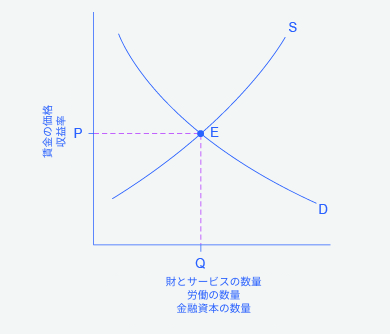
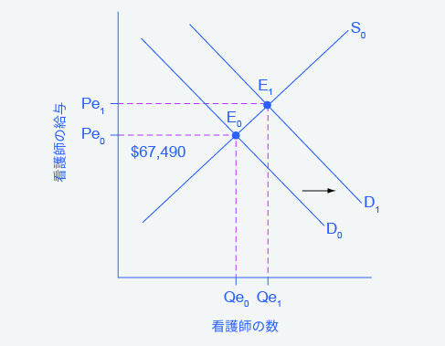
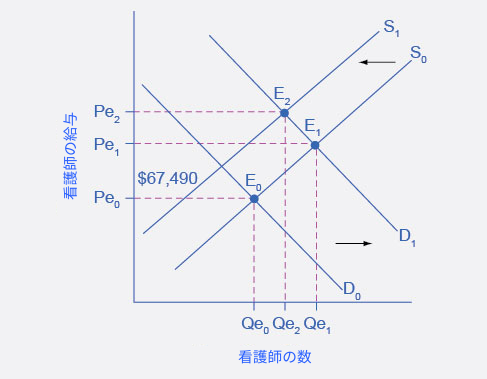

## 4.3 効率の良い情報のメカニズムとしての市場

この節の最後には以下のことができるようになります。

* 需要と供給のモデルを応用して価格と数量を分析する。
* 価格統制の均衡価格と均衡数量への影響を説明する。

財やサービスの市場、労働市場、金融市場には価格が存在します。これらのすべての市場では、価格はその市場の情報を集め、組み合わせ、伝達するすぐれた社会メカニズムとして働きます。すなわち、それは需要と供給の関係です。そしてその時価格は売り手と買い手にそれらの情報を伝えるメッセンジャーとして働きます。市場志向経済の中では、政府機関や情報機関は価格の変化に起因する反応や相互接続を管理することはありません。各々の消費者は個人的な趣向や予算設定をもとに価格の変化に反応を示し、そしてそれぞれの利潤を追求する生産者は期待される利潤への影響をもとに価格の変化に反応します。次の段落の図では需要と供給のモデルを詳しく見ます。

  <h3>なぜ需要曲線と供給曲線が重要なのか。</h3>
  

    需要と供給のモデルはこの教科書で二番目に重要な図です(希少性の世界での選択の章で紹介した予算制約モデルが最初の重要な図です)。算数の割り算において、答えを出すために全ての数の約数を暗記することができないのと同じように、この章、教科書全体の需要と供給の全ての事例を暗記しようとしてはいけません。需要と供給は具体例の目録ではありません。価格と数量を分析するためのモデルなのです。需要と供給の図では多くの異なるラベルが使われますが、根本的なロジックは同じなのです。根底にあるモデルを理解して、どんな市場の分析にも利用できるようにすることを目標にするべきです。
  

  

    図4.9は一般的な需要曲線と供給曲線を表しています。横軸は、財あるいはサービスの量、所定の仕事に対する労働の量、金融資本の量といった、数量の尺度を示しています。縦軸は、財あるいはサービスの価格、労働市場における賃金、金融市場における(利子率などの)収益率といった、価格の尺度を示しています。
  

  

    需要と供給モデルは存在する価格、賃金、収益率の度合いを説明することができます。このような分析を行う場合、それぞれの価格で需要される数量とそれぞれの価格で供給される数量(つまり需要曲線と供給曲線のかたち)を考え、これらがどのように合わさって均衡が作られるかを考えます。
  

  

    需要と供給を用いることで経済的な出来事が価格にどのような影響を与えるかも説明することができます。ある出来事により需要曲線が右側あるいは左側にシフトするか、供給曲線が右側あるいは左側にシフトするかの4つの可能性しかありません。経済的な出来事が均衡価格と均衡数量に及ぼす影響を分析するための鍵は、これらの4つの可能性のどれが起こったかを見分けることです。注意する必要があるのは、2つ以上の変数が変化している場合、全体としてのインパクトはそれぞれのシフトの度合いに依存するということです。複数の変数がある場合、経済学者はそれぞれの変化を分離させ、独立させた状態で分析します。
  

  
  

    

      図4.9
        需要供給曲線この図は、一般的な需要供給曲線を表しています。横軸は、財あるいはサービスの量、所定の仕事に対する労働の量、金融資本の量といった、数量の尺度を示しています。縦軸は、財あるいはサービスの価格、労働市場における賃金、金融市場における(利子率などの)収益率といった、価格の尺度を示しています。私たちは、経済的な事象が価格、賃金、収益率に対してどのような変化をもたらすかを説明するのに需要供給曲線を使うことができます。
    

  

商品の価格上昇は、消費者に対する商品不足の合図になることがあります。それゆえ、消費者はこの商品の購入において節約したいと思うかもしれません。例えば、あなたがハワイ旅行を考えていたところ、旅行を予定していた週では飛行機のチケットが割高であることが分かったとしますこのような場合あなたは旅行の日程を、チケットがより安い他の週に変更することを考えるかもしれません。価格が高かったのは旅行の需要が大きい休日に旅行を計画していたからかもしれません。あるいは、飛行機の燃料など投入物の費用が増加した、航空会社はどのくらい多くの人々が高い価格を支払う意思があるのかをみるために一時的に価格をあげた、といった理由かもしれません。もしかしたら、これらの要因が全て同時に存在しているかもしれません。ただ、市場を分析し、価格の変化をその根本的な要因に分解して把握する必要はありません。あなたはチケットの価格を見て、旅行するかどうか、また、いつ旅行するかを決めればよいのです。

同様に、価格の変化は生産者にとっても有用な情報です。オーツ麦農家が、オーツ麦の価格が上がったことを知るという状況を想定してみましょう。高い価格は、新たな研究によりオーツ麦を食べることが健康に良いということがわかったという発表によるものかもしれません。あるいは代替財となるトウモロコシといった穀物の価格が上昇し、人々がオーツ麦を買うことで反応したことによるものかもしれません。オーツ麦農家は具体的な理由を知る必要はありません。その農家は、オーツ麦の価格が上がったということと、それに伴って生産を拡大することでより儲かるということさえ知っていればよいのです。

価格の上昇に伴う個々の消費者の行動は市場の財、労働、金融資本と重なり合い、連動します。ある市場における変化はこれら複数の相互接続により他の市場に伝達されます。柔軟な価格が市場を均衡へと向かわせる役割を持ち、異なる市場をつなげているという知見は、価格設定が非生産的になりえることを説明する手助けとなる。「使者を殺すな」という古いことわざがある。古代では、使者(情報を伝達する人)が遠く離れた街や王国の間を情報を運んでいました。使者が悪い知らせを届けに来たときは、その使者を殺す衝動に駆られました。しかし使者を殺すことは悪い知らせを消すことには繋がりません。むしろ、使者を殺してしまうと、他の使者たちはその街または王国に知らせを届けに行くことを拒み、市民が情報を得られないという望まれない副作用がありました。

価格設定を求める人々は、使者を殺そうとしている、つまり価格がもたらす均衡価格と均衡数量に関する知らせを抑えようとしているのです。しかしながら、価格設定は、需要と供給の大元にある力に影響を与えるものではなく、これは深刻な反動をもたらす可能性があります。1950年代後半の中国の「大躍進政策」の間、政府は食糧価格を人為的に低く抑え、その結果、農場の生産が低下したため、3000万から4000万人が飢餓で亡くなりました。これは共産党指導者の毛沢東による、急速な工業化と集団化による農業経済から社会主義社会へと国を急速に変容させるための社会的、経済的キャンペーンでした。需要と供給の変化は、消費者と生産者の行動を通して明らかになり続けます。価格設定を通じて価格の使者を動けなくすることは、経済の中のすべての人から重要な情報を奪います。この情報がなければ、買い手も売り手も誰もが経済全体に変化が生じたときに柔軟で適切な方法で対応することが難しくなります。

  <h2>
    身の回りの経済学
  </h2>
  <h3>高齢化するベビーブーム世代</h3>
  

    図4.10に示すように、需要と供給の理論は、労働市場で何が起こるかを説明できます。またその中で団塊世代の医療需要の増加に伴い、看護師の需要が増加することを示唆しています。この増加の影響により平均給与は、この章の最初の部分で言及した2015年の平均給与よりも67,490ドルも高くなります。
    新しい均衡（E1）は新しい均衡価格（Pe1）になります。均衡数量もQe0からQe1に増加します。
  

  
  

    

      図4.10
        2014年-2024年の看護師の需要増加の影響2014年の看護師の給料の中央値は67,490ドルでした。サービスにおける需要が増加した時、需要曲線は（D0からD1へ）右にシフトし、看護師の数の均衡点がQe0からQe1へ増加します。給料の均衡点はPe0からPe1へ増加します。
    

  

  

    看護師の需要が増加すると同時に、看護学校の教育費の増加や退職する看護師の数の上昇によりその供給が減少するとします。図4.11の供給曲線の左へのシフトが看護師の供給減少の影響を表しています。二つの曲線のシフトが看護師の給料の上昇を引き起こしますが、看護師の数への全体的な影響は、供給と需要のシフトの相対量に依存するため不確かです。
  

  
  

    

      図4.11
        2014年から2024年の看護師の供給減少の影響図4.10で示されている看護師の需要の増加はより高い価格とより高い需要量の両方を導いています。現場から看護師が退職していくと、看護師の供給量は減少します。これは供給曲線の左へのシフトと、看護師の給与のPe2への上昇を引き起こします。看護師の均衡数量(Qe2)への正味の影響は不確かです。この図では便宜的にQe2をQe1より低く、Qe0より高い値として示しています。
    

  

  

    看護師の数が当初と比較して増加するか減少するかはわかりませんが、より高い給料を得ることはわかります。
  

  <h2>批判的思考のための問題</h2>
  <ol>
    <li>財の需要をシフトさせる要因が労働の需要をシフトさせる要因と異なるのはなぜでしょうか。また財の供給をシフトさせる要因が労働の供給をシフトさせる要因と異なるのはなぜでしょうか。</li>
    <li>
      数年前、アラスカへ天然ガスを運ぶパイプラインを建設することに関する議論がおこりました。アメリカの上院では、そのパイプラインを通る天然ガスに最低価格が保証されるべきだとする法案が可決されました。その背景にあるのは、もし私企業が生産する天然ガスに価格保証があるならば、それらの私企業はガスを採掘してパイプラインの建設費用を払おうという意思が強まるだろうという考えです。
      <ol type='a'>
        <li>需要と供給のフレームワークを使い、下限価格による、価格、需要量、供給量への影響を考えてみましょう。</li>
        <li>天然ガスの下限価格の制定によって生じる意図的ではない結果にどのようなものがあるでしょうか。</li>
        <li>アラスカにおける天然ガスの採掘と新しいパイプラインの建設を働きかけるための、政府が推し進めることが可能な、下限価格以外の政策を考えてみましょう。</li>
      </ol>
    </li>
  </ol>

[第4章について >>](Reference)