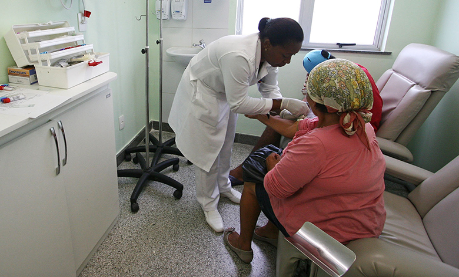

# 第3章 需要と供給

    

        図4.1人々は需要と供給を財との関係で考えることがあります。しかし看護職といった労働市場でもこの分析を当てはめることができます。(Credit: modification of work by "Fotos GOVBA"/Flickr Creative Commons)
    

    <h2>
        身の回りの経済学
    </h2>
    <h3>
        高齢化するベビーブーム世代
    </h3>
    

        アメリカ合衆国国勢調査局レポートによると2013年時点で米国人口の20%が60歳以上でした。これは約6300万人がより多くの医療を必要とする年齢に達していることを意味しています。
    

    

        1946年から1964年の間にうまれたベビーブーム世代の人口はおよそ7400万人で、ちょうど退職する年齢に達しています。この年齢層の人たちは年を重ねるに連れ心臓病や関節炎、長い入院期間や自宅療養が必要となってくるアルツハイマー病といった共通の健康問題に直面するでしょう。ベビーブーム世代が年を取り、寿命が延び、延命技術が向上することは医療や看護の需要が上がることになります。さらに、医療保険制度改革により医療を受けられるアメリカ人が増え、需要を拡大させました(ドナルド・トランプ氏の当選によりこの増加は維持されない可能性もありますが)。
    

    

        アメリカ合衆国労働省労働統計局によると、看護職のポストは2014年から2024年のあいだに16%増加することが予想されています。2015年の時点で6万7490ドルだった看護職員の年収の中央値も同様に上がると予想されています。アメリカ合衆国労働省労働統計局の予想では4万3900人もの新しい看護師が2022年には必要になるとしています。
    

    

        このデータから、医療関係者、特に看護師の市場はいくつかの難題に直面するということがわかります。供給と需要の考え方は、看護師やその他の医療関係者の労働市場に何が起こる可能性があるかを分析する手助けになるでしょう。そしてその議論については、この章の最後で再度見ていきます。
    

## はじめに
この章では以下の内容を学びます：
* 労働市場での需要と供給
* 金融市場での需要と供給
* 情報の効率的なメカニズムとしての市場システム

需要と供給の理論は商品の市場だけに当てはまる訳ではありません。それは労働や金融サービスなど私たちが財やサービスとして考えないような市場にも適応できます。労働市場は、労働者や雇用の市場です。金融市場は、貯金や貸借の市場です。

私たちが財やサービスの市場の需要・供給曲線を考えた場合、それは製品を生産する供給者と、それを家庭で購入する需要者で簡単に図示することが出来ます。労働市場と金融市場における需要者と供給者は誰なのでしょうか？労働市場では、就職希望者（個人）が労働の供給者であり、企業や従業員などの、労働者を雇用する人々が労働の需要者です。金融市場では、貯金を行う個人または企業がお金を供給する供給者であり、お金を借りる借入者（個人、企業、政府）がお金の需要者です。

大学生で言えば、大体の学生が労働市場と金融市場の両方に属しています。大学生の多くにとって雇用は当たり前のことです。アメリカ合衆国教育統計局(NCES)によると全日制の大学では学生の40%が、定時制の大学では学生の76%が働きながら教育を受けていました。。大学生は金融市場に、主に借入者として関与しています。全日制の大学の学生の約半数は毎年の教育に関わる費用を払うためにローンを組んでおり、その平均額は年間約6000ドルです。多くの学生はその他、車の購入などの費用もも借り入れています。この章では、労働市場と金融市場を財の市場と同様に、需要と供給を用いて分析することができるということを示していきます。

[4.1 労働市場における需要と供給 >>](4-1-Demand-and-Supply-at-Work-in-Labor-Markets)