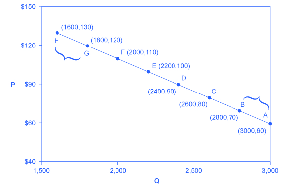
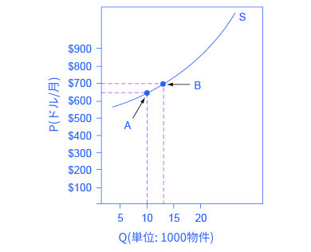

## 5.1 需要の価格弾力性と供給の価格弾力性

この節の最後には以下のことができるようになります。

* 需要の価格弾力性を計算する
* 供給の価格弾力性を計算する

需要曲線と供給曲線は共に、価格と需要または供給される量の関係を表します。**価格弾力性**とは需要量(Qd)または供給量(Qs)の変化率と、対応する価格の変化率との比率です。**需要の価格弾力性**はある財やサービスの需要量の変化率を価格の変化率で割ったものです。**供給の価格弾力性**は供給量の変化率を価格の変化率で割ったものです。

私たちは弾力性をおおまかに「弾力的」、「非弾力的」、「単位弾力的」の3つに分類できます。**弾力的な需要**または**弾力的な供給**は、弾力性が1よりも大きく、価格の変化に対する反応が大きいことを表します。弾力性が1より小さい場合は、価格の変化に対して反応が小さいことを表し、**非弾力的な需要**または**非弾力的な供給**と呼ばれます。**単位弾力的な弾力性**は表5.1に示されるように需要と供給がともに釣り合った反応を見せます。

<table>
  <tr>
    <th>条件</th>
    <th>つまり<th>
    <th>分類</th>
  </tr>
  <tr>
    <td>$$ \text{ 数量の変化率 } \gt \text{ 価格の変化率 } $$</td>
    <td>$$ \frac{ \text{ 数量の変化率 }}{ \text{ 価格の変化率 }} \gt 1 $$</td>
    <td>弾力的</td>
  </tr>
  <tr>
    <td>$$ \text{ 数量の変化率 } = \text{ 価格の変化率 } $$</td>
    <td>$$ \frac{ \text{ 数量の変化率 }}{ \text{ 価格の変化率 }} = 1 $$</td>
    <td>単位弾力的</td>
  </tr>
  <tr>
    <td>$$ \text{ 数量の変化率 } \lt \text{ 価格の変化率 } $$</td>
    <td>$$ \frac{ \text{ 数量の変化率 }}{ \text{ 価格の変化率 }} \lt 1 $$</td>
    <td>非弾力的</td>
  </tr>
</table>

  

    表5.1 弾力性の3つの分類
  

  
弾力性の詳細について入る前に、弾力性とスーパーボウルでのチケットの価格についての<a href="http://openstax.org/l/Super_Bowl">この記事</a>を読みましょう。

需要曲線と供給曲線に従って弾力性を計算するために経済学者は量と価格の平均的な変化率を用います。これは弾力性の中間点の方法と呼ばれ、以下の等式に表されます。

  $$ \begin{align} \text{ 数量の変化率 } & = \frac{Q_{2}-Q_{1}}{(Q_{2}+Q_{1})/2} \times 100 
  \\ \text{ 価格の変化率 } & = \frac{P_{2}-P_{1}}{(P_{2}+P_{1})/2} \times 100 \end{align} $$

中間点の方法の利点は、基準となる点から価格が上昇しようと下落しようと2点の平均量と平均価格を表す中間点の値を使うため同じ弾力性の値が得られることです。

  

  ＜訳注＞中間点をとらずにQ_{1}またはQ_{2}のどちらかを分母とした場合、どちらを分母にするかによって計算結果が変わってしまいます。
  

### 需要の価格弾力性の計算
図5.2に描かれている点Aと点B間の弾力性、点Gと点H間の弾力性を求めてみましょう。

  

    図5.2 需要の価格弾力性の計算
量の変化率（％）を価格の変化率（％）で割ることによって、需要の価格弾力性を計算します。
  

まず初めに、弾力性を計算するために、70ドル（点B）から60ドル（点A）への価格の減少を計算する式を用意しましょう。

  $$ \begin{align}
  \text{ 数量の変化率 } & = \frac{3000-2800}{(3000+2800)/2} \times 100
  \\ & = \frac{200}{2900} \times 100 
  \\ & = 6.9
  \\
  \\ \text{ 価格の変化率 } & = \frac{60-70}{(60+70)/2} \times 100
  \\ & = \frac{-10}{65} \times 100
  \\ & = -15.4
  \\
  \\ \text{ 需要の価格弾力性 } & = \frac{6.9\%}{-15.4\%}
  \\ & = 0.45
  \end{align} $$

したがって、2つの点の間の需要の弾力性は 6.9% ÷ 15.4% = 0.45 と計算できます。この値は1より小さいので、この財はA-B間では非弾力的だと言えます。需要の価格弾力性はいつも負の値を取ります。それは、需要曲線上では常に、価格が上がる(正の値を取る)と需要量は下がる(負の値を取る)からです。慣習的に、私たちは弾力性を正の値と定義します。数学的に言うと、得られた値の絶対値を用いるということです。今後の議論ではこのような細かいことは無視し、弾力性を正の値で表します。

ここでは以下のように弾力性を解釈します。すなわち、点Bと点A間の需要曲線に沿って、もしも価格が1%変化し場合、需要量が0.45%変化します。価格の1％の変化は需要量の1％以下の変化を引き起こします。例えば、価格が10%増加すると、需要量はたった4.5%しか減少しません。価格が10%減少すると、需要量はたった4.5%しか増加しません。需要の価格弾力性は負の値であり、需要曲線が下向に傾いている事を示していますが、一般的にはその絶対値を議論します。次の段落では、色々な場合の需要の価格弾力性を計算してみましょう。

  <h3>需要の価格弾力性を計算する</h3>
  

  図5.2の点Gから点Hへの増加のデータを使って需要の価格弾力性を計算します。弾力性は上昇するでしょうか、減少するでしょうか？
  

  

      ステップ1：次のことが分かっています。
  

  

      $$ \text{需要の価格弾力性} = \frac{数量の変化率}{価格の変化率} $$
  

  

      ステップ2：中間点の方法より
  

  

      $$ \begin{align} \text{ 数量の変化率 } & = \frac{Q_{2}-Q_{1}}{(Q_{2}+Q_{1})/2} \times 100 
      \\ \text{ 価格の変化率 } & = \frac{P_{2}-P_{1}}{(P_{2}+P_{1})/2} \times 100 \end{align} $$
  

  

      ステップ3：値をそれぞれの等式に代入します。
  

  

      $$ \begin{align}
      \text{ 数量の変化率 } & = \frac{1600-1800}{(1600+1800)/2} \times 100
      \\ & = \frac{-200}{1700} \times 100 
      \\ & = -11.76
      \\
      \\ \text{ 価格の変化率 } & = \frac{130-120}{(130+120)/2} \times 100
      \\ & = \frac{10}{125} \times 100
      \\ & = 8.0
      \end{align} $$
  

  

      ステップ4：得られた値を使って需要の価格弾力性を計算します。
  

  

      $$ \begin{align}
      \text{ 需要の価格弾力性 } & = \frac{数量の変化率}{価格の変化率}
      \\ & = \frac{-11.76}{8}
      \\ & = 1.47
      \end{align} $$
  

  

      こうして点Gから点Hまでの需要の価格弾力性は1.47と算出されました。弾力性の大きさ（絶対値）は点A点Bから需要曲線にそって上に行くにつれて大きくなっていきます。点A点B間の価格弾力性は0.45であったことを思い出してください。需要は点A点B間では非弾力的でしたが点G点H間では弾力的です。このことは直線の需要曲線において、需要の価格弾力性は違う点では変化することを示しています。
  

### 供給の価格弾力性を計算する
月に650ドルの家賃のアパートがあると仮定し、図5-3が示すように家主はその価格で10000の物件が貸し出されています。価格が月に700ドルへ上がった時、家主は13000の物件を市場へ供給します。価格上昇によってアパートの供給は何%上昇するでしょうか？価格感受性はどうでしょう？

  

    図5-3 供給の価格弾力性供給の価格弾力性は、供給量の変化率を価格の変化率で割ったものとして計算されます。
  

中間点方法を使用して

    $$ \begin{align}
      \text{ 数量の変化率 } & = \frac{13000-10000}{(13000+10000)/2} \times 100
      \\ & = \frac{3000}{11500} \times 100 
      \\ & = 26.1
      \\
      \\ \text{ 価格の変化率 } & = \frac{700-650}{(700+650)/2} \times 100
      \\ & = \frac{50}{675} \times 100
      \\ & = 7.4
      \\
      \\ \text{ 需要の価格弾力性 } & = \frac{26.1\%}{7.4\%}
      \\ & = 3.53
      \end{align} $$

前述の需要の弾力性と同様に、供給の弾力性にも後ろに単位はつきません。弾力性というのはある変化率とある変化率との間の比の絶対値にすぎません。この場合では、価格の1%の上昇が3.5%の供給量の増加を引き起こします。ある供給の弾力性が1より大きいということは、供給量の変化率が価格の変化率を上回っているということを表します。傾きの概念がこの計算に当てはまるのかどうか疑問に思うなら、次の段落を読んでみましょう。

  <h3>弾力性は傾きなのか？</h3>
  

      需要または供給曲線の傾きと、その弾力性とを混乱して間違えるのはよくあることです。傾きはその曲線上の単位の変化率、つまりxの増加量分のyの増加量で表されます。例えば図5.2では需要曲線上のそれぞれの点で、価格は10ドルずつ落ち、需要される単位の数はその左側の点と比べて200ずつ増加します。その傾きは需要曲線全体を通して10/200であり、変化しません。一方で価格の弾力性は曲線の場所によって変化します。点A点B間の弾力性は0.45ですが、点G点H間の弾力性は1.47に上昇します。弾力性とは変化率であり、傾きから異なる計算で導かれ、異なる意味を持ちます。
  

  

      需要曲線の上の端、つまり価格が高く需要量が低い場合、1単位という需要量の小さな変化でも変化率としてはかなり大きくなります。1ドルといった小さな価格の変化は需要曲線の下の端の場合と比較してその影響はずっと小さくなります。同様に、需要量の大きい需要曲線の下の端では需要量1単位の変化は変化率としては小さくなります。
  

  

      つまり需要曲線において需要量の変化率が大きく価格の変化率が小さい左端では弾力性の値は高く、需要は比較的弾力的となります。価格の変化量、需要量の変化量が左端と右端で同じ値であっても、需要曲線の右端では数量はより大きく、価格はより小さいため、需要量の変化率は小さく、価格の変化率はより大きくなります。これは、需要曲線の右端では、分子が小さく分母が大きい、つまり結果として弾力性はより低く、非弾力的であることを意味しています。
   

   

      需要曲線上では、曲線上を進む方向によって数量と価格の値は上がったり下がったりします。そのため1ドルの価格の違いまたは1単位の数量の違いの変化率も変化し、結果としてこれらの変化率の比率、つまり弾力性も変化します。
   

    <h2>
        批判的思考のための問題
    </h2>
    <ol>
        <li>大西洋を横断する飛行機のビジネスクラスの席の需要の価格弾力性の推定値は0.62で、エコノミークラスの需要の価格弾力性の推定値は0.12です。なぜでしょうか。</li>
        <li>価格弾力性と需要曲線上の位置との関係はどのようなものでしょうか。例えば、需要曲線上を上がると価格は上がり需要量は下がります。そのときの弾力性はどうなるでしょうか。またそれはなぜそうなるのでしょうか。</li>
    </ol>

    <h2>
        対訳表
    </h2>
    <table>
        <tr>
            <td>価格弾力性</td>
            <td>price elasticity</td>
        </tr>
        <tr>
            <td>需要の価格弾力性</td>
            <td>price elasticity of demand</td>
        </tr>
        <tr>
            <td>供給の価格弾力性</td>
            <td>price elasticity of supply</td>
        </tr>
        <tr>
            <td>弾力的な需要</td>
            <td>elastic demand</td>
        </tr>
        <tr>
            <td>弾力的な供給</td>
            <td>elastic supply</td>
        </tr>
        <tr>
            <td>非弾力的な需要</td>
            <td>inelastic demand</td>
        </tr>
        <tr>
            <td>非弾力的な供給</td>
            <td>inelastic supply</td>
        </tr>
        <tr>
            <td>単位弾力的な弾力性</td>
            <td>unitary elasticities</td>
        </tr>
    </table>

[5.2 極端な弾力性と等弾力性 >>](5-2-Polar-Cases-of-Elasticity-and-Constant-Elasticity)