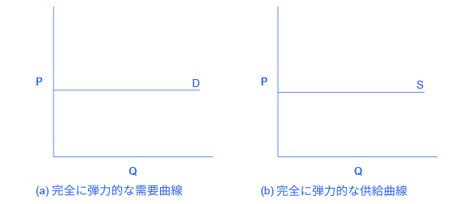
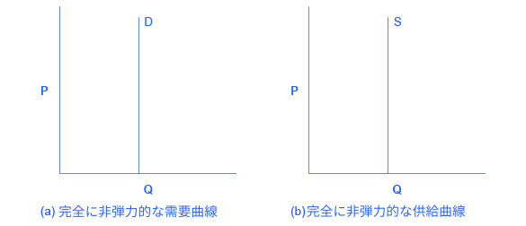
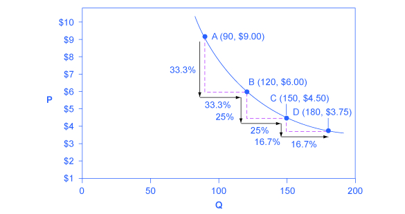
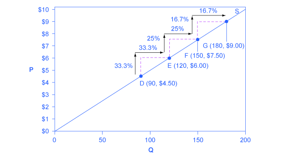

## 5.2 極端な弾力性と常に一定な弾力性

この節の最後には以下のことができるようになります。

* 弾力性がゼロと無限大との間の識別する
* 常に単位弾力的か、無限大か、ゼロかを分類するためにグラフを分析する

弾力性の極端な例には2つあります。それは弾力性がゼロである場合と弾力性が無限大である場合です。3つ目は常に単位弾力的である場合です。それぞれの例を説明していきます。**無限大の弾力性**あるいは**完全な弾力性**は、価格のいかなる変化でも需要量（Qｄ）あるいは供給量（Qｓ）が無限の値にまで増加する極端な場合を指します。。この両方の場合において、供給曲線と需要曲線は図5.4が示すように水平です。完全弾力性の供給曲線はほぼ非現実的なものですが、すぐに利用できる資金や生産量が容易に引き上げられるような財は非常に弾力的な供給曲線となります。例えば、ピザやパン、本や鉛筆などがそうです。同様に、需要の完全弾力性も極端な例です。しかし、高級な財、個人の所得の大部分を占めるものや、代替品のたくさん存在する財は高い弾力性の需要曲線をもっているでしょう。例えば、カリブ海でのクルーズやスポーツ車といったものです。

  

    図5.4 無限大の弾力性水平な線は無限大の量が特定の価格で需要されるあるいは供給されるということを示しています。これは完全に（あるいは無限に）弾力的な需要曲線と供給曲線を示しています。需要量または供給量は非常に敏感で、価格がPに達すると0から無限大にまで変化します。
  

**弾力性がゼロ**または**完全な非弾力性**とは、価格の変化率がどのような大きな値でも数量は一切変化しない極端なケースを指します。完全に非弾力的な供給は極端な例ですが、インプットの供給が限られた財の供給曲線は多くの場合非常に非弾力的となります。ダイヤの指輪やNew York City.のCentral Parkに面しているアパートなど、特別な場所に位置する住宅はその例です。同様に、完全な非弾力的な需要も極端な例で、代替材の無い必需品の需要曲線は多くの場合非常に非弾力的となります。医薬品やガソリンはその例です。

  

    図5.5 弾力性がゼロの需要供給曲線垂直な供給曲線と垂直な需要供給曲線は、価格に関係なく(a)需要または(b)供給の数量の変化率は0となることを示しています。
  

1％の価格変化で1％の数量変化が起こるとき、供給曲線あるいは需要曲線において常に単位弾力的となります。図5.6は、常に単位弾力的な需要曲線を表しています。中間点の方法を使わずに左側にある点を基準に弾力性の計算を行うと、需要曲線の点AB間において、価格が33%変わると需要量もまた33%変化するということが計算できます。ゆえに、弾力性は1です。点BC間では価格と数量のどちらもが25％変化し、点CD間では価格と数量のどちらもが16％変化します。つまりそれぞれの場合で、価格率は数量の変化率に等しく、結果的に弾力性は1になります。ただし需要曲線を下方へ辿るとき、価格の下落の絶対値は一定ではないということに注意してください。価格が点Aから点Bへ3ドル下がったとき、点BからCへはより少ない量の1.5ドルの下落、そして点CからDへはそれより少ない0.9ドルの下落が起こります。結果として、常に単位弾力的な需要曲線は左側の急な傾きから右側の緩やかな傾きへ変わっていきます。これは全体として曲線を描きます。

  
＜訳注＞ これまでと異なり、図5.6では中間点の方法は使っていません。また原文に誤りあり<a href="https://cnx.org/contents/ygzkb8kr@6/Polar-Cases-of-Elasticity-and-Constant-Elasticity">こちら</a>を参考に翻訳を行いました。原文の誤りは2019年9月現在レビュー中です。

  

    図5.6　常に単一弾力的な需要曲線常に単位弾力的な需要曲線は曲線となります。需要曲線上における2点間で、価格と数量の変化率が同じであることに注目しましょう。
  

単位弾力的な需要曲線と異なり、単位弾力的な供給曲線は直線で表され、その直線は原点を通ります。供給曲線上の各2点間には、量において等しく30ずつ差があります。しかし、中間点の方法による価格の変化率では、その差は左から右に移動するにつれて28.6%から22.2%、18.2%と減少していきます。これは各点での数値が増加するに従い、変化率の計算を行う際の分母が大きくなるからです。

図5.7において、価格が供給曲線上で変化することを考えましょう。供給曲線上の点Dから点E、点F、そして点Gにかけて、それぞれの価格差は絶対値にして＄1.50と同じです。しかし、価格変化を中間点の方法を用いた変化率で測るとき、これらは28.6%から22.2%、そして18.2%と減少していきます。これはそれぞれの割合の計算における元の点の価格が増加し、価格の変化率の計算における分母が増加するからです。常に単位弾力的な供給曲線に沿って、水平方向の数量の上昇率は垂直方向の価格の上昇率とぴったり一致します。そのため、この供給曲線は全ての点において常に単位弾力的です。

  

    図5.7　常に単位弾力的な供給曲線常に単位弾力的な供給曲線は原点から伸びる直線となります。各2点間において、供給量の上昇率は価格の上昇率と同じです。
  

    <h2>
        批判的思考のための問題
    </h2>
    <ol>
        <li>短期的にみて、無限大に近い供給の価格弾力性をもつ産業や製品はあるでしょうか。つまり、どのような産業が価格の増加率に関係なく供給量Qをほぼ際限なく増加させることができるでしょうか。</li>
    </ol>

    <h2>
        対訳表
    </h2>
    <table>
        <tr>
            <td>無限大の弾力性</td>
            <td>infinite elasticity</td>
        </tr>
        <tr>
            <td>完全な弾力性</td>
            <td>perfect elasticity</td>
        </tr>
        <tr>
            <td>弾力性がゼロ</td>
            <td>zero elasticity</td>
        </tr>
        <tr>
            <td>完全な非弾力性</td>
            <td>perfect inelasticity</td>
        </tr>
    </table>

[5.3 弾力性と価格決定 >>](5-3-Elasticity-and-Pricing)