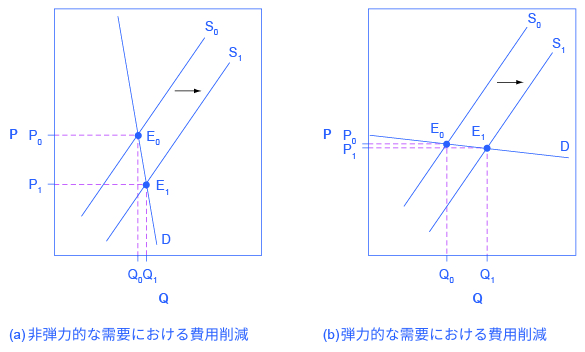
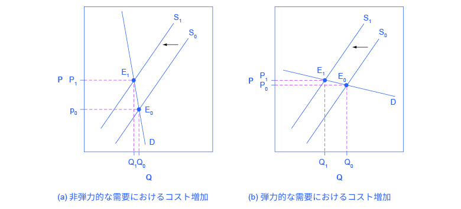
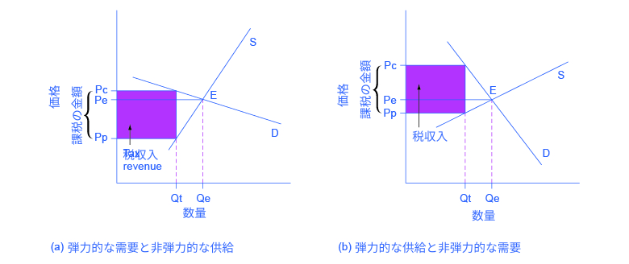

## 5.3 弾力性と価格決定

この節の最後には以下のことができるようになります。

* 弾力性が収益に及ぼす影響を分析する
* 弾力性が需要と供給のシフトを引き起こすことを理解する
* 弾力性の長期的および短期的な影響が均衡にどのような影響を与えるかを予測する
* 需要と供給の弾力性が購入者と販売者に対する課税をどのように決定するかを説明する

弾力性を考えることは、価格決定をはじめあらゆる場面で役に立ちます。長期的および短期的にみて、弾力性が収益と価格決定にどのように関係しているかを見ていきましょう。まずはじめにいくつかの財とサービスの弾力性を見てみましょう。

表5.2は経済学者の様々な研究から得られた、異なる財やサービスの需要の価格弾力性を弾力性の大きさ順に示しています。

<table>
  <tr>
    <th>財やサービス</th>
    <th>価格の弾力性</th>
  </tr>
  <tr>
    <td>住宅</td>
    <td>0.12</td>
  </tr>
  <tr>
    <td>大西洋横断の航空券(エコノミークラス)</td>
    <td>0.12</td>
  </tr>
  <tr>
    <td>鉄道(ピーク時)</td>
    <td>0.15</td>
  </tr>
  <tr>
    <td>電気</td>
    <td>0.20</td>
  </tr>
  <tr>
    <td>タクシー</td>
    <td>0.22</td>
  </tr>
  <tr>
    <td>ガソリン</td>
    <td>0.35</td>
  </tr>
  <tr>
    <td>大西洋横断の航空券(ファーストクラス)</td>
    <td>0.40</td>
  </tr>
  <tr>
    <td>ワイン</td>
    <td>0.55</td>
  </tr>
  <tr>
    <td>牛肉</td>
    <td>0.59</td>
  </tr>
  <tr>
    <td>大西洋横断の航空券(ビジネスクラス)</td>
    <td>0.62</td>
  </tr>
  <tr>
    <td>家電品</td>
    <td>0.63</td>
  </tr>
  <tr>
    <td>ケーブルテレビ(地方)</td>
    <td>0.69</td>
  </tr>
  <tr>
    <td>鶏肉</td>
    <td>0.64</td>
  </tr>
  <tr>
    <td>ソフトドリンク</td>
    <td>0.70</td>
  </tr>
  <tr>
    <td>ビール</td>
    <td>0.80</td>
  </tr>
  <tr>
    <td>新車</td>
    <td>0.87</td>
  </tr>
  <tr>
    <td>鉄道(オフピーク)</td>
    <td>1.00</td>
  </tr>
  <tr>
    <td>パソコン</td>
    <td>1.44</td>
  </tr>
  <tr>
    <td>ケーブルテレビ(都市部)</td>
    <td>1.51</td>
  </tr>
  <tr>
    <td>ケーブルテレビ(プレミアム)</td>
    <td>1.77</td>
  </tr>
  <tr>
    <td>レストランでの食事</td>
    <td>2.27</td>
  </tr>
</table>

  

    表5.2 需要の弾力性の例
  

住宅や電気などの必需品の需要は非弾力的である一方でレストランでの外食などの必需品でないものはより価格に敏感で弾力的であることを覚えておきましょう。レストランでの食事の価格が10%増加した場合、需要量は22.7%減少します。住宅の価格が10%上昇した場合、需要量はわずか1.2%しか減少しません。

  
あなたに影響を与えたかもしれない価格弾力性の例を<a href="http://openstax.org/l/Movietickets">こちら</a>で読みましょう。

### 価格を下げることは利益を増加させるか？
あるバンドが15,000席ある室内の会場で演奏するとします。この例を簡単にしておくために、チケットの売上は全てバンドが受け取ると仮定します。さらに交通費、設営費といった費用は観客の数に関わらず同じであると仮定します。最後に、全てのチケットが同じ価格であると仮定します。(以下に示すことは、席によって価格が変わる場合にも当てはまりますが、計算は複雑になります)。このバンドは、チケットの需要曲線が右肩下がり、つまりチケットの価格を上げると売上が減ることを知っています。このバンドが総収益、この場合は費用が固定されているので同時に総利益、を最大にするためにはどうすれば良いでしょうか。バンドは低い価格でより多くのチケットを販売するのが良いのでしょうか、それとも高い価格でより少ないチケットを販売するのが良いのでしょうか。

最も多くの収入を得ることを考慮するときは需要の価格弾力性が重要です。総収入は価格に売れたチケットの枚数を掛けた値になります。バンドがチケットをとある販売数量に結びつくある価格にとしようと考えるているとします。表5.3に３つの可能性が示されています。もしその価格帯において需要が弾力的であるならばバンドは価格を下げるべきです。なぜならを下げることは、価格の下降率より大きい需要の上昇率を引き起こし、総収入が増えるからです。反対に元の価格帯において需要が非弾力的ならばバンドはチケット価格をあげるべきです。なぜなら価格の上昇率は需要量の減少率を下回り、総収入が上がるからです。もし元の価格帯において需要が単位弾力的ならば供給量のある程度の変化率は等しい価格の変化率で相殺されるでしょう。その場合バンドはチケット価格を（ある程度）上げても下げても同じ収入が得られるでしょう。

<table>
  <tr>
    <th>需要の弾力性</th>
    <th>であるならば</th>
    <th>つまり</th>
  </tr>
  <tr>
    <td>弾力的</td>
    <td>Qの変化率 &gt; Pの変化率</td>
    <td>Pの増加率はより大きいQの減少率により相殺され、総収益(P × Q)は減少する。</td>
  </tr>
  <tr>
    <td>単位弾力的</td>
    <td>Qの変化率 = Pの変化率</td>
    <td>Pの増加率は値の等しいQの減少率により相殺され、総収益(P × Q)は変化しない。</td>
  </tr>
  <tr>
    <td>非弾力的</td>
    <td>Qの変化率 &lt; Pの変化率</td>
    <td>Pの増加率はQの減少率より大きく、総収益(P × Q)は増加する。</td>
  </tr>
</table>

  

    表5.3 チケットの価格を変えることで収益は増えるか？
  

需要が弾力的であるため、バンドが会場の販売できる全15,000席が売れるような価格帯まで価格を下げ続けたらどうなるでしょう。もし15,000席の供給量においても需要が弾力的なままならば、バンドはさらにチケットの価格を下げ、チケットの販売数量のより大きな増加率を見越してより大きな会場に変えるかもしれません。しかしもしバンドが用意できる最大数が15,000席であったり、より大きい会場にすることが相当なコストの追加につながるならば、その選択肢はうまく行かないでしょう。

逆に、とても有名か、熱狂的なファンを持つような数少ないバンドであれば、チケットの需要は会場が満席になるまで非弾力的である可能性があります。これらのバンドは、望むならチケットの価格を上げ続けることができます。皮肉なことに、いくつかの最も人気のあるバンドはアリーナが満員にならないようにチケットの価格を高く設定することでより多い収益を得ることができますが、逆にチケットを買う人はより高い価格を払わなければならないのです。しかし、時にバンドは彼らが請求できる最高価格よりも安い価格でチケットを売ることを選択します。それは多くの場合、ファンがより幸せに感じ、CDやTシャツ、その他のグッズにより多くのお金を費やすことを期待しているからです。

### 企業はコストを消費者に転嫁できるか？
ほとんどの企業は、より高い利益を得る手段としてより低いコストで生産する方法を見つけるための日々奮闘しています。しかし、いくつかのケースでは、企業がコントロールできない重要な投入要素の価格が上がることがあります。例えば、多くの化学企業は石油を重要な投入要素として利用していますが、彼らは世界の原油市場の価格をコントロールすることはできません。コーヒーショップはコーヒー豆を重要な投入要素として利用しますが、彼らは世界のコーヒー市場価格をコントロールすることはできません。重要な投入要素のコストが上がった場合、企業はそのより高くなったコストを商品価格の値上げという形で消費者に転嫁することはできるでしょうか。逆に、より安く生産できる新しい方法が発明された場合、企業はより高い利益という形で利益を確保することができるでしょうか、それとも市場がより低い価格という形で消費者に利益をわたすように圧力をかけるでしょうか。これらの疑問に答えるには、需要における価格弾力性が重要な役割を果たします。

正規の医薬品の消費者を想像してみましょう。あなたは新聞でアスピリンの技術進歩が起きることで、全てのアスピリン製作会社がさらに安価にアスピリンを作ることができるという記事を読んだとします。この進歩はあなたにどんな意味をもたらすのでしょうか。図5.8は2つの可能性を示しています。図5.8（a)では、需要曲線はとても非弾力的です。この場合、供給をS0からS1へ右にシフトさせ、それによって均衡点がE0からE1へシフトさせる技術進歩は、製品の価格を大幅に下げる一方で販売数量に比較的小さな影響しか与えません。図5.8(b)では、需要曲線はとても弾力的です。この場合、技術進歩によって、もとの価格に近い価格で市場に非常に多くの数量が販売されます。一般的に需要曲線が非弾力的であるほど消費者の利益は増します。なぜなら供給曲線のシフトが消費者にとって低い価格をもたらすからです。

  

    図5.8 コスト削減を消費者に転嫁するコスト削減の利益は供給曲線の右へのシフト、S0からS1へのシフトを引き起こします。これはどんな価格であっても会社は大量に供給しようとするということです。もし需要が(a)のように非弾力的な時、このコスト削減の技術進歩の結果、価格は相当安くなるでしょう。また、もし需要が(b)のように弾力的な時、コスト削減の技術進歩の結果、価格はほんの少し下がるくらいでしょう。消費者はいずれの場合でも低い価格でより多くの数量を得ることができるため得をしますが、(a)のように需要が非弾力的な場合により得をします。

このときアスピリンの製造者は苦境に立たされていると考えるかもしれません。図5.8のような非常に非弾力的な需要では、新しい発明は数量が少し変化するだけで価格が劇的に下ることを意味します。結果として新しい生産技術は、企業がアスピリンの販売から得られる利益の低下につながります。しかし、もしアスピリン製造者同士で激しい競争が存在する場合、それぞれの製造者は製造コストを削減できる方法を探し、導入する以外に選択肢はないかもしれません。もし費用を削減できる技術を導入しないとある判断した場合、その技術を導入した他の企業によって廃業に追い込まれるかもしれません。

一般的に食べ物の需要は非弾力的であるため、農家はたびたび図5.8(a)と同様の状況に直面するかもしれません。つまり、生産量が急上昇して価格が急落した場合、農家が受け取る総収益が下がる可能性があるのです。反対に、悪天候などの生産量を下げる条件下では価格が急上昇するため農家が受け取る総収益が急上昇することもあります。下の段落で、これがコーヒーとどう関係するかを見ていきます。

  <h3>コーヒーの価格はどのように変動するのか？</h3>
  

      コーヒーは国際的な作物です。世界で上位5位のコーヒー輸出国は、ブラジル、ベトナム、コロンビア、インドネシア、エチオビアです。これらの国やその他の国では、2,000万人の世帯が主な収入源としてコーヒー豆を売って生活しています。コーヒーの世界価格は乱高下するため、こういった世帯は莫大なリスクにさらされています。例えば、1993年に、コーヒーの世界価格は約50セント/ポンドでした。1995年には価格が4倍になり、2ドル/ポンドになりました。1997年までには、半分の1ドル/ポンドまで落ち、1998年には、再び2ドル/ポンドまで増加しました。2001年までには、46セント/ポンドに落ちました。2011年頃までには2.31ドル/ポンドに上昇しました。そして、2012年末までには、価格は1.31ドル/ポンドまで落ちました。
  

  

      こういった価格変動の理由は、非弾力的な需要と供給のシフトで説明できます。コーヒー需要の弾力性はたったの約0.3であり、10%の値上がりによって、コーヒーの消費量は3%しか減少しません。1994年にブラジルで霜によるコーヒー豆の大不作が起きたとき、コーヒーの供給曲線な左にシフトしました。コーヒーの需要曲線は非弾力的であるため価格が急上昇したのです。逆に、1990年代末にベトナムが大規模な供給者として世界のコーヒー市場に参入したとき、供給曲線は右に大きくシフトしました。非常に非弾力的な需要曲線に沿って、コーヒー価格は劇的に下落したのです。図5.8(a)はこの時の状況を説明しています。
  

弾力性は、企業が高いコストを消費者に負担させることが可能かどうかを明らかにします。依存性のある物質は需要が非弾力的であり、生産者が高いコストを消費者に負担させることが可能です。例えばタバコの需要は、幾分依存している喫煙者の間では比較的非弾力的です。経済的な研究で、タバコの価格が10%上がると需要量が3%減少する、つまりタバコの需要の弾力性が0.3であることが示唆されました。もし社会がタバコを生産する会社に対する税を上げたら、図5.9(a)に示されるように供給曲線はS0からS1へシフトするでしょう。しかし均衡がE0からE1へ動くとき、政府は主にタバコの値上げという形で消費者に税を払わせることになります。これらのタバコに対する高い税は政府の税収を増やしますが、喫煙量にはそれほど影響を及ばさないでしょう。

もしタバコの需要量を減少させることが目的なら、非弾力的な需要を左へシフトさせることに取り組む必要があります。それにはタバコの使用を抑制したり、使用を止める手助けをする政策が有効かもしれません。例えば禁煙を勧める運動は喫煙を減らすのに効果があることが示されています。しかしもしタバコの需要が図5.9(b)に示されるように弾力的ならば、税の引き上げは供給曲線をS0からS1へ移動させ、均衡はE0からE1へ移動し、十分にタバコの喫煙量を減らすでしょう。また若い喫煙者の需要は大人の喫煙者の需要より弾力的であるようです。すなわち若い喫煙者は大人の喫煙者より、価格の上昇率に対して大きい需要量の減少率を示します。

  

    図5.9 より高い費用の消費者への転嫁より高い費用（先程例として挙げた、タバコ会社に対する増税など）は供給曲線を左にシフトさせます。このシフトは(a)(b)間において同じです。しかしながら需要が非弾力的な(a)の状況においては、企業は追加コストの大方を消費者に価格として、均衡数量の減少をさほど減少させること無く転嫁することができます。一方(b)の需要が弾力的な状況においては、供給のシフトは主に、より低い均衡数量を生み出します。いずれにしても消費者は何かしらの損を被ります。(a)においては同量の商品をより高い価格で買わなければならず、(b)においてはより少量しか買うことができなくなります（おそらくそれまで消費に費やしていたお金を他の場所に移すことになります）。
  

### 弾力性と租税の帰着
たばこ税の事例は「需要が非弾力的であるため課税は喫煙の均衡数量の減少に有効ではなく、従って政府は主に商品の値上げという形で消費者に税金を転嫁する」ということを示しています。税負担がどのように消費者と生産者の間で分担されているのかについての分析や方法は、**租税の帰着**と呼ばれます。通常、租税の帰着は課税対象の消費者と生産者の両方に当てはまります。しかしながら、もしどちらのグループがほとんどを負担するのかを予想したいのであれば、需要と供給の弾力性について調査すれば事足ります。たばこ税の例では、税負担のほとんどが、市場においてより非弾力的な方にかかります。

もし需要が供給よりも非弾力的であれば、消費者が税のほとんどを負担します。供給が需要よりも非弾力的であれば、生産者が税のほとんどを負担します。

これは直感的に理解できます。需要が非弾力的な場合、消費者は価格の変化に対して大きな反応を見せません。このため税金が導入された場合でも需要量の減少は非常に小さいものとなります。喫煙の場合、消費者はたばこに依存している状態であるため需要は非弾力的です。このため政府は均衡数量をさほど減少させることなく、税を消費者に負担させることができます。

政府が供給が非弾力的な市場に対して課税を行うこともあります。例えば、海沿いのホテルのように、低い価格を受け入れる以外に経営維持する方法がない場合です。この場合も、課税は均衡数量に大きな影響を与えることはありません。この場合は税を売り手が負担することになります。もし供給が弾力的で、売り手が課税対象の財を販売することを回避するように経営を変えることが可能であれば、売り手に対する税の負担はより軽くなると考えられます。その場合は低い価格設定ではなく、販売数量が大きく減少する結果となります。図5.10は需要と供給の弾力性と租税の帰着との関連を示しています。

  

    図5.10 弾力性と税の負担特定の財に対する課税は消費者によって支払われる価格（Pc）と生産者が受け取る価格（Pe）の間に差を生じさせます。PcとPp間の垂直距離は単位当たりの税を示しています。Peは課税が行われる前の均衡価格です。（a）の場合、需要は供給よりも弾力的であり、消費者の税の負担(Pc - Pe)は生産者の税の負担(Pe - Pp)よりも少なくなります。（b）の場合、供給が需要よりも弾力的であり、消費者の税の負担(Pc - Pe)は生産者の税の負担(Pe - Pp)よりも大きくなります。需要と供給が弾力的であるほど税収入は小さくなります。
  

