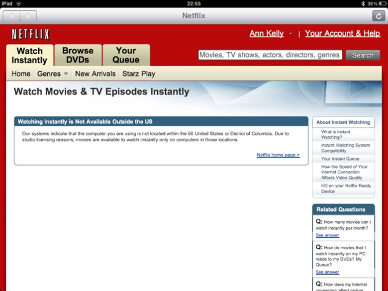

# 第5章 弾力性

  

    図5.1 オンデマンド型メディアのNetflixNetflix, inc.はアメリカのオンデマンド型ストリーミング配信メディアであり、アメリカ合衆国を含む世界中の多くの国に動画を配信しています。また、アメリカ合衆国では定額制の配達型のレンタルも行っています。(Credit: modification of work by Traci Lawson/Flickr Creative Commons)
  

    <h2>
        身の回りの経済学
    </h2>
    <h3>
        おいくらですか？
    </h3>
    

      お気に入りのコーヒーショップを訪れ、ウェイターに最近価格が変わったことを伝えられる場面を想像してください。それまではコーヒー1杯は3ドルでしたが、これからはコーヒー単体が2ドル、クリームが1ドル、砂糖が1ドルとなりました。もしも今まで通り3ドルをコーヒー1杯に払いたいなら、クリームと砂糖のどちらか片方を選ばなくてはいけません。もしも両方欲しかったら、もう1ドル多く払わなければいけません。このように価格帯を勝手に変更されるのは馬鹿馬鹿しいと思いますか。しかし、これはNetflixの登録者に起こった事と同様の出来事なのです。Netflixの登録者は、2011年に、それまでのサービスを受けるためには60%も多く支払わないといけなくなりました。
    

    

      2011年初頭、Netflixの登録者はビデオのストリーミングサービスとDVDレンタルのパッケージに対して月額10ドルを払っていました。しかし2011年7月に、Netflixはそのパッケージの変更を発表しました。同様のサービスを望む登録者は月に15.98ドルも払わなければいけなくなったのです。それは実に60%の値上げでした。更に2014年に、Netflixはストリーミングビデオサービスのアメリカの登録者向けの会費を7.99ドルから8.99ドルに上ました。同じ年にNetflixは4Kストリーミングのコンテンツ使用時の会費を9ドルから12ドルに上げました。
    

    

      18歳の消費者たちはどんな反応を示すでしょうか。Netflixを諦めるのでしょうか。他のサービスの利用のしやすさがNetflixの価格の改訂に対する消費者の反応に影響を与えるでしょうか。この章では、私たちはそれらの質問への回答を考えていきます。そこでは価格の変化に対する量の変化に焦点を当てます。経済学者たちはその概念を弾力性と呼びます。
    

## はじめに
この章では以下の内容を学びます：
* 需要の価格弾力性と供給の価格弾力性
* 弾力性の主な傾向と恒弾性
* 弾力性と価格設定
* 価格ではない分野における弾力性

経済学を勉強した人であれば誰もが需要の法則（より高い価格はより低い量の需要につながるという法則）を知っているはずです。しかしそれがどのくらいなのか（どのくらい需要量が低下するのか）は知らないかもしれません。同じように、供給の法則とはつまり、より高い価格がより高い供給量を引き起こすということですが、問題は「どのくらい高いか」です。この章では、これらの質問への回答の仕方や、なぜそれらが現実の世界でとても重要なのかということを説明します。

これらの質問に対する解答を見つけるためには、私たちは**弾力性**という概念を理解する必要があります。弾力性とは経済学の概念で、ある変数の変化に対する他の変数の変化の度合いを測る指標です。 
<!-- 例えが分かりづらいと判断したため削除した文: Suppose you drop two items from a second-floor balcony. The first item is a tennis ball. The second item is a brick. Which will bounce higher? Obviously, the tennis ball. We would say that the tennis ball has greater elasticity. -->

経済における弾力性の例を考えてみましょう。たばこ税は、お酒のように身体によくないものに対して課される「悪行税」の一例です。政府は、州や国家レベルでたばこに税を課しています。州の税率はミズーリ州の1箱17セントから、ニューヨーク州の1箱4.35ドルまでと幅があります。平均は1箱1.69ドルです。連邦の税率は2014年には1箱1.01ドルでしたが、2015年にオバマ政権は連邦による税率を1ドル近く引上げた1箱1.95ドルにすることを提案しました。鍵となる問題は「どのくらいタバコの購入量が減少するか」ということです。

たばこ税には、政府の税収を増やすことと、たばこの消費を抑制することの2つの目的があります。しかし、より高いたばこ税が消費を大幅に抑制する場合、たばこの販売量が大幅に減少するので、それぞれのパックに課せられたたばこ税は政府の税収をそれほど増大させません。一方で、増税が消費をそこまで妨げない場合は、実際に政府の税収は増加します。従って、政府がたばこ税の変更による影響を算出しようとする際、税がどの程度たばこの消費量に影響を与えるかの分析が不可欠です。この問題は政府と税にとどまりません。全ての企業は同じような問題に直面します。ある企業が売値を上げることを考えた時、価格の上昇がどの程度その商品の需要量を減少させるのかを考えなければなりません。逆に、企業が製品を売りに出す際、より低い価格はより高い需要量につながると予想(または期待)します。

    <h2>
        対訳表
    </h2>
    <table>
  <tr>
    <td>弾力性</td>
    <td>elasticity</td>
  </tr>
</table>

[5.1 需要の価格弾力性と供給の価格弾力性 >>](5-1-Price-Elasticity-of-Demand-and-Price-Elasticity-of-Supply)