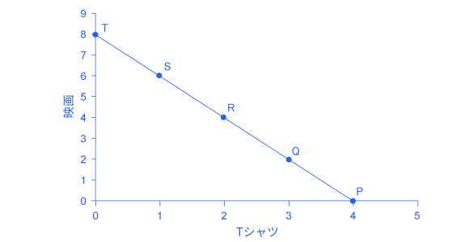

## 6.1 消費選択

この節の最後には以下のことができるようになります。

* 総効用を計算する
* 効用を最大化する選択肢を挙げる
* 限界効用と限界効用逓減の重要性を説明する

アメリカ人の消費行動に関する情報はアメリカ労働省労働統計局による消費者の支出調査から手に入れることが出来ます。表6.1は、アメリカの世帯のさまざまな支出の平均を示しています。最初の行は所得を示しています。2行目は、1行目の所得から税と個人貯蓄を差し引いたものです。それを見ると2015年にはアメリカの世帯平均消費が48,109ドルであったことがわかります。この表はその消費を様々なカテゴリーに分類しています。表からわかる通り、アメリカの平均世帯の約1/3の支出は住居や家賃に向けられ、もう1/3は食料や車の費用、残りは様々なものに向けられています。この割合は世帯の収入や地理的条件や好みなど様々な要因によって変化します。

<table>
  <tr>
    <td>税引き前の世帯収入の平均</th>
    <td>$62,481</th>
  </tr>
  <tr>
    <td>平均年間支出</td>
    <td>$48.109</td>
  </tr>
  <tr>
    <td>家庭内での食事</td>
    <td>$3,264</td>
  </tr>
  <tr>
    <td>外食</td>
    <td>$2,505</td>
  </tr>
  <tr>
    <td>住宅</td>
    <td>$16,557</td>
  </tr>
  <tr>
    <td>衣服とサービス</td>
    <td>$1,700</td>
  </tr>
  <tr>
    <td>交通費</td>
    <td>$7,677</td>
  </tr>
  <tr>
    <td>医療費</td>
    <td>$3,157</td>
  </tr>
  <tr>
    <td>娯楽費</td>
    <td>$2,504</td>
  </tr>
  <tr>
    <td>教育費</td>
    <td>$1,074</td>
  </tr>
  <tr>
    <td>保険料・年金</td>
    <td>$5,357</td>
  </tr>
  <tr>
    <td>その他：お酒、たばこ、本、美容、寄付金など</td>
    <td>$3,356</td>
  </tr>
</table>

  

    表6.1 2015年におけるアメリカ人の消費行動 (Source: http://www.bls.gov/cex/csxann13.pdf)
  

### 総効用と限界効用逓減
経済学者は、世帯がどのような選択をするかを理解するために、消費者が何を買うことができるかを見ます。消費者が何を買うことができるかは、**予算制約線**と、選択から発生する**総効用**または満足度で表されます。予算制約線では、ある財の数量は横軸に、もう一つの財の数量は縦軸に設定します。この予算制約線は、消費者の所得の範囲内で購入可能な二つの財の様々な数量の組み合わせを示しています。Joséさんの場合は図6.2のようになります。JoséさんはＴシャツを集めることと映画を見ることが好きです。

図6.2では横軸にTシャツの数量、縦軸に映画の本数を示しています。もしJoséさんの所得が無限である場合、あるいは財が無料である場合、Joséさんは際限なく財を消費することができます。しかし、Joséさんにも予算制約があります。Joséさんは56ドルを使うことができるとします。Tシャツの価格は14ドルで、映画の価格は7ドルです。この場合、予算制約線の縦軸との切片では8つの映画と0個のTシャツとなります(56ドル / 7ドル = 8)。予算制約線と横軸との切片では4つのTシャツと0本の映画となります(56ドル / 14ドル = 4)。予算制約線の傾きは –8 / 4= –2 となります。予算制約線上の選択は買うことのできるTシャツと映画の数量の組み合わせを示しています。

  

    図6.2 消費材の選択Joséの所得は56ドルです。映画の料金は7ドル、Tシャツは14ドルです。予算制約線上の点は購入可能な映画とTシャツの価格の組み合わせを示します。
  

Joséは自分に最も大きい効用をもたらす財の数の組み合わせを選びたいと思っています。効用とは、経済学者が、ある人の選択がもたらすその人にとっての満足度や幸福度を表す用語です。

Joséが彼自身の効用を単位効用と呼ばれるものを利用して測定できるという仮定から始めましょう。この仮定については後ほど詳しく見ていきます。(ひとつ注意点として、個々の単位効用を比較することはできないということは覚えておきましょう。もし一人の人が一杯のコーヒーから20単位効用を得て、もう一人は10単位効用だったとしても、これは1人目の人がもう一人よりもより多くの楽しみを得たとか、コーヒーを2倍楽しんだといった意味ではありません。なぜかというと、単位効用は個々の主観に基づくからです。単位効用の測り方は人によって異なります。)表6.2はJoséの効用がどのように彼のTシャツと映画の消費に関係しているかを示しています。表の1列目はTシャツの消費量を示しています。2列目はJoséがTシャツを消費するにあたって得られる効用または満足度の合計を示しています。効用の合計における最も一般的なパターンは、追加で財を消費することはより大きい総効用につながりますが、その増加率は減少していく、というものです。3列目は追加で消費された財1単位によって新たに得られた効用である限界効用を表しています。限界効用についての式は：

  $$ MU = \frac{総効用の変化}{数量の変化} $$

表を見ると、限界効用は財が追加で消費されるにつれ減少していくことがわかります。これは追加で消費された財によって追加でもたらされる効用は、その前に消費された財によってもたらされる効用よりも少ないということを意味しています。例えば、Joséが購入する一つ目のTシャツは彼のお気に入りで、彼はそのTシャツから22単位効用を得ます。Joséが購入する4つ目のTシャツは彼の他の衣服が全て洗濯されているときに着るような服で、そのTシャツは彼に18単位効用しか与えません。これらは財1単位の消費から追加で得られる効用は、その消費量が増えるに連れ減少するという**限界効用逓減**の法則の例です。限界効用逓減の法則は私たちが以前2.2章の「[希少性の世界における選択](../chapter_2/2-2-The-Production-Possibilities-Frontier-and-Social-Choices)」で学んだ、より包括的な「収穫逓減の法則」の一つの例です。

表6.2の残りはJoséの映画鑑賞数とそれらから得られる総効用と限界効用を表しています。Tシャツと同様に、総効用は映画の鑑賞回数とともに上昇します。限界効用もTシャツと同様に鑑賞回数が増えるにつれてその鑑賞から得られる効用は減少していきます。最初の映画鑑賞は彼がもっとも見たかったもので、彼に大きな効用または満足を与えます。5回目の映画鑑賞はただ単に時間をつぶすためのものかもしれません。総効用は限界効用の総和です。次のコラムを読んでそれらの計算方法を学びましょう。

<table>
  <tr>
    <th>Tシャツ (数量)</th>
    <th>総効用</th>
    <th>限界効用</th>
    <th>映画 (数量)</th>
    <th>総効用</th>
    <th>限界効用</th>
  </tr>
  <tr>
    <td>1</td>
    <td>22</td>
    <td>22</td>
    <td>1</td>
    <td>16</td>
    <td>16</td>
  </tr>
  <tr>
    <td>2</td>
    <td>43</td>
    <td>21</td>
    <td>2</td>
    <td>31</td>
    <td>15</td>
  </tr>
  <tr>
    <td>3</td>
    <td>63</td>
    <td>20</td>
    <td>3</td>
    <td>45</td>
    <td>14</td>
  </tr>
  <tr>
    <td>4</td>
    <td>81</td>
    <td>18</td>
    <td>4</td>
    <td>58</td>
    <td>13</td>
  </tr>
  <tr>
    <td>5</td>
    <td>97</td>
    <td>16</td>
    <td>5</td>
    <td>70</td>
    <td>12</td>
  </tr>
  <tr>
    <td>6</td>
    <td>111</td>
    <td>14</td>
    <td>6</td>
    <td>81</td>
    <td>11</td>
  </tr>
  <tr>
    <td>7</td>
    <td>123</td>
    <td>12</td>
    <td>7</td>
    <td>91</td>
    <td>10</td>
  </tr>
  <tr>
    <td>8</td>
    <td>133</td>
    <td>10</td>
    <td>8</td>
    <td>100</td>
    <td>9</td>
  </tr>
</table>

  

    表6.2 総効用と限界効用
  

表6.3は図6.2における予算制約線の5つの点に注目し、各Tシャツと映画の組み合わせにおけるJoséの総効用を計算しています。

<table>
  <tr>
    <th>点</th>
    <th>Tシャツ</th>
    <th>映画</th>
    <th>総効用</th>
  </tr>
  <tr>
    <td>P</td>
    <td>4</td>
    <td>0</td>
    <td>81 + 0 = 81</td>
  </tr>
  <tr>
    <td>Q</td>
    <td>3</td>
    <td>2</td>
    <td>63 + 31 = 94</td>
  </tr>
  <tr>
    <td>R</td>
    <td>2</td>
    <td>4</td>
    <td>43 + 58 = 101</td>
  </tr>
  <tr>
    <td>S</td>
    <td>1</td>
    <td>6</td>
    <td>22 + 81 = 103</td>
  </tr>
  <tr>
    <td>T</td>
    <td>0</td>
    <td>8</td>
    <td>0 + 100 = 100</td>
  </tr>
</table>

  

    表6.3 最も効用の大きい選択の導出
  

