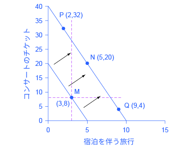
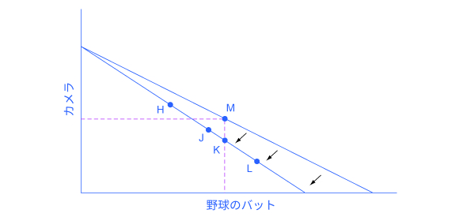
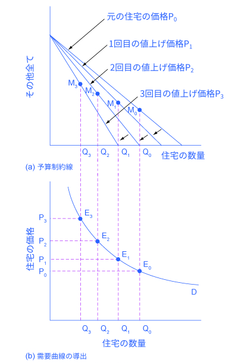

## 6.2 所得と価格の変化が消費選択に与える影響

この節の最後には以下のことができるようになります。

* どのように所得、価格や好みが消費選択に影響を与えるか
* 代替効果と所得効果の比較
* 消費選択を分析するための需要の概念の利用
* 効用最大化選択の政府や事業に対する適用

アメリカ人の消費行動に関する情報はアメリカ労働省労働統計局による消費者の支出調査から手に入れることが出来ます。表6.1は、アメリカの世帯のさまざまな支出の平均を示しています。最初の行は所得を示しています。2行目は、1行目の所得から税と個人貯蓄を差し引いたものです。それを見ると2015年にはアメリカの世帯平均消費が48,109ドルであったことがわかります。この表はその消費を様々なカテゴリーに分類しています。表からわかる通り、アメリカの平均世帯の約1/3の支出は住居や家賃に向けられ、もう1/3は食料や車の費用、残りは様々なものに向けられています。この割合は世帯の収入や地理的条件や好みなど様々な要因によって変化します。

効用や限界効用を使って予算制約下の消費者選択を議論することができるように、所得や価格の変化に伴い予算制約がシフトする場合に消費者選択がどのように変わるのかを議論することもできます。価格が変化することによって需要量がどのように変化するのかを分析するために、予算制約のフレームワークを使うことができます。このため、予算制約モデルは需要曲線の背後にある論理を説明することができます。

### 所得の変化はどのように消費者選択に影響を与えるのか
所得水準が変化する時どのように消費選択が変わるのかを説明できる具体的な例を用いて議論を進めましょう。図6.3は予算制約を示しており、例えば、Kimberlyさんが50ドルのコーサートチケットと一泊200ドルの朝食付き宿との間の所得配分で迷っていたとします。Kimberlyさんはこれら２つの財の消費の為に毎年1000ドル使えるとします。次に、彼女の総効用と限界効用について考えます。最適な消費選択の際の、限界効用と価格との比が2財の間で等しくなるというルールを当てはめると、Kimberlyは点Mを選びます。この点M、つまり8枚のチケットと宿に三泊するときにKimberlyの効用は最大となります。

  

    図6.3 所得の変化が消費者選択にどのような影響を与えるか元の予算制約において効用を最大化するのは点Mです。点Mを通る横線や縦線を見ることで、新しい予算制約下の各財の消費量が元の予算制約下の状態より高いか低いかを知る事ができます。新しい予算制約下では、もしも両財が普通財なら、KimberlyはNのような選択をします。もしも宿泊が劣等財である場合はKimberlyは点Pのような選択をします。もしもコンサートチケットが劣等財である場合は、Kimberlyは点Qのような選択をします。
  

さて、Kimberlyがこれらの2つの材に費やす所得が年間2000ドルに上昇するとしましょう。その場合彼女の予算制約線は右にシフトします。この所得の上昇は彼女の効用最大化の選択にどのような影響を与えるのでしょうか。Kimberlyはコンサートチケットと宿泊それぞれから受けとる効用と限界効用を再考し、新たな予算制約線から効用が最大化する選択肢を探します。彼女の新たな選択は元々の選択とどのように関連するのでしょうか。

私達は新たな予算制約線上の選択を3つのグループに分類することができます。そのグループは元の予算制約線の選択肢である点Mを通る縦と横の破線で区切られています。新たな予算制約線における、縦の破線より左上の全ての（点Pの様な）選択肢では横軸の財の消費が減り、縦軸の財の消費が増えます。縦方向の破線より右で横方向の破線よりも上の全ての（点Nの様な）選択肢では両方の財の消費が増えます。最後に縦方向の破線より右で横方向の破線より下の全ての選択肢（点Qの様な）では縦軸の財の消費が減り、横軸の財の消費が増えます。

2つの財を消費した時に得る総効用と限界効用によって示されるKimberlyさんの個人的な嗜好に基づくと、このような選択全てが理論上可能です。収入が増加した場合、最も一般的な反応は2つの財の両方の購入量を増やす点Ｎの選択肢のような反応です。個人的な趣味嗜好によってそれぞれの財の消費量は変わるものの、この選択肢Ｎは、Kimberlyさんが初めに選んだ選択肢Ｍよりも右上にあります。逆に、収入が減少した場合の最も典型的な反応は、2つの財両方の購入量を減らす反応です。「需要と供給」や「弾力性」の章で定義したように、収入が増加した時に消費量も増加し、、収入が減少したときに消費量も減少する財のことを正常財と呼びます。

しかしながら、Kimberlyさんの好みによっては、収入が増加した場合片方の財の消費量は増加するものの、もう一方の財の消費量が減少する場合があります。選択肢Ｐのように、収入が増加することで宿泊の消費量が減少することもあれば、選択肢Ｑのように収入が増加することでコンサートの消費量が減少することもあります。このように収入が増加すると需要が減少する財（逆に収入が減少すると需要が増加する財）のことを下級財と呼びます。人々は、収入が増加した時に下級財の消費量を減らし、収入が増加することで買えるようになった高級品を買うようになります。例えば、高収入な家庭はハンバーガーを食べたり、中古車を買ったりするのではなく、高価なステーキを食べ、新車を購入するでしょう。

### 価格は消費者選択にどのように影響するか
価格変化が消費に及ぼしうる影響を分析するためにもう１度実際の例を用いましょう。図6.4は野球のバットとカメラの購入を考えているSergeiさんの消費選択を表しています。野球のバットの価格上昇はカメラの購入数の上限には影響も及ぼしませんが、Sergeiさんの購入できるバットの量は減るでしょう。したがってバット(横軸の財)の価格上昇は予算制約線を垂直軸との接点を軸に内側へ移動させます。前節でSergeiさんが総効用と限界効用と元の予算制約下でのトレードオフを考慮した後に選んだのは、点Mでした。今回の例では水平軸と垂直軸の単位が与えられていないので、数量ではなく、Sergeiさんが財をより多く消費するのか少なく消費するのかについての議論となります。

  

    図6.4 価格変化が消費選択にどのように影響するか効用が最大である元の選択は点Mでした。価格が上がると予算制約線は時計回りに回転します。破線を見ると新しい消費選択は両方の財の減少、もしくは片方の財の減少ともう片方の財の上昇を示すことが分かります。新しい選択では、点Hのようにより少ないバットとより多いカメラとなるか、点Jのように両方の財が少なくなるかとなります。点Kは、バットの価格上昇によって、消費するバットの量は同じであるにもかかわらず、消費するカメラの量が少なくなることを意味しています。また、理論上は可能ですが、現実世界では点Lのような選択を除外します。なぜなら点Lでは、より高いバットの価格がより多いバット消費を意味し、非現実的だからです。
  

価格が上がると、Sergeiは新しい予算制約線に従って選択をします。先ほどと同様に彼の選択を縦と横の破線によって3つの部分に分けることができます。新しい予算制約線の左上の点Hの部分では、Sergeiはカメラの消費を増やし、バットの消費を減らします。真ん中の点Jの部分では両方の財の消費を減らします。右側の点Lの部分では、彼はバットの消費を増やし、カメラの消費を減らします。

商品の価格上昇に対する個人の典型的な反応は、その商品の消費を減らすことです。これは2つの理由から起こり、さらにその2つの効果は同時に起こり得ます。1つ目の効果である**代替効果**は、価格が変化した時に起こるもので、消費者が相対的に高い価格の財の消費を減らし、相対的に低い価格の財の消費を増やそうとするというものです。2つ目の効果である**所得効果**は、財の価格が上がると、(実際の収入は変化していないものの)事実上収入による購買力が減少し、それが財の購買を減少させる(その財が正常財のとき)というものです。この例のでは、野球のバットの価格が上がると、Sergeiは両方の理由からバットの購入を減らすことになります。バットの価格が上がると、Sergeiさんのバットの消費はどのくらい落ちるのでしょうか？。図6.4はその可能性の範囲を示しています。Sergeiさんは野球のバットの価格が上がってもこれまでと同じ量のバットを購入し、カメラの消費を削るかもしれません。この選択は新しい予算制約線上の点Kで示されており、もともとの選択である点Mの真下に位置します。反対に、Sergeiさんはバットの購入を劇的に減らし、その代わりにカメラの消費をより増やすかもしれません。

野球のバットの価格の変化がバットの消費量にしか影響せず、他の財の消費量は変わらないと考えるのは軽率です。Sergeiさんは同じ予算の中で商品を購入する必要があるので、1つの財の価格の変化は他の財の消費量に対して正あるいは負の様々な影響を及ぼします。

端的に言うと、価格の上昇はその財の消費量を減少させますが、同時に他の財の消費にも影響を及ぼし得るのです。

  
価格変動型の自動販売機のポテンシャルについて<a href="http://openstax.org/l/vending">こちらの記事</a>で読むことができます。

### 需要曲線の基礎
ある財の価格の変化は予算制約線を回転させます。予算制約線の回転は、個人の効用が最大となる選択を考える際に、需要する数量が変化することを表しています。このようにして、需要の価格と数量の関係を表す需要曲線は、効用を最大化しようとしている個々人の考えがおおもとにあります。図6.5 (a)は、家賃と「その他全て」を軸にとった予算制約線を表しています。(ある特定の財に焦点を当てて分析する場合などは特にそうですが、「その他全て」を縦軸に置くと便利な場合が多々あります)。元の予算制約線で、効用が最大となり好ましいと考えられた選択肢をM0と名付けます。他の3つの予算制約線はP1、P2、P3の家賃の上昇を示します。予算制約線が内側(時計回り)に回転するに従って、それぞれで効用が最大となる選択肢をM1、M2、M3と名付けます。その際、住宅の需要量は元のQ0から、Q1、Q2、Q3と減少します。

  

    図6.5 需要曲線の基礎：住宅を例に(a)ではP0からP1、P2、P3と価格が上がるにつれて予算制約線は時計回りに傾いていきます。効用が最大となる選択はM0からM1、M2、M3へと移っていきます。他の諸要因を固定した条件下では、結果として住宅の需要量はQ0からQ1、Q2、Q3へと移っていきます。(b)の需要曲線のグラフは他の諸要因を固定した条件下での住宅の価格と需要量の組み合わせを示しています。住宅の需要量は(a)、(b)のグラフで対応しています。元の価格(P0)と元の需要量(Q0)は需要曲線上では点E0として表れます。より高い価格(P1)とそれに対応して下がった需要量(Q1)は需要曲線上では点E1として表れます。
  

上の住宅の例から分かるように、他のすべての条件が同じであり住宅の価格が上がったならば、予算制約線は時計回りに回転し、住宅の消費量は減少します。図6.5(b)では、この関係が住宅価格のP0からP1、P2、P3への上昇と需要量のQ0から、Q1、Q2、Q3への減少することからわかります。図6.5の縦の破線は(a)、(b)のそれぞれの点で住宅の需要量が同じことを示しています。最終的には需要曲線の形は、予算制約線が与えられた状況で、そこに存在する効用最大化のための選択肢によって決まります。経済学者は単位効用を測定することはできないかもしれませんが、価格と需要量については測定することができます。

### 政府と企業における応用
効用を最大化する選択をするための予算制約のフレームワークから、人々が価格や収入の変化に対して様々な方法で反応することがわかります。例えば、2005年の冬、ハリケーンカトリーナとリタによって発生した広域での混乱を原因とした天然ガスと電気の価格高騰により、アメリカ国内の多くの地域で住宅の暖房費が大幅に上昇しました。それを受け、家の中での暖房の設定温度を数度下げて、より厚手のセーターを着るといった方法でエネルギーの需要量を減らすことで対応した人もいました。それでも、多くの家庭で暖房費は上がったため、人々は消費を他の方法でも調節しました。弾力性の章で学んだように、住宅の暖房における短期的な需要は一般的に非弾力的です。そのため各家庭は最も価値の低いものを削減しました。ある人にとってそれは外食や旅行かもしれませんし、新しい冷蔵庫や新しい車を購入するのを延期した人もいるでしょう。エネルギー価格の急激な高騰はエネルギー市場を越えて影響を及ぼし、経済全体での広域的な購買量の減少につながる可能性があります。

政府が、ガソリン、タバコ、アルコール類といった特定の財に税を導入した際にも同様の事態が起こります。アルコール類に対する課税が、酒屋さんでの価格の上昇を招くとします。アルコール類の価格上昇は購買者の予算制約線を内側に回転させ、アルコール飲料の消費量は減少すると考えられます。しかし同時に、人々がその他の購入を抑えることでアルコール飲料の価格上昇に対応することも考えられます。例えば、外食する際、チキンナゲットやナチョスといったサイドメニューの消費量を減らすかもしれません。アルコール類への課税で影響を受けるのがアルコール飲料業界のみと考えるのは軽率です。

### 予算制約と効用最大化のフレームワークの汎用性
価格、予算制約、個人の趣味嗜好が世帯の選択を決めます。効用最大化の議論で用いられる柔軟で強力な用語は、これらの要素をまとめ上げます。

経済学者も、人々がお店に入る前、職業選択をする時、貯金をする時に限界効用についてぶつぶつ言いながら選択を行っているとは考えていません。ただし経済学者は、個々人が納得感や効用を求め、何かを減らしたり違うなにかを増やしたりする選択を行うと考えています。これらの仮定を受け入れるならば、予算制約の中で世帯は効用を最大化させようとするという考えはかなり現実的でしょう。

  <h3>世帯所得を誰が管理するかで何が変わる？</h3>
  

    1970年代中頃、イギリスは「お小遣い政策」にて興味深い政策の変更を行いました。この政策は子を持つ家庭を対象に、世帯の所得とは無関係に子供一人あたり一定の金額を支給するというものです。従来は、「お小遣い」は世帯主(当時は主にその世帯の父親)の所得から差し引かれる税を軽減することで支給されていました。これに対して新しい政策は、母親に対して現金の形で支給するものでした。この結果として、各世帯は同レベルの所得と、市場の価格で生活しますが、お金は父親ではなく母親の財布に入りやすい構図となります。
  

  

    この政策の変更は世帯の消費行動に変化を与えるのでしょうか？消費行動の基本的なモデルでは、親であれば家族の効用を最大化させようとするため、お金を母親が受け取るか父親が受け取るかは関係ないと考えます。結果としてこのモデルでは家族全員が同じ趣味嗜好を持っていると仮定されます。
  

  

    しかし現実では、父親が管理するシェアと母親が管理するシェアは世帯が何を消費するかに影響を与えます。母親が世帯収入のより大きなシェアを管理する場合、家庭はレストランでの食事、子育て、婦人服の出費が増え、アルコール類とタバコの出費が減ることがイギリスや他の国における数々の研究から明らかになっています。母親が世帯収入のより大きなシェアを管理することで子供の健康も改善します。これらの発見は、先進国と発展途上国にかかわらず貧困家庭の支援を行う場合、支援の金額は全てではなく、誰が実際にお金を受け取るかも関係することを示唆します。
  

予算制約のフレームワークは、所得や価格の変化によって一番最初に影響されると思われる1つの商品に対する影響だけではなく、様々な影響を常に考えなければならないということを教えてくれます。

    <h2>
        批判的思考のための問題
    </h2>
    <ol>
        <li>所得の影響は、購入する財それぞれの需要の所得弾力性に依存します。もし購入する財のうち一つが負の所得弾力性をもつ場合、つまり劣等財である場合、もう一方の財の所得弾力性についてはどのようなことが言えるでしょうか。</li>
    </ol>

    <h2>
        対訳表
    </h2>
    <table>
        <tr>
            <td>代替効果</td>
            <td>substitution effect</td>
        </tr>
        <tr>
            <td>所得効果</td>
            <td>income effect</td>
        </tr>
    </table>

[6.3 行動経済学：消費者選択のオルタナティブなフレームワーク >>](6-3-Behavioral-Economics-An-Alternative-Framework-for-Consumer-Choice)