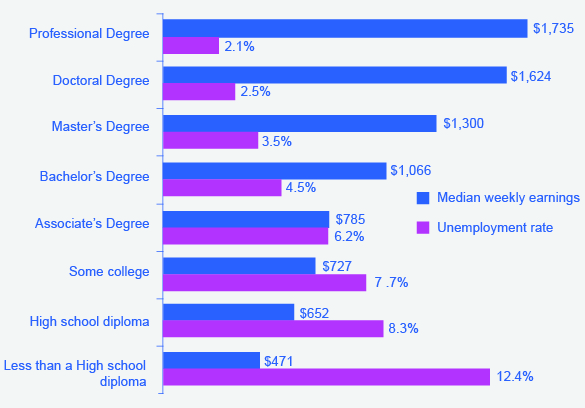

## 6.3 行動経済学：消費者選択の代替的なフレームワーク

この節の最後には以下のことができるようになります。

* アメリカ人がなぜ所得の非常に小さな割合しか貯金しない傾向にあるかを分析する

私達が経験から知っているように、人々は「合理的ではない」選択を行うことがあります。人々の選択は日によって異なって一貫性を欠いているようにみえたり、時にはお金や時間を節約する方法を意図的に無視することさえあります。従来の経済モデルは合理性、つまり人々が全ての入手可能な情報を考慮し、一貫性のある、情報に基づいた、自身にとって最善の選択を行うことを仮定しています。

しかし行動経済学者として知られる新しいグループの経済学者たちは、従来の手法は人々の心理状態という重要な問題を考慮していないと主張します。例えばある人が損をした分を取り返そうとしているか、あるいは楽観的な気持ちであるか、あるいは損をしたような気分になっているかによって、その人のお金に対する考えは違いうるということです。これらの心理状態は必ずしも非合理的な心理状態ではなく、ある人のある一日に影響を与えうる数多くの感情の一部分なのです。加えて、もし置かれている環境をより把握できたのならば、そのような心理状態下の行動は予測可能なのです。**行動経済学**は、心理学の知見を経済学に統合することによって人の意思決定の把握をより進めようとする学問です。行動経済学は、あるお金の量が状況によって個人の行動にどのような違いをもたらすかを調査することで、意思決定の把握を行います。これらは外部の観測者にとって一見すると一貫性を欠き、合理的でないように見える判断をもたらすことがあります。

行動経済学が捉える人間の思考は、従来の経済学者にとっては一貫性を欠くものに思えるかもしれません。しかし、人々の思考はコストと利益を計算する感情を持たない機械ではなく、もっと複雑なものなのです。例えば従来の経済学者は、「もしあなたが10ドルを今日失って、給料に追加で10ドルを受け取ったならあなたは怒りも喜びもしないはずだ。」と言うでしょう。結局、-10ドル+10ドル=0ドルで、あなたは財政上以前と同じなのですから。しかし行動経済学者は、多くの人がこれら2つの出来事の後に怒りやいらだちといったネガティブな感情を抱くことを研究を通じて示しました。人間は何かを得ることよりも失うことに注目する傾向があるのです。これを損失回避と呼びます。この用語は、Daniel KahnemanとAmos Tverskyの２人の経済学者が、1ドルの喪失による悲しみが1ドルを得られる喜びの2.25倍だということを示した、1979年のEconometrica紙に掲載された有名な記事で登場しました。株式市場にて得ることよりも失うことに「大げさに」反応してしまう投資業界にとって、この識見は大きな含蓄を持っています。この行動は従来の経済学者にとっては合理的でないように見えますが、心の動きをより理解すれば一貫性のある行動だと言えると行動経済学者は言います。

従来の経済学者は人間が完全に自身を制御できると仮定します。しかし、例えば人々はタバコを購入する際に、カートンで買う方が安上がりであるにも関わらず、使用量を減らすために箱単位で買うかもしれません。さらに、冷蔵庫に取り付ける鍵を購入したりします。。言い換えると、私たちは誘惑から逃れるためにお金を払おうとします。これに対する行動経済学者の反応の1つとして、人々をこれらの衝動から開放する方策を確立していくことを目指しています。その中の一つに、政府による強制的な規制の代わりに行われる、合理的な行動を進めるための「ナッジ(nudges)」と呼ばれるものがあります。例えば、新規従業員の20%は登録を先延ばしにしたり、多数の選択肢に圧倒され、退職貯蓄保険にすぐ登録しません。そこでいくつかの会社は彼らがオプトアウト(辞退)しないかぎり、自動的に登録を行う新しいシステムに移ろうとしています。ほとんどの従業員はこのプログラムをオプトアウトすることなく、早い時期から貯蓄を始めます。これは退職時にとても重要になります。

非合理的にみえる分野として「メンタルアカウンティング」の考え方が挙げられます。メンタルアカウンティングでは、私達は異なる価値観を持つ様々な精神カテゴリーに基づいてお金の価値を判断するといいます。しかし、経済学者は通常、お金は状況に関わらず、ある個人にとって**等しい価値を持つ**と考えます。

例えば、「ファストフードレストランで3時間働いて稼いだ25ドル」と、「道端で拾った25ドル」を考えてみましょう。あなたはその道端のお金を「まぐれによる」収入として、その用途にほとんど合理的な配慮を払わないかもしれません。お金自体はレストランで3時間の労働で得たお金と同等の価値を持つのので、これはある意味おかしなことです。あなたがお金を手に入れた状況や文脈によって合理的な判断が「簡単に手に入れたものは簡単に失っても良い」という考え方にとって代わられてしまうことを表しています。

今までの経済学者と矛盾があるメンタルアカウンティングの別の例として、年間金利が15％のクレジットカードで1000ドルの借金を抱えていると同時に、年間金利2％の口座に2000ドル貯金している人の例があります。これは、この人がクレジット会社に年間150ドル支払っている間に銀行口座には利子が年間40ドルしか入っていないということになります。もし借金をすぐに返済した場合、クレジットカード会社には0ドルを支払い、銀行口座に入っている1000ドルに対する利子20ドルが入ってきますつまりこの人は年間130ドルの損をしていることになりますます。これは賢い選択ではないように思われます。

合理的な選択というのは借金を返済することです。借金が0ドルで1000ドルの貯金をしているというのは借金が0ドルで貯金が2000ドルの場合と純資産は同等になり、さらに1年で20ドル純資産が増加します。不思議なことに、人々がこのアドバイスを受け入れないことは少なくありません。それは彼らが、借金を返済する利益よりも貯金を失うことの不利益を大きく見積もるためです。彼らは同じ額のお金を代替可能なものとして扱いませんこれは、従来の経済学者には不合理な行動であるように映ります。

行動経済学者と今までの経済学者の見方はどちらが正しいのでしょうか？どちらもそれぞれに優位性がありますが、行動経済学者は今までの経済学者が不合理であるとして見逃してきた行動について説明を試みています。もしも私たちの多くが不合理な行動を行っているとしたら、それにはより深く根本的な理由があるのかもしれません。

  <h2>
    身の回りの経済学
  </h2>
  <h3>「どれにしようかな...」ー 選択をするということ</h3>
  

      世界金融危機の中で世界中の消費者が支出を増加させたのはどのカテゴリーだったのでしょうか。それは高等教育です。国際連合教育科学文化機関(ユネスコ)によると単科大学や総合大学への入学者が、中国では33%、サウジアラビアではおよそ66%、パキスタンではほぼ2倍、ウガンダでは3倍に増加し、そしてアメリカでは18%に当たる300万人に入学者が急増しました。なぜ消費者は不況時に教育にお金を使おうとしたのでしょうか。個人も国もともに高等教育が国の繁栄、個人の幸福につながると見なしたのです。収入が増加することが、大学に通うことの重要な恩恵だと感じる人が多いのです。
  

  

      図6.6が示すように、アメリカ労働統計局の2012年5月のデータもこの見解を裏付けています。図は収入と教育の正の相関関係を示しています。データでは高いレベルの教育と訓練によって失業率が下がることも示しています。
  

  

      なぜ不況時に大学に通うお金を出すのでしょうか。それはもし雇用されなかった（あるいは非正規雇用や希望よりも少ない時間の労働であった）場合、あなたの時間の機会費用が下がるからです。。大学に行くためには労働時間や得られたはずの収入を諦めなくてはなりませんが、もしそもそも雇用されていないならば、労働時間や収入をあきらめる必要がありません。
  

  
  

    

        図6.6 2012年の収入と失業率における教育の影響2012年では高水準の教育を受けていた層は失業率が相当低かったですが、一方教育の水準が低い層では失業率が高い結果となりました。週当たりの収入の全国平均は815ドルで、全国失業率は6.8%でした。（Source: U.S. Bureau of Labor Statistics, May 22, 2013）
    

  

    <h2>
        対訳表
    </h2>
    <table>
        <tr>
            <td>行動経済学</td>
            <td>behavioral economics</td>
        </tr>
        <tr>
            <td>等しい価値を持つ</td>
            <td>fungible</td>
        </tr>
    </table>

[第6章について >>](Reference)